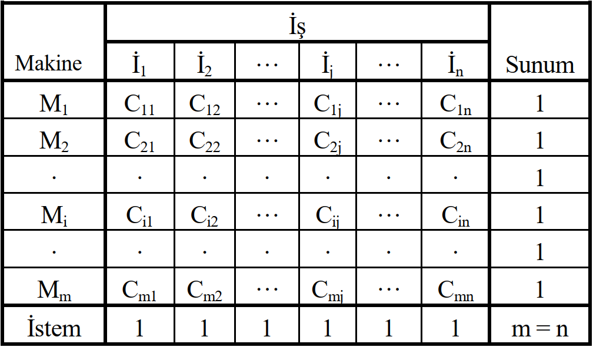

## Atama Problemleri (1)

::: {.callout-important icon=false title="Atama Modeli" style="font-size: 115%;"}

* [Atama modeli]{.light-red}, ulaştırma modelinin [basit]{.light-red} ve [özel]{.light-red} bir biçimidir. 
* Ulaştırma problemlerinde olduğu gibi atama problemlerinde de amaç, belirli [merkezler arasındaki dağıtım]{.light-red} işlemlerinin [en uygun]{.light-red} biçimde gerçekleştirilmesidir. 
* Ancak, atama probleminin [mal taşınması ile doğrudan bir ilişkisi]{.light-red} genellikle [yoktur]{.light-red}. 
* Atama modellerine daha çok [işlerin makinelere]{.light-red}, [işçilerin işlere]{.light-red}, [uçuşların uçuş hatlarına]{.light-red}, [kişilerin kişilere vb.]{.light-red} atanmalarının programlanmasında başvurulur.
* Programlama, [bir işçi bir işe]{.light-red} veya [bir makine bir işe]{.light-red} atanacak şekilde, yani [bire bir eşleme]{.light-red} ile gerçekleştirilir.

:::


## Atama Problemleri (2)

::: {.callout-important icon=false title="Bire-bir eşleme, Kare Matris" style="font-size: 130%;"}

* Her model gibi atama modeli de bazı varsayımlara dayanmaktadır. 
* Daha önce açıklandığı gibi, ulaştırma probleminde [$(m > n)$]{.light-blue} veya [$(m < n)$]{.light-blue} olabildiği halde atama probleminde [$(m = n)$]{.light-blue} olması gerekir. 
* Bunun sonucunda, ulaştırma modeli katsayılar [$(C_{ij})$]{.light-blue} matrisi [kare matris]{.light-red} şeklinde ortaya çıkar ve [atama matrisi]{.light-red} adıyla anılır. 
* Atama matrisinin kare matris olması bire bir eşlemenin [doğal bir sonucudur]{.light-red} ve atama modelinin çok önemli bir özelliğidir.

:::

## Atama Problemleri (3)

::: {.callout-important icon=false title="Standart Olmayan Atama Problemleri" style="font-size: 110%;"}

* [$m = n$]{.light-blue} koşulunun sağlanmadığı atama modeli [standart olmayan]{.light-red} veya [dengesiz atama modelleri]{.light-red} kapsamına girer. 
* Standart olmayan bir atama probleminin çözülebilmesi için [modelin standart biçime dönüştürülmesi]{.light-red}, yani [$m = n$]{.light-blue} olmasının sağlanması gerekir. 
* Bunun için, dengesiz bir ulaştırma probleminin dengelenmesinde kullanılan yönteme benzer bir yöntem kullanılır. 
* Sözgelimi, makine sayısından [daha fazla]{.light-red} sayıda işe sahip olduğumuzu düşünelim. Bu durumda bazı işler yapılamayacaktır. Bunu engellemek için modele [fazla olan iş sayısı kadar makine eklenmesi]{.light-red} gerekir. Eklenen makinelere karşılık gelen [$C_{ij}$]{.light-blue}’ler [sıfır]{.light-red} kabul edilir. 
* Bunun tersi olarak, [makine sayısı fazla]{.light-red} ise bu makinelerin görevlendirileceği sayıda [işin modele eklenmesi]{.light-red} zorunludur.
:::


## Atama Problemleri (4)

::: {.callout-important icon=false title="Atama Matrisi" style="font-size: 100%;"}

* [Atama Matrisi]{.light-red}, [sütunlarını]{.light-red} sayıları [$n$]{.light-blue} olan [işler]{.light-red}, [satırlarını]{.light-red} [$m$]{.light-blue} sayıdaki [makineler]{.light-red}, [elemanlarını]{.light-red} ise [bire bir eşlemelerin ortaya koyduğu sonuçlar]{.light-red} [($C_{ij}$)]{.light-blue} oluşturur.


{width=800 height=400}

:::


## Atama Problemleri (5)

::: {.callout-important icon=false title="Atama Problerinin Çözüm Yöntemleri" style="font-size: 110%;"}

* Herhangi bir atama problemi, [olanaklı tüm atamaların (bire bir eşlemelerin) listelenmesiyle]{.light-red} çözülebilir. 
* Ancak bu yaklaşım yalnızca [küçük boyutlu problemlerde]{.light-red} kullanılabilir. Problemin boyutu büyüdükçe, listeleme çok zor hatta [imkansızdır]{.light-red}.
* Daha önce açıklandığı gibi esas olarak bir tür ulaştırma problemi olması nedeniyle, herhangi bir atama problemi, [ulaştırma problemlerinin klasik çözüm yöntemleriyle ve aynı süreç izlenerek çözülebilir]{.light-red}. 
* Ancak, bilinen yöntemlerden hangisi kullanılırsa kullanılsın, [başlangıç çözümü dahil, bütün çözümler bozuk olacaktır]{.light-red}.
* Atama problemleri, kendilerine özgü tekniklerle [daha az zaman harcayarak]{.light-red} ve [daha az işlem yapılarak]{.light-red} çözülebilir. Burada [Macar yöntemi]{.light-blue} açıklanacaktır.
:::


## Atama Problemleri (6)

::: {.callout-important icon=false title="Macar Yöntemi" style="font-size: 130%;"}

* Atama problemlerinin çözümünde kullanılan [Macar yöntemi]{.light-red} Macar matematikçi [D. Konig]{.light-red} tarafından formüle edilen sisteme dayanmaktadır. 
* Macar yönteminin atama problemlerinin çözümüne uygulanabilmesi için [$C_{ij}$]{.light-blue}’lerin [negatif olmaması]{.light-red} gerekir. 
* Yöntem, standart atama matrisinin [herhangi bir satır]{.light-red} veya [sütununun tüm elemanlarına sabit bir sayının eklenmesi]{.light-red} veya [çıkartılmasının en iyi çözümü değiştirmediği]{.light-red} esasına dayanır.
:::


## Atama Problemleri (7)

::: {.callout-important icon=false title="Macar Yönteminin Adımları (1)" style="font-size: 130%;"}

* [1. Adım:]{.red} Maliyet matrisinin [her bir satırının en küçük değeri]{.light-red}, [bulunduğu satırın tüm elemanlarından çıkartılır]{.light-red}. Bu işlemle elde edilen matrise [satırları indirgenmiş matris]{.light-blue} denir.

* [2. Adım:]{.red} Satır indirgenmiş matrisin [her bir sütununun en küçük değeri]{.light-red} [bulunduğu sütunun tüm elemanlarından çıkartılır]{.light-red}. Bu yolla [satırları-sütunları indirgenmiş]{.light-blue} [bir maliyet (sonuç) matrisi]{.light-red} elde edilir.

:::

## Atama Problemleri (8)

::: {.callout-important icon=false title="Macar Yönteminin Adımları (2)" style="font-size: 125%;"}

* [3. Adım:]{.red} İkinci adımda belirlenen matrisin [sıfır değerli elemanlarından geçen en az sayıdaki çizgiler]{.light-red} çizilir. Çizgilerinin çizimi konusunda kararsızlığa düşmemek için, çizme işlemine [sıfırı en çok olan satır]{.light-red} veya [sütunlardan]{.light-red} başlanması önerilebilir. 

[Koruma çizgisi sayısı matrisin satır/sütun sayısına]{.light-red} [eşit]{.light-blue} ise [en iyi çözüm elde edilmiş olur]{.light-red}. [Sıfır]{.light-blue} [değerine sahip hücrelere]{.light-red}, [bire bir olmak koşuluyla]{.light-red} yapılacak atamalar sonunda [en iyi çözüme]{.light-blue} ulaşılır.

Çizilen [en az sayıdaki çizgilerin sayısı]{.light-red} [$n$]{.light-blue}’ye eşit değilse [dördüncü adıma]{.light-blue} geçilir.
:::

## Atama Problemleri (9)

::: {.callout-important icon=false title="Macar Yönteminin Adımları (3)" style="font-size: 130%;"}

* [4. Adım:]{.red} [Üzerinden çizgi geçmeyen elemanların en küçük değerli]{.light-red} olanı belirlenir. Bu elemanın değeri, [üzerinden çizgi geçmeyen diğer bütün elemanlardan çıkartılır]{.light-red}. Aynı değer, [çizgilerin kesişme noktalarındaki sayılara eklenir]{.light-red}. [Üzerinden çizgi geçen diğer elemanlar değişmeden kalır]{.light-red}. Bu işlemlerden sonra [üçüncü adıma]{.light-blue} dönülür.

En iyi çözüm bulununcaya kadar [üçüncü]{.light-blue} ve [dördüncü]{.light-blue} adımlar [tekrarlanır]{.light-red}.
:::

## Örnek 1: Makine - İş Eşleştirme (1)


::: {.callout-tip icon=false title="Soru" style="font-size: 110%;"}

::: columns

::: {.column width="66%"}


:::{.tblbox .tbl-fs-xl .w-100 .scale-150  .pad-cozy .text-center .scroll-x .scroll-y}
```{=html}

```
:::
Bir işletmenin [en kısa sürede tamamlamak]{.light-red} istediği [dört]{.light-blue} [işi]{.light-red} ve bu işlerin yapımında kullandığı [dört]{.light-blue} [makinesi]{.light-red} vardır. 
:::
::: {.column width="3%"}
:::

::: {.column width="30%"}


Yandaki tabloda, [makinelerin işleri tamamlama süreleri saat]{.light-red} olarak verilmiştir. İşlerin [en kısa toplam sürede]{.light-red} tamamlanması istenmektedir. 

Problemin [matematiksel modelini kurunuz]{.light-red} ve [MACAR yöntemi]{.light-red} ile çözünüz.
:::
:::

:::


## Örnek 1: Makine - İş Eşleştirme (2)

::: {.callout-tip icon=false title="Amaç Fonksiyonu" style="font-size: 120%;"}

[İşlerin en kısa sürede tamamlanması ]{.light-red} istendiğinden [amaç fonksiyonu]{.red} aşağıdaki gibi yazılır.


[\begin{align*} 
Z_{enk} &= 20x_{11}+11x_{12}+3x_{13}+6x_{14} \\
        &+ 5x_{21}+9x_{22}+10x_{23}+2x_{24} \\
        &+ 18x_{31}+7x_{32}+4x_{33}+1x_{34} \\
        &+ 10x_{41}+11x_{42}+18x_{43}+6x_{44}
\end{align*}]{.light-blue}

:::

## Örnek 1: Makine - İş Eşleştirme (3)

::: {.callout-tip icon=false title="Kısıtlar" style="font-size: 120%;"}

::: columns

::: {.column width="45%"}

[Makine Kısıtları]{.red}
[$$
\begin{alignedat}{7}
x_{11} &+& x_{12}  &+& x_{13} &+& x_{14}  &\;= & 1\\
x_{21} &+& x_{22}  &+& x_{23} &+& x_{24}  &\;= & 1\\
x_{31} &+& x_{32}  &+& x_{33} &+& x_{34}  &\;= & 1\\
x_{41} &+& x_{42}  &+& x_{43} &+& x_{44}  &\;= & 1\\
\end{alignedat}
$$]{.light-blue}
:::

::: {.column width="10%"}
:::

::: {.column width="45%"}
[İş Kısıtları]{.red}
[$$
\begin{alignedat}{7}
x_{11} &+& x_{21}  &+& x_{31} &+& x_{41}  &\;= & 1\\
x_{12} &+& x_{22}  &+& x_{32} &+& x_{42}  &\;= & 1\\
x_{13} &+& x_{23}  &+& x_{33} &+& x_{43}  &\;= & 1\\
x_{14} &+& x_{24}  &+& x_{34} &+& x_{44}  &\;= & 1\\
\end{alignedat}
$$]{.light-blue}
:::
[İşaret kısıtlaması:]{.red}
Son olarak negatif atama olmayacağına göre 
[$$x_{ij} \geq 0; \quad{} i = 1,2 \dots 4; \quad{} j = 1,2 \dots 4;$$]{.light-blue}
:::
:::


## Örnek 1: Makine - İş Eşleştirme (4)


::: {.callout-tip icon=false title="Başlangıç Tablosu" style="font-size: 110%;"}

::: columns

::: {.column width="66%"}
[Adım 0: Başlangıç Tablosu]{.red}

:::{.tblbox .tbl-fs-xl .w-100 .scale-150  .pad-cozy .text-center .scroll-x .scroll-y}
```{=html}

```
:::

:::
::: {.column width="3%"}
:::

::: {.column width="30%"}
:::{.fragment fragment-index=1}
[Satır indirgenmiş matrisi]{.light-red} elde etmek için her bir satırdan satırın en küçük elemanı çıkarılmalı.

[$X_{1.}-3$]{.light-blue}, [$X_{2.}-2$]{.light-blue}, [$X_{3.}-1$]{.light-blue} ve [$X_{4.}-6$]{.light-blue},
:::
:::
:::

:::

## Örnek 1: Makine - İş Eşleştirme (5)


::: {.callout-tip icon=false title="Satır İndirgeme" style="font-size: 110%;"}

::: columns

::: {.column width="66%"}
[Adım 1: Satır İndirgenmiş Matris]{.red}

:::{.tblbox .tbl-fs-xl .w-100 .scale-150  .pad-cozy .text-center .scroll-x .scroll-y}
```{=html}

```
:::

:::
::: {.column width="3%"}
:::

::: {.column width="30%"}
:::{.fragment fragment-index=1}
[Sütun indirgenmiş matrisi]{.light-red} elde etmek için her bir sütundan sütunun en küçük elemanı çıkarılmalı.

[$X_{.1}-3$]{.light-blue}, [$X_{.2}-5$]{.light-blue}, [$X_{.3}-0$]{.light-blue} ve [$X_{.4}-0$]{.light-blue},
:::

:::
:::

:::

## Örnek 1: Makine - İş Eşleştirme (6)


::: {.callout-tip icon=false title="Sütun İndirgeme" style="font-size: 110%;"}

::: columns

::: {.column width="66%"}
[Adım 2: Sütun İndirgenmiş Matris]{.red}

:::{.tblbox .tbl-fs-xl .w-100 .scale-150  .pad-cozy .text-center .scroll-x .scroll-y}
```{=html}

```
:::

:::
::: {.column width="3%"}
:::

::: {.column width="30%"}
:::{.fragment fragment-index=1 style="font-size: 90%;"}
[$0$]{.light-blue} ların bulunduğu sütunlara [dikey çizgiler çekilerek]{.light-red}, [tüm hücrelerin 0 değerli hücrelerle kapsanıp kapsanmadığı]{.light-red} kontrol edilir.

[Tüm hücreler kapsanıyorsa]{.light-red} [optimal çözüm vardır]{.light-blue}. 

:::

:::
:::

:::

## Örnek 1: Makine - İş Eşleştirme (7)


::: {.callout-tip icon=false title="Kapsama Kontrolü" style="font-size: 110%;"}

::: columns

::: {.column width="66%"}
[Adım 3: Kapsama Kontrolü]{.red}

:::{.tblbox .tbl-fs-xl .w-100 .scale-150  .pad-cozy .text-center .scroll-x .scroll-y}
```{=html}

```
:::

:::
::: {.column width="3%"}
:::

::: {.column width="30%"}
:::{.fragment fragment-index=1}

Tüm hücreler kapsandığından optimum çözüm vardır.

[Her bir satır]{.light-red} ve [sütunda]{.light-red} [tek bir $0$]{.light-blue} olacak şekilde seçim yapılır.


:::

:::
:::

:::

## Örnek 1: Makine - İş Eşleştirme (8)


::: {.callout-tip icon=false title="Optimum hücrelerin belirlenmesi" style="font-size: 110%;"}

::: columns

::: {.column width="66%"}
[Çözüm: Optimum hücrelerin belirlenmesi]{.red}

:::{.tblbox .tbl-fs-xl .w-100 .scale-150  .pad-cozy .text-center .scroll-x .scroll-y}
```{=html}

```
:::

:::
::: {.column width="3%"}
:::

::: {.column width="30%"}
:::{.fragment fragment-index=1}

[Makine 1 $\rightarrow$ İş 3]{.light-blue} e, [Makine 2 $\rightarrow$ İş 1]{.light-blue} e, [Makine 3 $\rightarrow$ İş 4]{.light-blue} e ve [Makine 4 $\rightarrow$ İş 2]{.light-blue} ye atanır.


:::

:::
:::

:::

## Örnek 1: Makine - İş Eşleştirme (9)


::: {.callout-tip icon=false title="Optimum değerin belirlenmesi" style="font-size: 110%;"}

::: columns

::: {.column width="66%"}
[Çözüm (Devam): Optimum değerin belirlenmesi]{.red}

:::{.tblbox .tbl-fs-xl .w-100 .scale-150  .pad-cozy .text-center .scroll-x .scroll-y}
```{=html}

```
:::

:::
::: {.column width="3%"}
:::

::: {.column width="30%"}
:::{.fragment fragment-index=1}

[Başlangıç tablosunda atama yapılan hücrelerin değerleri toplanarak]{.light-red} [optimum değer]{.light-blue} bulunur.

[$$3+5+1+11=20$$ ]{.light-blue}

Dört işin en hızlı bitebileceği süre [20 saattir]{.orange}.

:::

:::
:::

:::

## Örnek 2: Makine - İş Eşleştirme (1)


::: {.callout-tip icon=false title="Soru" style="font-size: 110%;"}

::: columns

::: {.column width="66%"}


:::{.tblbox .tbl-fs-xl .w-100 .scale-150  .pad-cozy .text-center .scroll-x .scroll-y}
```{=html}

```
:::

:::
::: {.column width="3%"}
:::

::: {.column width="30%"}

[Beş]{.light-blue} [makinesi]{.light-red} bulunan bir firma [beş]{.light-blue} farklı [iş siparişi]{.light-red} almıştır. 

Makinelerin işleri tamamlama süreleri [yandaki tabloda]{.light-red} verilmiştir.


:::
:::
İşlerin [en kısa toplam sürede]{.light-red} tamamlanması istenmektedir. İşlerin en kısa sürede tamamlanmasını sağlayacak [iş-makine eşleşmesini]{.light-red} bulunuz.
:::


## Örnek 2: Makine - İş Eşleştirme (2)

::: {.callout-tip icon=false title="Amaç Fonksiyonu" style="font-size: 120%;"}

[İşlerin en kısa sürede tamamlanması ]{.light-red} istendiğinden [amaç fonksiyonu]{.red} aşağıdaki gibi yazılır.


[\begin{align*} 
Z_{enk} &= 2x_{11}+4x_{12}+9x_{13}+7x_{14}+10x_{15} \\
        &+ 4x_{21}+6x_{22}+8x_{23}+2x_{24}+3x_{25} \\
        &+ 5x_{31}+7x_{32}+9x_{33}+11x_{34}+13x_{35} \\
        &+ 10x_{41}+9x_{42}+8x_{43}+7x_{44}+6x_{45}\\
        &+ 5x_{51}+5x_{52}+3x_{53}+4x_{54}+2x_{55}
\end{align*}]{.light-blue}

:::

## Örnek 2: Makine - İş Eşleştirme (3)

::: {.callout-tip icon=false title="Kısıtlar" style="font-size: 120%;"}

::: columns

::: {.column width="45%"}

[İş Kısıtları]{.red}
[$$
\begin{alignedat}{7}
x_{11} &+& x_{12}  &+& x_{13} &+& x_{14} &+& x_{15} &\;= & 1\\
x_{21} &+& x_{22}  &+& x_{23} &+& x_{24} &+& x_{25} &\;= & 1\\
x_{31} &+& x_{32}  &+& x_{33} &+& x_{34} &+& x_{35} &\;= & 1\\
x_{41} &+& x_{42}  &+& x_{43} &+& x_{44} &+& x_{45} &\;= & 1\\
x_{51} &+& x_{52}  &+& x_{53} &+& x_{54} &+& x_{55} &\;= & 1
\end{alignedat}
$$]{.light-blue}
:::

::: {.column width="10%"}
:::

::: {.column width="45%"}
[Makine Kısıtları]{.red}
[$$
\begin{alignedat}{7}
x_{11} &+& x_{21}  &+& x_{31} &+& x_{41} &+& x_{51}  &\;= & 1\\
x_{12} &+& x_{22}  &+& x_{32} &+& x_{42} &+& x_{52}  &\;= & 1\\
x_{13} &+& x_{23}  &+& x_{33} &+& x_{43} &+& x_{53}  &\;= & 1\\
x_{14} &+& x_{24}  &+& x_{34} &+& x_{44} &+& x_{54}  &\;= & 1\\
x_{15} &+& x_{25}  &+& x_{35} &+& x_{45} &+& x_{55}  &\;= & 1
\end{alignedat}
$$]{.light-blue}
:::
[İşaret kısıtlaması:]{.red}
Son olarak negatif atama olmayacağına göre 
[$$x_{ij} \geq 0; \quad{} i = 1,2 \dots, 5; \quad{} j = 1,2 \dots, 5;$$]{.light-blue}
:::
:::


## Örnek 2: Makine - İş Eşleştirme (4)


::: {.callout-tip icon=false title="Başlangıç Tablosu" style="font-size: 110%;"}

::: columns

::: {.column width="66%"}
[Adım 0: Başlangıç Tablosu]{.red}

:::{.tblbox .tbl-fs-xl .w-100 .scale-150  .pad-cozy .text-center .scroll-x .scroll-y}
```{=html}

```
:::

:::
::: {.column width="3%"}
:::

::: {.column width="30%"}
:::{.fragment fragment-index=1}
[Satır indirgenmiş matrisi]{.light-red} elde etmek için her bir satırdan satırın en küçük elemanı çıkarılmalı.

[$X_{1.}-2$]{.light-blue}, [$X_{2.}-2$]{.light-blue}, [$X_{3.}-5$]{.light-blue}, [$X_{4.}-6$]{.light-blue} ve [$X_{5.}-2$]{.light-blue}
:::
:::
:::

:::

## Örnek 2: Makine - İş Eşleştirme (5)


::: {.callout-tip icon=false title="Satır İndirgeme" style="font-size: 110%;"}

::: columns

::: {.column width="66%"}
[Adım 1: Satır İndirgenmiş Matris]{.red}

:::{.tblbox .tbl-fs-xl .w-100 .scale-150  .pad-cozy .text-center .scroll-x .scroll-y}
```{=html}

```
:::

:::
::: {.column width="3%"}
:::

::: {.column width="30%"}
:::{.fragment fragment-index=1}
[Sütun indirgenmiş matrisi]{.light-red} elde etmek için her bir sütundan sütunun en küçük elemanı çıkarılmalı.

[$X_{.1}-0$]{.light-blue}, [$X_{.2}-2$]{.light-blue}, [$X_{.3}-1$]{.light-blue}, [$X_{.4}-0$]{.light-blue} ve [$X_{.5}-0$]{.light-blue},
:::

:::
:::

:::

## Örnek 2: Makine - İş Eşleştirme (6)


::: {.callout-tip icon=false title="Sütun İndirgeme" style="font-size: 110%;"}

::: columns

::: {.column width="66%"}
[Adım 2: Sütun İndirgenmiş Matris]{.red}

:::{.tblbox .tbl-fs-xl .w-100 .scale-150  .pad-cozy .text-center .scroll-x .scroll-y}
```{=html}

```
:::

:::
::: {.column width="3%"}
:::

::: {.column width="30%"}
:::{.fragment fragment-index=1 style="font-size: 90%;"}
[$0$]{.light-blue} ların bulunduğu sütunlara [dikey çizgiler çekilerek]{.light-red}, [tüm hücrelerin kapsanıp kapsanmadığı 0 değerli hücrelerle]{.light-red} kontrol edilir.

[Tüm hücreler kapsanıyorsa]{.light-red} [optimal çözüm vardır]{.light-blue}. 

:::

:::
:::

:::

## Örnek 2: Makine - İş Eşleştirme (7)


::: {.callout-tip icon=false title="Kapsama Kontrolü" style="font-size: 110%;"}

::: columns

::: {.column width="66%"}
[Adım 3: Kapsama Kontrolü]{.red}

:::{.tblbox .tbl-fs-xl .w-100 .scale-150  .pad-cozy .text-center .scroll-x .scroll-y}
```{=html}

```
:::

:::
::: {.column width="3%"}
:::

::: {.column width="30%"}
:::{.fragment fragment-index=1}

Tüm hücreler kapsandığından optimum çözüm vardır.

[Her bir satır]{.light-red} ve [sütunda]{.light-red} [tek bir $0$]{.light-blue} olacak şekilde seçim yapılır.


:::

:::
:::

:::

## Örnek 2: Makine - İş Eşleştirme (8)


::: {.callout-tip icon=false title="Optimum hücrelerin belirlenmesi" style="font-size: 110%;"}

::: columns

::: {.column width="66%"}
[Çözüm: Optimum hücrelerin belirlenmesi]{.red}

:::{.tblbox .tbl-fs-xl .w-100 .scale-150  .pad-cozy .text-center .scroll-x .scroll-y}
```{=html}

```
:::

:::
::: {.column width="3%"}
:::

::: {.column width="30%"}
:::{.fragment fragment-index=1}

[İş A $\rightarrow$ Makine 1]{.light-blue} e, <br>
[İş B $\rightarrow$ Makine 4]{.light-blue} e, <br>
[İş C $\rightarrow$ Makine 2]{.light-blue} e, <br>
[İş D $\rightarrow$ Makine 5]{.light-blue} e ve <br>
[İş E $\rightarrow$ Makine 3]{.light-blue} e atanır.


:::

:::
:::

:::

## Örnek 2: Makine - İş Eşleştirme (9)


::: {.callout-tip icon=false title="Optimum değerin belirlenmesi" style="font-size: 110%;"}

::: columns

::: {.column width="66%"}
[Çözüm: Optimum değerin belirlenmesi]{.red}

:::{.tblbox .tbl-fs-xl .w-100 .scale-150  .pad-cozy .text-center .scroll-x .scroll-y}
```{=html}

```
:::

:::
::: {.column width="3%"}
:::

::: {.column width="30%"}
:::{.fragment fragment-index=1 style="font-size: 90%;"}

[Başlangıç tablosunda atama yapılan hücrelerin değerleri toplanarak]{.light-red} [optimum değer]{.light-blue} bulunur.

[$$2+2+7+6+3=20$$ ]{.light-blue}

Beş işin en hızlı bitebileceği süre [20 saattir]{.orange}.

:::

:::
:::

:::

## Örnek 2: Makine - İş Eşleştirme (10)


::: {.callout-tip icon=false title="Alternatif Çözüm" style="font-size: 110%;"}

::: columns

::: {.column width="66%"}
[Çözüm (Devam): Alternatif Çözüm]{.red}

:::{.tblbox .tbl-fs-xl .w-100 .scale-150  .pad-cozy .text-center .scroll-x .scroll-y}
```{=html}

```
:::

:::
::: {.column width="3%"}
:::

::: {.column width="30%"}
:::{.fragment fragment-index=1 style="font-size: 90%;"}

Atama sırasında tablo dikkatle kontrol edilirse, <br>

[İş A $\rightarrow$ Makine 2]{.light-red} e, <br>
[İş B $\rightarrow$ Makine 4]{.light-blue} e, <br>
[İş C $\rightarrow$ Makine 1]{.light-red} e, <br>
[İş D $\rightarrow$ Makine 5]{.light-blue} e ve <br>
[İş E $\rightarrow$ Makine 3]{.light-blue} e

atandığı [alternatif bir çözüm daha olduğu]{.light-red} görülür.


:::

:::
:::
:::{.fragment fragment-index=2 style="font-size: 90%;"}

[Optimum değer]{.light-blue} tekrar bulunursa [$4+2+5+6+3=20$ ]{.light-blue}

[Beş]{.light-blue} işin en hızlı bitebileceği süre yine [20 saattir]{.orange}. [Optimum değer değişmemiştir]{.light-red}.
:::
:::


## Örnek 3: Araştırmacı - Proje Eşleştirme (1)


::: {.callout-tip icon=false title="Soru" style="font-size: 110%;"}

::: columns

::: {.column width="66%"}


:::{.tblbox .tbl-fs-xl .w-100 .scale-150  .pad-cozy .text-center .scroll-x .scroll-y}
```{=html}

```
:::

:::
::: {.column width="3%"}
:::

::: {.column width="30%"}

Bir araştırma şirketinin elinde [beş]{.light-blue} [proje]{.light-red}, bu projelerde görevlendireceği [beş]{.light-blue} [araştırmacısı]{.light-red} vardır. Araştırmacıların projelere göre [günlük ücretleri]{.light-red} (TL) yandaki tabloda gösterilmiştir. 
:::
:::
Şirket, araştırmacılarını [günlük ücretler toplamını en küçükleyecek]{.light-red} biçimde dağıtmak istemektedir. Günlük ücret toplamını [en küçükleyecek proje-araştırmacı eşleşmesini]{.light-red} bulunuz.
:::


## Örnek 3: Araştırmacı - Proje Eşleştirme (2)

::: {.callout-tip icon=false title="Amaç Fonksiyonu" style="font-size: 120%;"}

[Günlük toplam ücretin en az olması]{.light-red} istendiğinden [amaç fonksiyonu]{.red} aşağıdaki gibi yazılır.


[\begin{align*} 
Z_{enk} &= 2x_{11}+4x_{12}+5x_{13}+6x_{14}+8x_{15} \\
        &+ 3x_{21}+5x_{22}+6x_{23}+4x_{24}+5x_{25} \\
        &+ 6x_{31}+1x_{32}+2x_{33}+3x_{34}+4x_{35} \\
        &+ 5x_{41}+7x_{42}+8x_{43}+9x_{44}+1x_{45}\\
        &+ 2x_{51}+3x_{52}+5x_{53}+9x_{54}+10x_{55}
\end{align*}]{.light-blue}

:::

## Örnek 3: Araştırmacı - Proje Eşleştirme (3)

::: {.callout-tip icon=false title="Kısıtlar" style="font-size: 120%;"}

::: columns

::: {.column width="45%"}

[Araştırmacı Kısıtları]{.red}
[$$
\begin{alignedat}{7}
x_{11} &+& x_{12}  &+& x_{13} &+& x_{14} &+& x_{15} &\;= & 1\\
x_{21} &+& x_{22}  &+& x_{23} &+& x_{24} &+& x_{25} &\;= & 1\\
x_{31} &+& x_{32}  &+& x_{33} &+& x_{34} &+& x_{35} &\;= & 1\\
x_{41} &+& x_{42}  &+& x_{43} &+& x_{44} &+& x_{45} &\;= & 1\\
x_{51} &+& x_{52}  &+& x_{53} &+& x_{54} &+& x_{55} &\;= & 1
\end{alignedat}
$$]{.light-blue}
:::

::: {.column width="10%"}
:::

::: {.column width="45%"}
[Proje Kısıtları]{.red}
[$$
\begin{alignedat}{7}
x_{11} &+& x_{21}  &+& x_{31} &+& x_{41} &+& x_{51}  &\;= & 1\\
x_{12} &+& x_{22}  &+& x_{32} &+& x_{42} &+& x_{52}  &\;= & 1\\
x_{13} &+& x_{23}  &+& x_{33} &+& x_{43} &+& x_{53}  &\;= & 1\\
x_{14} &+& x_{24}  &+& x_{34} &+& x_{44} &+& x_{54}  &\;= & 1\\
x_{15} &+& x_{25}  &+& x_{35} &+& x_{45} &+& x_{55}  &\;= & 1
\end{alignedat}
$$]{.light-blue}
:::
[İşaret kısıtlaması:]{.red}
Son olarak negatif atama olmayacağına göre 
[$$x_{ij} \geq 0; \quad{} i = 1,2 \dots, 5; \quad{} j = 1,2 \dots, 5;$$]{.light-blue}
:::
:::


## Örnek 3: Araştırmacı - Proje Eşleştirme (4)


::: {.callout-tip icon=false title="Başlangıç Tablosu" style="font-size: 110%;"}

::: columns

::: {.column width="66%"}
[Adım 0: Başlangıç Tablosu]{.red}

:::{.tblbox .tbl-fs-xl .w-100 .scale-150  .pad-cozy .text-center .scroll-x .scroll-y}
```{=html}

```
:::

:::
::: {.column width="3%"}
:::

::: {.column width="30%"}
:::{.fragment fragment-index=1}
[Satır indirgenmiş matrisi]{.light-red} elde etmek için her bir satırdan satırın en küçük elemanı çıkarılmalı.

[$X_{1.}-2$]{.light-blue}, [$X_{2.}-3$]{.light-blue}, [$X_{3.}-1$]{.light-blue}, [$X_{4.}-1$]{.light-blue} ve [$X_{5.}-2$]{.light-blue}
:::
:::
:::

:::

## Örnek 3: Araştırmacı - Proje Eşleştirme (5)


::: {.callout-tip icon=false title="Satır İndirgeme" style="font-size: 110%;"}

::: columns

::: {.column width="66%"}
[Adım 1: Satır İndirgenmiş Matris]{.red}

:::{.tblbox .tbl-fs-xl .w-100 .scale-150  .pad-cozy .text-center .scroll-x .scroll-y}
```{=html}

```
:::

:::
::: {.column width="3%"}
:::

::: {.column width="30%"}
:::{.fragment fragment-index=1}
[Sütun indirgenmiş matrisi]{.light-red} elde etmek için her bir sütundan sütunun en küçük elemanı çıkarılmalı.

[$X_{.1}-0$]{.light-blue}, [$X_{.2}-0$]{.light-blue}, [$X_{.3}-1$]{.light-blue}, [$X_{.4}-1$]{.light-blue} ve [$X_{.5}-0$]{.light-blue},
:::

:::
:::

:::

## Örnek 3: Araştırmacı - Proje Eşleştirme (6)


::: {.callout-tip icon=false title="Sütun İndirgeme" style="font-size: 110%;"}

::: columns

::: {.column width="66%"}
[Adım 2: Sütun İndirgenmiş Matris]{.red}

:::{.tblbox .tbl-fs-xl .w-100 .scale-150  .pad-cozy .text-center .scroll-x .scroll-y}
```{=html}

```
:::

:::
::: {.column width="3%"}
:::

::: {.column width="30%"}
:::{.fragment fragment-index=1 style="font-size: 90%;"}
[$0$]{.light-blue} ların bulunduğu sütunlara [dikey çizgiler çekilerek]{.light-red}, [tüm hücrelerin 0 değerli hücrelerle kapsanıp kapsanmadığı]{.light-red} kontrol edilir.

[Tüm hücreler kapsanıyorsa]{.light-red} [optimal çözüm vardır]{.light-blue}. 

:::

:::
:::

:::

## Örnek 3: Araştırmacı - Proje Eşleştirme (7)


::: {.callout-tip icon=false title="Kapsama Kontrolü" style="font-size: 110%;"}

::: columns

::: {.column width="66%"}
[Adım 3: Kapsama Kontrolü]{.red}

:::{.tblbox .tbl-fs-xl .w-100 .scale-150  .pad-cozy .text-center .scroll-x .scroll-y}
```{=html}

```
:::

:::
::: {.column width="3%"}
:::

::: {.column width="30%"}
:::{.fragment fragment-index=1}

Tüm hücreler kapsanmadığından [Adım 4]{.red} e geçilmelidir.

:::

:::{.fragment fragment-index=2}

Bunun için [problem çıkaran dikey çizgi]{.light-red}, [yatay çizgi]{.light-red} haline getirilir.
:::


:::
:::

:::


## Örnek 3: Araştırmacı - Proje Eşleştirme (8)


::: {.callout-tip icon=false title="Çizgi Değiştirme" style="font-size: 110%;"}

::: columns

::: {.column width="66%"}
[Adım 4: Çizgi Değiştirme]{.red}

:::{.tblbox .tbl-fs-xl .w-100 .scale-150  .pad-cozy .text-center .scroll-x .scroll-y}
```{=html}

```
:::

:::
::: {.column width="3%"}
:::

::: {.column width="30%"}
:::{.fragment fragment-index=1}
Çizgi değiştirildikten sonra, [kapsanmayan hücrelerdeki en düşük değer]{.light-red}, [kapsanmayan hücrelerden çıkarılır]{.light-red}. 

[Çizgilerin kesiştiği yerlerdeki hücrelere eklenir]{.light-red}.
:::


:::
:::
:::{.fragment fragment-index=2}
Yani beyaz hücrelerden [$1$]{.light-blue} çıkarılırken,
[$A3$]{.light-red} satırının, [$P3$]{.light-red}, [$P4$]{.light-red} ve [$P5$]{.light-red} sütunu ile kesiştiği hücrelere [$1$]{.light-blue} eklenir.
:::
:::

## Örnek 3: Araştırmacı - Proje Eşleştirme (9)


::: {.callout-tip icon=false title="Değer Güncelleme" style="font-size: 110%;"}

::: columns

::: {.column width="66%"}
[Adım 4: Değer Güncelleme]{.red}

:::{.tblbox .tbl-fs-xl .w-100 .scale-150  .pad-cozy .text-center .scroll-x .scroll-y}
```{=html}

```
:::

:::
::: {.column width="3%"}
:::

::: {.column width="30%"}
:::{.fragment fragment-index=1}
Değer güncellenmesinden sonra [$A5$]{.light-red} satırı ve [$P3$]{.light-red} sütununun kesiştiği hücrede yeni bir [$0$]{.light-blue} değeri ortaya çıkmıştır. 
:::
:::{.fragment fragment-index=2}
Yeni matris kullanılarak kapsam kontrol edilirse,
:::

:::
:::

:::


## Örnek 3: Araştırmacı - Proje Eşleştirme (10)


::: {.callout-tip icon=false title="Tekrar Kapsam Kontrolü" style="font-size: 110%;"}

::: columns

::: {.column width="66%"}
[Adım 3: Tekrar Kapsam Kontrolü]{.red}

:::{.tblbox .tbl-fs-xl .w-100 .scale-150  .pad-cozy .text-center .scroll-x .scroll-y}
```{=html}

```
:::

:::
::: {.column width="3%"}
:::

::: {.column width="30%"}
:::{.fragment fragment-index=1}
Tüm hücreler kapsandığından optimum çözüm vardır.

[Her bir satır]{.light-red} ve [sütunda]{.light-red} [tek bir $0$]{.light-blue} olacak şekilde seçim yapılır.

:::

:::
:::

:::


## Örnek 3: Araştırmacı - Proje Eşleştirme (11)


::: {.callout-tip icon=false title="Optimum hücrelerin belirlenmesi" style="font-size: 110%;"}

::: columns

::: {.column width="66%"}
[Çözüm: Optimum hücrelerin belirlenmesi]{.red}

:::{.tblbox .tbl-fs-xl .w-100 .scale-150  .pad-cozy .text-center .scroll-x .scroll-y}
```{=html}

```
:::

:::
::: {.column width="3%"}
:::

::: {.column width="30%"}
:::{.fragment fragment-index=1}

[A1 $\rightarrow$ P1]{.light-blue} e, <br>
[A2 $\rightarrow$ P4]{.light-blue} e, <br>
[A3 $\rightarrow$ P3]{.light-blue} e, <br>
[A4 $\rightarrow$ P5]{.light-blue} e ve <br>
[A5 $\rightarrow$ P2]{.light-blue} ye atanır.


:::

:::
:::

:::

## Örnek 3: Araştırmacı - Proje Eşleştirme (12)


::: {.callout-tip icon=false title="Optimum değerin belirlenmesi" style="font-size: 110%;"}

::: columns

::: {.column width="66%"}
[Çözüm: Optimum değerin belirlenmesi]{.red}

:::{.tblbox .tbl-fs-xl .w-100 .scale-150  .pad-cozy .text-center .scroll-x .scroll-y}
```{=html}

```
:::

:::
::: {.column width="3%"}
:::

::: {.column width="30%"}
:::{.fragment fragment-index=1 style="font-size: 90%;"}

[Başlangıç tablosunda atama yapılan hücrelerin değerleri toplanarak]{.light-red} [optimum değer]{.light-blue} bulunur.

[$$2+4+2+1+3=12$$]{.light-blue}

[Beş]{.light-blue} iş için harcanabilecek [en düşük maliyet]{.light-blue} [12 TL]{.orange} dir.

:::

:::
:::

:::


## Maksimum Amaçlı Atama Problemleri (1)

::: {.callout-important icon=false title="Maksimum Amaçlı Atama Problemleri" style="font-size: 130%;"}

* [Maksimum Amaçlı Atama Problemlerinde]{.light-red} Macar Yöntemi uygulanırken değişik şekilde uygulanacak tek adım [Adım 1: Satır İndirgeme]{.red} adımıdır.
* Bu adımda her satırdan en küçük elemanı çıkarmak yerine, [en büyük eleman çıkarılır ve sonucun mutlak değeri alınarak]{.light-red} hücrelere yazılır.
* [Diğer tüm adımlar minimum amaçlı problemle aynıdır]{.light-red}.
:::

## Örnek 4: Bölge - Eleman Eşleştirme (1)


::: {.callout-tip icon=false title="Soru" style="font-size: 110%;"}

::: columns

::: {.column width="66%"}


:::{.tblbox .tbl-fs-xl .w-100 .scale-150  .pad-cozy .text-center .scroll-x .scroll-y}
```{=html}

```
:::

Satışlardan elde edilecek [toplam geliri en büyükleyecek]{.light-red} dağıtım planını belirleyiniz.
:::
::: {.column width="3%"}
:::

::: {.column width="30%"}


Bir pazarlama şirketinin piyasaya süreceği yeni ürünü için [$4$]{.light-blue} farklı [bölgede]{.light-red} görevlendireceği [$4$]{.light-blue} [satış elemanı]{.light-red} vardır. 

Görevlendirilecek satış elemanına göre, bölgelerden beklenen [satış gelirleri]{.light-red} yandaki tabloda verilmiştir. 

:::
:::

:::


## Örnek 4: Bölge - Eleman Eşleştirme (2)

::: {.callout-tip icon=false title="Amaç Fonksiyonu" style="font-size: 120%;"}

[En fazla gelir]{.light-red} istendiğinden [amaç fonksiyonu]{.red} aşağıdaki gibi yazılır.


[\begin{align*} 
Z_{enb} &= 11x_{11}+1x_{12}+5x_{13}+8x_{14} \\
        &+ 9x_{21}+9x_{22}+8x_{23}+1x_{24} \\
        &+ 10x_{31}+3x_{32}+5x_{33}+10x_{34} \\
        &+ 1x_{41}+13x_{42}+12x_{43}+11x_{44}
\end{align*}]{.light-blue}

:::

## Örnek 4: Bölge - Eleman Eşleştirme (3)

::: {.callout-tip icon=false title="Kısıtlar" style="font-size: 120%;"}

::: columns

::: {.column width="45%"}

[Eleman Kısıtları]{.red}
[$$
\begin{alignedat}{7}
x_{11} &+& x_{12}  &+& x_{13} &+& x_{14}  &\;= & 1\\
x_{21} &+& x_{22}  &+& x_{23} &+& x_{24}  &\;= & 1\\
x_{31} &+& x_{32}  &+& x_{33} &+& x_{34}  &\;= & 1\\
x_{41} &+& x_{42}  &+& x_{43} &+& x_{44}  &\;= & 1\\
\end{alignedat}
$$]{.light-blue}
:::

::: {.column width="10%"}
:::

::: {.column width="45%"}
[Bölge Kısıtları]{.red}
[$$
\begin{alignedat}{7}
x_{11} &+& x_{21}  &+& x_{31} &+& x_{41}  &\;= & 1\\
x_{12} &+& x_{22}  &+& x_{32} &+& x_{42}  &\;= & 1\\
x_{13} &+& x_{23}  &+& x_{33} &+& x_{43}  &\;= & 1\\
x_{14} &+& x_{24}  &+& x_{34} &+& x_{44}  &\;= & 1\\
\end{alignedat}
$$]{.light-blue}
:::
[İşaret kısıtlaması:]{.red}
Son olarak negatif atama olmayacağına göre 
[$$x_{ij} \geq 0; \quad{} i = 1,2 \dots 4; \quad{} j = 1,2 \dots 4;$$]{.light-blue}
:::
:::


## Örnek 4: Bölge - Eleman Eşleştirme (4)


::: {.callout-tip icon=false title="Başlangıç Tablosu" style="font-size: 110%;"}

::: columns

::: {.column width="66%"}
[Adım 0: Başlangıç Tablosu]{.red}

:::{.tblbox .tbl-fs-xl .w-100 .scale-150  .pad-cozy .text-center .scroll-x .scroll-y}
```{=html}

```
:::

:::
::: {.column width="3%"}
:::

::: {.column width="30%"}
:::{.fragment fragment-index=1}
[Satır indirgenmiş matrisi]{.light-red} elde etmek için her bir satırdan, satırın en büyük elemanı çıkarılmalı ve mutlak değeri alınmalıdır.

[|$X_{1.}-11$|]{.light-blue},<br> 
[|$X_{2.}-9$|]{.light-blue},<br> 
[|$X_{3.}-10$|]{.light-blue} ve <br>
[|$X_{4.}-13$|]{.light-blue}
:::
:::
:::

:::

## Örnek 4: Bölge - Eleman Eşleştirme (5)


::: {.callout-tip icon=false title="Satır İndirgeme" style="font-size: 110%;"}

::: columns

::: {.column width="66%"}
[Adım 1: Satır İndirgenmiş Matris]{.red}

:::{.tblbox .tbl-fs-xl .w-100 .scale-150  .pad-cozy .text-center .scroll-x .scroll-y}
```{=html}

```
:::

:::
::: {.column width="3%"}
:::

::: {.column width="30%"}
:::{.fragment fragment-index=1}
[Sütun indirgenmiş matrisi]{.light-red} elde etmek için her bir sütundan sütunun en küçük elemanı çıkarılmalı.

[$X_{.1}-0$]{.light-blue},<br> 
[$X_{.2}-0c$]{.light-blue},<br> 
[$X_{.3}-1$]{.light-blue} ve <br>
[$X_{.4}-0$]{.light-blue}
:::

:::
:::

:::

## Örnek 4: Bölge - Eleman Eşleştirme (6)


::: {.callout-tip icon=false title="Sütun İndirgeme" style="font-size: 110%;"}

::: columns

::: {.column width="66%"}
[Adım 2: Sütun İndirgenmiş Matris]{.red}

:::{.tblbox .tbl-fs-xl .w-100 .scale-150  .pad-cozy .text-center .scroll-x .scroll-y}
```{=html}

```
:::

:::
::: {.column width="3%"}
:::

::: {.column width="30%"}
:::{.fragment fragment-index=1 style="font-size: 90%;"}
[$0$]{.light-blue} ların bulunduğu sütunlara [dikey çizgiler çekilerek]{.light-red}, [tüm hücrelerin 0 değerli hücrelerle kapsanıp kapsanmadığı]{.light-red} kontrol edilir.

[Tüm hücreler kapsanıyorsa]{.light-red} [optimal çözüm vardır]{.light-blue}. 

:::

:::
:::

:::

## Örnek 4: Bölge - Eleman Eşleştirme (7)


::: {.callout-tip icon=false title="Kapsama Kontrolü" style="font-size: 110%;"}

::: columns

::: {.column width="66%"}
[Adım 3: Kapsama Kontrolü]{.red}

:::{.tblbox .tbl-fs-xl .w-100 .scale-150  .pad-cozy .text-center .scroll-x .scroll-y}
```{=html}

```
:::

:::
::: {.column width="3%"}
:::

::: {.column width="30%"}
:::{.fragment fragment-index=1}

Tüm hücreler kapsandığından optimum çözüm vardır.

[Her bir satır]{.light-red} ve [sütunda]{.light-red} [tek bir $0$]{.light-blue} olacak şekilde seçim yapılır.


:::

:::
:::

:::

## Örnek 4: Bölge - Eleman Eşleştirme (8)


::: {.callout-tip icon=false title="Optimum hücrelerin belirlenmesi" style="font-size: 110%;"}

::: columns

::: {.column width="66%"}
[Çözüm: Optimum hücrelerin belirlenmesi]{.red}

:::{.tblbox .tbl-fs-xl .w-100 .scale-150  .pad-cozy .text-center .scroll-x .scroll-y}
```{=html}

```
:::

:::
::: {.column width="3%"}
:::

::: {.column width="30%"}
:::{.fragment fragment-index=1}

[E1 $\rightarrow$ B1]{.light-blue} e,<br>
[E2 $\rightarrow$ B2]{.light-blue} e,<br>
[E3 $\rightarrow$ B4]{.light-blue} e ve <br>
[E4 $\rightarrow$ B3]{.light-blue} ye atanır.


:::

:::
:::

:::

## Örnek 4: Bölge - Eleman Eşleştirme (9)


::: {.callout-tip icon=false title="Optimum değerin belirlenmesi" style="font-size: 110%;"}

::: columns

::: {.column width="66%"}
[Çözüm (Devam): Optimum değerin belirlenmesi]{.red}

:::{.tblbox .tbl-fs-xl .w-100 .scale-150  .pad-cozy .text-center .scroll-x .scroll-y}
```{=html}

```
:::

:::
::: {.column width="3%"}
:::

::: {.column width="30%"}
:::{.fragment fragment-index=1 style="font-size: 96%;"}

[Başlangıç tablosunda atama yapılan hücrelerin değerleri toplanarak]{.light-red} [optimum değer]{.light-blue} bulunur.

[$$11+9+10+12=42$$ ]{.light-blue}

En çok elde edilebilecek gelir [42 TL]{.orange} dir.

:::

:::
:::

:::


##  Örnek 4: Bölge - Eleman Eşleştirme (10)


::: {.callout-tip icon=false title="Alternatif Çözüm" style="font-size: 110%;"}

::: columns

::: {.column width="66%"}
[Çözüm (Devam): Alternatif Çözüm]{.red}

:::{.tblbox .tbl-fs-xl .w-100 .scale-150  .pad-cozy .text-center .scroll-x .scroll-y}
```{=html}

```
:::

:::
::: {.column width="3%"}
:::

::: {.column width="30%"}
:::{.fragment fragment-index=1 style="font-size: 90%;"}

Atama sırasında tablo dikkatle kontrol edilirse, <br>

[E1 $\rightarrow$ B1]{.light-blue} e,<br>
[E2 $\rightarrow$ B3]{.light-red} e,<br>
[E3 $\rightarrow$ B4]{.light-blue} e ve <br>
[E4 $\rightarrow$ B2]{.light-red} ye atanır.

atandığı [alternatif bir çözüm daha olduğu]{.light-red} görülür.


:::

:::
:::
:::{.fragment fragment-index=2 style="font-size: 90%;"}

[Optimum değer]{.light-blue} tekrar bulunursa [$11+8+10+13=42$ ]{.light-blue}

En çok elde edilebilecek gelir yine [42 TL]{.orange} dir. [Optimum değer değişmemiştir]{.light-red}.
:::
:::


## Örnek 5: Makine - Bölge (SMS Şirketi) (1)


::: {.callout-tip icon=false title="Soru" style="font-size: 110%;"}

::: columns

::: {.column width="62%"}


:::{.tblbox .tbl-fs-xl .w-100 .scale-150  .pad-cozy .text-center .scroll-x .scroll-y}
```{=html}

```
:::
[SMS]{.light-red} şirketi üretim kapasitesini arttırmak için satın aldığı [4]{.light-blue} makineyi [$A$]{.light-red}, [$B$]{.light-red}, [$C$]{.light-red} ve [$D$]{.light-red} ismi verilen [4]{.light-blue} olanaklı yere kurmak istemektedir. 

Dört makinenin [toplam taşıma maliyetini minimum kılan atama şekli]{.light-red} ve [atama değeri]{.light-red} nedir?

:::
::: {.column width="3%"}
:::

::: {.column width="34%"}


Her bir olanaklı yerleşimde her bir makinenin [taşıma maliyeti (TL/saat) cinsinden]{.light-red} tabloda verilmiştir. 

[$M$]{.light-blue} değeri [çok büyük pozitif bir sayıyı]{.light-red} ifade etmektedir. Bu, [$4$]{.light-blue} numaralı makinenin [$B$]{.light-blue} bölgesine [kurulmasının mümkün olmadığını]{.light-red} ifade etmektedir.

:::
:::

:::


## Örnek 5: Makine - Bölge (SMS Şirketi) (2)

::: {.callout-tip icon=false title="Amaç Fonksiyonu" style="font-size: 120%;"}

[İşlerin en kısa sürede tamamlanması ]{.light-red} istendiğinden [amaç fonksiyonu]{.red} aşağıdaki gibi yazılır.


[\begin{align*} 
Z_{enk} &= 112x_{11}+15x_{12}+74x_{13}+85x_{14} \\
        &+ 74x_{21}+22x_{22}+100x_{23}+115x_{24} \\
        &+ 90x_{31}+105x_{32}+21x_{33}+96x_{34} \\
        &+ 13x_{41}+Mx_{42}+97x_{43}+25x_{44}
\end{align*}]{.light-blue}

:::

## Örnek 5: Makine - Bölge (SMS Şirketi) (3)

::: {.callout-tip icon=false title="Kısıtlar" style="font-size: 120%;"}

::: columns

::: {.column width="45%"}

[Makine Kısıtları]{.red}
[$$
\begin{alignedat}{7}
x_{11} &+& x_{12}  &+& x_{13} &+& x_{14}  &\;= & 1\\
x_{21} &+& x_{22}  &+& x_{23} &+& x_{24}  &\;= & 1\\
x_{31} &+& x_{32}  &+& x_{33} &+& x_{34}  &\;= & 1\\
x_{41} &+& x_{42}  &+& x_{43} &+& x_{44}  &\;= & 1\\
\end{alignedat}
$$]{.light-blue}
:::

::: {.column width="10%"}
:::

::: {.column width="45%"}
[Bölge Kısıtları]{.red}
[$$
\begin{alignedat}{7}
x_{11} &+& x_{21}  &+& x_{31} &+& x_{41}  &\;= & 1\\
x_{12} &+& x_{22}  &+& x_{32} &+& x_{42}  &\;= & 1\\
x_{13} &+& x_{23}  &+& x_{33} &+& x_{43}  &\;= & 1\\
x_{14} &+& x_{24}  &+& x_{34} &+& x_{44}  &\;= & 1\\
\end{alignedat}
$$]{.light-blue}
:::
[İşaret kısıtlaması:]{.red}
Son olarak negatif atama olmayacağına göre 
[$$x_{ij} \geq 0; \quad{} i = 1,2 \dots, 4; \quad{} j = 1,2 \dots, 4;$$]{.light-blue}
:::
:::


## Örnek 5: Makine - Bölge (SMS Şirketi) (4)


::: {.callout-tip icon=false title="Başlangıç Tablosu" style="font-size: 110%;"}

::: columns

::: {.column width="66%"}
[Adım 0: Başlangıç Tablosu]{.red}

:::{.tblbox .tbl-fs-xl .w-100 .scale-150  .pad-cozy .text-center .scroll-x .scroll-y}
```{=html}

```
:::

:::
::: {.column width="3%"}
:::

::: {.column width="30%"}
:::{.fragment fragment-index=1}
[Satır indirgenmiş matrisi]{.light-red} elde etmek için her bir satırdan satırın en küçük elemanı çıkarılmalı.

[$X_{1.}-15$]{.light-blue},<br> 
[$X_{2.}-22$]{.light-blue},<br>
[$X_{3.}-21$]{.light-blue} ve <br>
[$X_{4.}-13$]{.light-blue}
:::
:::
:::

:::

## Örnek 5: Makine - Bölge (SMS Şirketi) (5)


::: {.callout-tip icon=false title="Satır İndirgeme" style="font-size: 110%;"}

::: columns

::: {.column width="66%"}
[Adım 1: Satır İndirgenmiş Matris]{.red}

:::{.tblbox .tbl-fs-xl .w-100 .scale-150  .pad-cozy .text-center .scroll-x .scroll-y}
```{=html}

```
:::

:::
::: {.column width="3%"}
:::

::: {.column width="30%"}
:::{.fragment fragment-index=1}
[Sütun indirgenmiş matrisi]{.light-red} elde etmek için her bir sütundan sütunun en küçük elemanı çıkarılmalı.

[$X_{.1}-0$]{.light-blue},<br>
[$X_{.2}-0$]{.light-blue}, <br>
[$X_{.3}-0$]{.light-blue} ve <br>
[$X_{.4}-12$]{.light-blue},
:::

:::
:::

:::

## Örnek 5: Makine - Bölge (SMS Şirketi) (6)


::: {.callout-tip icon=false title="Sütun İndirgeme" style="font-size: 110%;"}

::: columns

::: {.column width="66%"}
[Adım 2: Sütun İndirgenmiş Matris]{.red}

:::{.tblbox .tbl-fs-xl .w-100 .scale-150  .pad-cozy .text-center .scroll-x .scroll-y}
```{=html}

```
:::

:::
::: {.column width="3%"}
:::

::: {.column width="30%"}
:::{.fragment fragment-index=1 style="font-size: 90%;"}
[$0$]{.light-blue} ların bulunduğu sütunlara [dikey çizgiler çekilerek]{.light-red}, [tüm hücrelerin 0 değerli hücrelerle kapsanıp kapsanmadığı]{.light-red} kontrol edilir.

[Tüm hücreler kapsanıyorsa]{.light-red} [optimal çözüm vardır]{.light-blue}. 

:::

:::
:::

:::

## Örnek 5: Makine - Bölge (SMS Şirketi) (7)


::: {.callout-tip icon=false title="Kapsama Kontrolü" style="font-size: 110%;"}

::: columns

::: {.column width="66%"}
[Adım 3: Kapsama Kontrolü]{.red}

:::{.tblbox .tbl-fs-xl .w-100 .scale-150  .pad-cozy .text-center .scroll-x .scroll-y}
```{=html}

```
:::

:::
::: {.column width="3%"}
:::

::: {.column width="30%"}
:::{.fragment fragment-index=1}

Tüm hücreler kapsanmadığından [Adım 4]{.red} e geçilmelidir.

:::

:::{.fragment fragment-index=2}

Bunun için [problem çıkaran dikey çizgi]{.light-red}, [yatay çizgi]{.light-red} haline getirilir.
:::

:::
:::

:::


## Örnek 5: Makine - Bölge (SMS Şirketi) (8)


::: {.callout-tip icon=false title="Çizgi Değiştirme" style="font-size: 110%;"}

::: columns

::: {.column width="66%"}
[Adım 4: Çizgi Değiştirme]{.red}

:::{.tblbox .tbl-fs-xl .w-100 .scale-150  .pad-cozy .text-center .scroll-x .scroll-y}
```{=html}

```
:::

:::
::: {.column width="3%"}
:::

::: {.column width="30%"}
:::{.fragment fragment-index=1}
Çizgi değiştirildikten sonra, [kapsanmayan hücrelerdeki en düşük değer]{.light-red}, [kapsanmayan hücrelerden çıkarılır]{.light-red}. 

[Çizgilerin kesiştiği yerlerdeki hücrelere eklenir]{.light-red}.
:::


:::
:::
:::{.fragment fragment-index=2}
Yani beyaz hücrelerden [$52$]{.light-blue} çıkarılırken,
[$M4$]{.light-red} satırının, [$B$]{.light-red} ve [$C$]{.light-red} sütunu ile kesiştiği hücrelere [$52$]{.light-blue} eklenir.
:::
:::

## Örnek 5: Makine - Bölge (SMS Şirketi) (9)


::: {.callout-tip icon=false title="Değer Güncelleme" style="font-size: 110%;"}

::: columns

::: {.column width="66%"}
[Adım 4: Değer Güncelleme]{.red}

:::{.tblbox .tbl-fs-xl .w-100 .scale-150  .pad-cozy .text-center .scroll-x .scroll-y}
```{=html}

```
:::

:::
::: {.column width="3%"}
:::

::: {.column width="30%"}
:::{.fragment fragment-index=1}
Değer güncellenmesinden sonra [$M2$]{.light-red} satırı ve [$A$]{.light-red} sütununun kesiştiği hücrede yeni bir [$0$]{.light-blue} değeri ortaya çıkmıştır. 
:::
:::{.fragment fragment-index=2}
Yeni matris kullanılarak kapsam kontrol edilirse,
:::

:::
:::

:::


## Örnek 5: Makine - Bölge (SMS Şirketi) (10)


::: {.callout-tip icon=false title="Tekrar Kapsam Kontrolü" style="font-size: 110%;"}

::: columns

::: {.column width="66%"}
[Adım 3: Tekrar Kapsam Kontrolü]{.red}

:::{.tblbox .tbl-fs-xl .w-100 .scale-150  .pad-cozy .text-center .scroll-x .scroll-y}
```{=html}

```
:::

:::
::: {.column width="3%"}
:::

::: {.column width="30%"}
:::{.fragment fragment-index=1}
Tüm hücreler kapsandığından optimum çözüm vardır.

[Her bir satır]{.light-red} ve [sütunda]{.light-red} [tek bir $0$]{.light-blue} olacak şekilde seçim yapılır.

:::

:::
:::

:::


## Örnek 5: Makine - Bölge (SMS Şirketi) (11)


::: {.callout-tip icon=false title="Optimum hücrelerin belirlenmesi" style="font-size: 110%;"}

::: columns

::: {.column width="66%"}
[Çözüm: Optimum hücrelerin belirlenmesi]{.red}

:::{.tblbox .tbl-fs-xl .w-100 .scale-150  .pad-cozy .text-center .scroll-x .scroll-y}
```{=html}

```
:::

:::
::: {.column width="3%"}
:::

::: {.column width="30%"}
:::{.fragment fragment-index=1}

[M1 $\rightarrow$ B]{.light-blue} e,<br> 
[M2 $\rightarrow$ A]{.light-blue} ya,<br>
[M3 $\rightarrow$ C]{.light-blue} ye ve <br>
[M4 $\rightarrow$ D]{.light-blue} ye atanır.


:::

:::
:::

:::

## Örnek 5: Makine - Bölge (SMS Şirketi) (12)


::: {.callout-tip icon=false title="Optimum değerin belirlenmesi" style="font-size: 110%;"}

::: columns

::: {.column width="66%"}
[Çözüm (Devam): Optimum değerin belirlenmesi]{.red}

:::{.tblbox .tbl-fs-xl .w-100 .scale-150  .pad-cozy .text-center .scroll-x .scroll-y}
```{=html}

```
:::

:::
::: {.column width="3%"}
:::

::: {.column width="30%"}
:::{.fragment fragment-index=1 style="font-size: 92%;"}

[Başlangıç tablosunda atama yapılan hücrelerin değerleri toplanarak]{.light-red} [optimum değer]{.light-blue} bulunur.

[$$15+74+21+25=135$$ ]{.light-blue}

[Dört]{.light-blue} makinenin yerleşimi sırasında oluşabilecek [en düşük maliyet]{.light-red} [135 TL/saat]{.orange} tir.

:::

:::
:::

:::


## Örnek 6: Firma - İş Eşleştirme (1)


::: {.callout-tip icon=false title="Soru" style="font-size: 110%;"}

::: columns

::: {.column width="66%"}


:::{.tblbox .tbl-fs-xl .w-100 .scale-150  .pad-cozy .text-center .scroll-x .scroll-y}
```{=html}

```
:::

:::
::: {.column width="3%"}
:::

::: {.column width="30%"}

[$A$]{.light-blue}, [$B$]{.light-blue}, [$C$]{.light-blue}, [$D$]{.light-blue} ve [$E$]{.light-blue} gibi [beş]{.light-blue} [firma]{.light-red} [beş]{.light-blue} [işe]{.light-red} teklif verirler. 

Firmaların verdikleri tekliflerin maliyetleri milyar tl olarak tabloda verilmiştir. 
:::
:::
Tablodaki [$-$]{.light-blue} çizgisi firmaların bu işlere [teklif vermediğini]{.light-red} gösterir. Teklif verilmeyen bu hücrelere yine [$M$]{.light-blue} değeri atanmalıdır.

Hangi firmanın hangi işi alması gerektiğini [minimum maliyeti]{.light-red} gözeterek bulunuz. 


:::


## Örnek 6: Firma - İş Eşleştirme (2)

::: {.callout-tip icon=false title="Amaç Fonksiyonu" style="font-size: 120%;"}

[Günlük toplam ücretin en az olması]{.light-red} istendiğinden [amaç fonksiyonu]{.red} aşağıdaki gibi yazılır.


[\begin{align*} 
Z_{enk} &= 35x_{11}+15x_{12}+Mx_{13}+30x_{14}+30x_{15} \\
        &+ 25x_{21}+20x_{22}+15x_{23}+25x_{24}+40x_{25} \\
        &+ 20x_{31}+Mx_{32}+30x_{33}+20x_{34}+50x_{35} \\
        &+ 15x_{41}+40x_{42}+35x_{43}+15x_{44}+40x_{45}\\
        &+ 10x_{51}+50x_{52}+40x_{53}+30x_{54}+35x_{55}
\end{align*}]{.light-blue}

:::

## Örnek 6: Firma - İş Eşleştirme (3)

::: {.callout-tip icon=false title="Kısıtlar" style="font-size: 120%;"}

::: columns

::: {.column width="45%"}

[Firma Kısıtları]{.red}
[$$
\begin{alignedat}{7}
x_{11} &+& x_{12}  &+& x_{13} &+& x_{14} &+& x_{15} &\;= & 1\\
x_{21} &+& x_{22}  &+& x_{23} &+& x_{24} &+& x_{25} &\;= & 1\\
x_{31} &+& x_{32}  &+& x_{33} &+& x_{34} &+& x_{35} &\;= & 1\\
x_{41} &+& x_{42}  &+& x_{43} &+& x_{44} &+& x_{45} &\;= & 1\\
x_{51} &+& x_{52}  &+& x_{53} &+& x_{54} &+& x_{55} &\;= & 1
\end{alignedat}
$$]{.light-blue}
:::

::: {.column width="10%"}
:::

::: {.column width="45%"}
[İş Kısıtları]{.red}
[$$
\begin{alignedat}{7}
x_{11} &+& x_{21}  &+& x_{31} &+& x_{41} &+& x_{51}  &\;= & 1\\
x_{12} &+& x_{22}  &+& x_{32} &+& x_{42} &+& x_{52}  &\;= & 1\\
x_{13} &+& x_{23}  &+& x_{33} &+& x_{43} &+& x_{53}  &\;= & 1\\
x_{14} &+& x_{24}  &+& x_{34} &+& x_{44} &+& x_{54}  &\;= & 1\\
x_{15} &+& x_{25}  &+& x_{35} &+& x_{45} &+& x_{55}  &\;= & 1
\end{alignedat}
$$]{.light-blue}
:::
[İşaret kısıtlaması:]{.red}
Son olarak negatif atama olmayacağına göre 
[$$x_{ij} \geq 0; \quad{} i = 1,2 \dots, 5; \quad{} j = 1,2 \dots, 5;$$]{.light-blue}
:::
:::


## Örnek 6: Firma - İş Eşleştirme (4)


::: {.callout-tip icon=false title="Başlangıç Tablosu" style="font-size: 110%;"}

::: columns

::: {.column width="66%"}
[Adım 0: Başlangıç Tablosu]{.red}

:::{.tblbox .tbl-fs-xl .w-100 .scale-150  .pad-cozy .text-center .scroll-x .scroll-y}
```{=html}

```
:::

:::
::: {.column width="3%"}
:::

::: {.column width="30%"}
:::{.fragment fragment-index=1}
[Satır indirgenmiş matrisi]{.light-red} elde etmek için her bir satırdan satırın en küçük elemanı çıkarılmalı.

[$X_{1.}-15$]{.light-blue}, <br> 
[$X_{2.}-15$]{.light-blue}, <br> 
[$X_{3.}-20$]{.light-blue}, <br> 
[$X_{4.}-15$]{.light-blue} ve <br> 
[$X_{5.}-10$]{.light-blue}
:::
:::
:::

:::

## Örnek 6: Firma - İş Eşleştirme (5)


::: {.callout-tip icon=false title="Satır İndirgeme" style="font-size: 110%;"}

::: columns

::: {.column width="66%"}
[Adım 1: Satır İndirgenmiş Matris]{.red}

:::{.tblbox .tbl-fs-xl .w-100 .scale-150  .pad-cozy .text-center .scroll-x .scroll-y}
```{=html}

```
:::

:::
::: {.column width="3%"}
:::

::: {.column width="30%"}
:::{.fragment fragment-index=1}
[Sütun indirgenmiş matrisi]{.light-red} elde etmek için her bir sütundan sütunun en küçük elemanı çıkarılmalı.

[$X_{.1}-0$]{.light-blue},<br> 
[$X_{.2}-0$]{.light-blue},<br>
[$X_{.3}-0$]{.light-blue},<br> 
[$X_{.4}-0$]{.light-blue} ve <br>
[$X_{.5}-15$]{.light-blue},
:::

:::
:::

:::

## Örnek 6: Firma - İş Eşleştirme (6)


::: {.callout-tip icon=false title="Sütun İndirgeme" style="font-size: 110%;"}

::: columns

::: {.column width="66%"}
[Adım 2: Sütun İndirgenmiş Matris]{.red}

:::{.tblbox .tbl-fs-xl .w-100 .scale-150  .pad-cozy .text-center .scroll-x .scroll-y}
```{=html}

```
:::

:::
::: {.column width="3%"}
:::

::: {.column width="30%"}
:::{.fragment fragment-index=1 style="font-size: 90%;"}
[$0$]{.light-blue} ların bulunduğu sütunlara [dikey çizgiler çekilerek]{.light-red}, [tüm hücrelerin 0 değerli hücrelerle kapsanıp kapsanmadığı]{.light-red} kontrol edilir.

[Tüm hücreler kapsanıyorsa]{.light-red} [optimal çözüm vardır]{.light-blue}. 

:::

:::
:::

:::

## Örnek 6: Firma - İş Eşleştirme (7)


::: {.callout-tip icon=false title="Kapsama Kontrolü" style="font-size: 110%;"}

::: columns

::: {.column width="66%"}
[Adım 3: Kapsama Kontrolü]{.red}

:::{.tblbox .tbl-fs-xl .w-100 .scale-150  .pad-cozy .text-center .scroll-x .scroll-y}
```{=html}

```
:::

:::
::: {.column width="3%"}
:::

::: {.column width="30%"}
:::{.fragment fragment-index=1}

Tüm hücreler kapsanmadığından [Adım 4]{.red} e geçilmelidir.

:::

:::{.fragment fragment-index=2}

Bunun için [problem çıkaran dikey çizgi]{.light-red}, [yatay çizgi]{.light-red} haline getirilir.
:::


:::
:::

:::


## Örnek 6: Firma - İş Eşleştirme (8)


::: {.callout-tip icon=false title="Çizgi Değiştirme" style="font-size: 110%;"}

::: columns

::: {.column width="66%"}
[Adım 4: Çizgi Değiştirme]{.red}

:::{.tblbox .tbl-fs-xl .w-100 .scale-150  .pad-cozy .text-center .scroll-x .scroll-y}
```{=html}

```
:::

:::
::: {.column width="3%"}
:::

::: {.column width="30%"}
:::{.fragment fragment-index=1}
Çizgi değiştirildikten sonra, [kapsanmayan hücrelerdeki en düşük değer]{.light-red}, [kapsanmayan hücrelerden çıkarılır]{.light-red}. 

[Çizgilerin kesiştiği yerlerdeki hücrelere eklenir]{.light-red}.
:::


:::
:::
:::{.fragment fragment-index=2}
Yani beyaz hücrelerden [$5$]{.light-blue} çıkarılırken,
[$A$]{.light-red} satırının, [$İş 1$]{.light-red}, [$İş 3$]{.light-red} ve [$İş 5$]{.light-red} sütunu ile kesiştiği hücrelere [$5$]{.light-blue} eklenir.
:::
:::

## Örnek 6: Firma - İş Eşleştirme (9)


::: {.callout-tip icon=false title="Değer Güncelleme" style="font-size: 110%;"}

::: columns

::: {.column width="66%"}
[Adım 4: Değer Güncelleme]{.red}

:::{.tblbox .tbl-fs-xl .w-100 .scale-150  .pad-cozy .text-center .scroll-x .scroll-y}
```{=html}

```
:::
:::{.fragment fragment-index=3}

Bunun için [problem çıkaran dikey çizgi]{.light-red}, [yatay çizgi]{.light-red} haline getirilir.
:::
:::
::: {.column width="3%"}
:::

::: {.column width="30%"}
:::{.fragment fragment-index=1}
Değer güncellenmesinden sonra [$B$]{.light-red} satırı ve [$İş 2$]{.light-red} sütununun kesiştiği hücrede yeni bir [$0$]{.light-blue} değeri ortaya çıkmıştır. 
:::
:::{.fragment fragment-index=2}
Yeni matris kullanılarak kapsam kontrol edilirse, [yine kapsamın sağlanmadığı]{.light-red} görülür.
:::

:::
:::

:::


## Örnek 6: Firma - İş Eşleştirme (10)


::: {.callout-tip icon=false title="Çizgi Değiştirme" style="font-size: 110%;"}

::: columns

::: {.column width="66%"}
[Adım 4: Çizgi Değiştirme]{.red}

:::{.tblbox .tbl-fs-xl .w-100 .scale-150  .pad-cozy .text-center .scroll-x .scroll-y}
```{=html}

```
:::

:::
::: {.column width="3%"}
:::

::: {.column width="30%"}
:::{.fragment fragment-index=1}
Çizgi değiştirildikten sonra, [kapsanmayan hücrelerdeki en düşük değer]{.light-red}, [kapsanmayan hücrelerden çıkarılır]{.light-red}. 

[Çizgilerin kesiştiği yerlerdeki hücrelere eklenir]{.light-red}.
:::


:::
:::
:::{.fragment fragment-index=2}
Yani beyaz hücrelerden [$5$]{.light-blue} çıkarılırken,
[$A$]{.light-red} ve [$B$]{.light-red} satırlarının, [$İş 1$]{.light-red} ve [$İş 4$]{.light-red} sütunları ile kesiştiği hücrelere [$5$]{.light-blue} eklenir.
:::
:::

## Örnek 6: Firma - İş Eşleştirme (11)


::: {.callout-tip icon=false title="Değer Güncelleme" style="font-size: 110%;"}

::: columns

::: {.column width="66%"}
[Adım 4: Değer Güncelleme]{.red}

:::{.tblbox .tbl-fs-xl .w-100 .scale-150  .pad-cozy .text-center .scroll-x .scroll-y}
```{=html}

```
:::

:::
::: {.column width="3%"}
:::

::: {.column width="30%"}
:::{.fragment fragment-index=1}
Değer güncellenmesinden sonra [$D$]{.light-red} ve [$E$]{.light-red} satırlarının [$İş5$]{.light-red} sütunu ile kesiştiği hücrede yeni [$0$]{.light-blue} değerleri ortaya çıkmıştır. 
:::
:::{.fragment fragment-index=2}
Yeni matris kullanılarak kapsam kontrol edilirse,
:::

:::
:::

:::


## Örnek 6: Firma - İş Eşleştirme (12)


::: {.callout-tip icon=false title="Değer Güncelleme" style="font-size: 110%;"}

::: columns

::: {.column width="66%"}
[Adım 3: Tekrar Kapsam Kontrolü]{.red}

:::{.tblbox .tbl-fs-xl .w-100 .scale-150  .pad-cozy .text-center .scroll-x .scroll-y}
```{=html}

```
:::

:::
::: {.column width="3%"}
:::

::: {.column width="30%"}
:::{.fragment fragment-index=1}
Tüm hücreler kapsandığından optimum çözüm vardır.

[Her bir satır]{.light-red} ve [sütunda]{.light-red} [tek bir $0$]{.light-blue} olacak şekilde seçim yapılır.

:::


:::
:::

:::

## Örnek 6: Firma - İş Eşleştirme (13)


::: {.callout-tip icon=false title="Optimum hücrelerin belirlenmesi" style="font-size: 110%;"}

::: columns

::: {.column width="66%"}
[Çözüm: Optimum hücrelerin belirlenmesi]{.red}

:::{.tblbox .tbl-fs-xl .w-100 .scale-150  .pad-cozy .text-center .scroll-x .scroll-y}
```{=html}

```
:::

:::
::: {.column width="3%"}
:::

::: {.column width="30%"}
:::{.fragment fragment-index=1}

[A $\rightarrow$ İş 2]{.light-blue} ye,<br>
[B $\rightarrow$ İş 3]{.light-blue} e,<br>
[C $\rightarrow$ İş 4]{.light-blue} e <br>
[D $\rightarrow$ İş 5]{.light-blue} e ve <br>
[E $\rightarrow$ İş 1]{.light-blue} e atanır.


:::

:::
:::

:::

## Örnek 6: Firma - İş Eşleştirme (14)


::: {.callout-tip icon=false title="Optimum değerin belirlenmesi" style="font-size: 110%;"}

::: columns

::: {.column width="66%"}
[Çözüm (Devam): Optimum değerin belirlenmesi]{.red}

:::{.tblbox .tbl-fs-xl .w-100 .scale-150  .pad-cozy .text-center .scroll-x .scroll-y}
```{=html}

```
:::

:::
::: {.column width="3%"}
:::

::: {.column width="30%"}
:::{.fragment fragment-index=1 style="font-size: 80%;"}

[Başlangıç tablosunda atama yapılan hücrelerin değerleri toplanarak]{.light-red} [optimum değer]{.light-blue} bulunur.

[$$15+15+20+40+10=100$$ ]{.light-blue}

[Beş]{.light-blue} firma iş yerleşimi sırasında oluşabilecek [en düşük maliyet]{.light-red} [100 milyar TL]{.orange} dir.

:::

:::
:::

:::


##  Örnek 6: Firma - İş Eşleştirme (15)


::: {.callout-tip icon=false title="Alternatif Çözüm (1)" style="font-size: 110%;"}

::: columns

::: {.column width="66%"}
[Çözüm (Devam): Alternatif Çözüm]{.red}

:::{.tblbox .tbl-fs-xl .w-100 .scale-150  .pad-cozy .text-center .scroll-x .scroll-y}
```{=html}

```
:::

:::
::: {.column width="3%"}
:::

::: {.column width="30%"}
:::{.fragment fragment-index=1 style="font-size: 90%;"}

Atama sırasında tablo dikkatle kontrol edilirse, <br>

[A $\rightarrow$ İş 2]{.light-blue} ye,<br>
[B $\rightarrow$ İş 3]{.light-blue} e,<br>
[C $\rightarrow$ İş 4]{.light-blue} e <br>
[D $\rightarrow$ İş 1]{.light-red} e ve <br>
[E $\rightarrow$ İş 5]{.light-red} e

atandığı [alternatif bir çözüm daha olduğu]{.light-red} görülür.


:::

:::
:::
:::{.fragment fragment-index=2 style="font-size: 90%;"}

[Optimum değer]{.light-blue} tekrar bulunursa [$15+15+20+15+35=100$ ]{.light-blue}

[Beş]{.light-blue} firma iş yerleşimi sırasında oluşabilecek [en düşük maliyet]{.light-red} yine [100 milyar TL]{.orange} dir. [Optimum değer değişmemiştir]{.light-red}.
:::
:::

##  Örnek 6: Firma - İş Eşleştirme (16)


::: {.callout-tip icon=false title="Alternatif Çözüm (2)" style="font-size: 110%;"}

::: columns

::: {.column width="66%"}
[Çözüm (Devam): Alternatif Çözüm]{.red}

:::{.tblbox .tbl-fs-xl .w-100 .scale-150  .pad-cozy .text-center .scroll-x .scroll-y}
```{=html}

```
:::

:::
::: {.column width="3%"}
:::

::: {.column width="30%"}
:::{.fragment fragment-index=1 style="font-size: 90%;"}

Atama sırasında tablo dikkatle kontrol edilirse, <br>

[A $\rightarrow$ İş 2]{.light-blue} ye,<br>
[B $\rightarrow$ İş 3]{.light-blue} e,<br>
[C $\rightarrow$ İş 1]{.light-red} e <br>
[D $\rightarrow$ İş 4]{.light-red} e ve <br>
[E $\rightarrow$ İş 5]{.light-red} e atanır.

atandığı [alternatif bir çözüm daha olduğu]{.light-red} görülür.


:::

:::
:::
:::{.fragment fragment-index=2 style="font-size: 90%;"}

[Optimum değer]{.light-blue} tekrar bulunursa [$15+15+20+15+35=100$ ]{.light-blue}

[Beş]{.light-blue} firma iş yerleşimi sırasında oluşabilecek [en düşük maliyet]{.light-red} yine [100 milyar TL]{.orange} dir. [Optimum değer değişmemiştir]{.light-red}.
:::
:::


## Örnek 7: İş - İşçi Ataması (1)


::: {.callout-tip icon=false title="Soru" style="font-size: 110%;"}

::: columns

::: {.column width="62%"}


:::{.tblbox .tbl-fs-xl .w-100 .scale-150  .pad-cozy .text-center .scroll-x .scroll-y}
```{=html}

```
:::


:::
::: {.column width="3%"}
:::

::: {.column width="34%"}

[Toplam maliyeti minimum kılmak]{.light-red} için tabodaki [dört]{.light-blue} [işçiyi (W)]{.light-red}, [dört]{.light-blue} [işe (J)]{.light-red} atayınız. Tablodaki matris elemanları TL yi göstermektedir.

:::
:::

:::


## Örnek 7: İş - İşçi Ataması (2)

::: {.callout-tip icon=false title="Amaç Fonksiyonu" style="font-size: 120%;"}

[İşlerin en kısa sürede tamamlanması ]{.light-red} istendiğinden [amaç fonksiyonu]{.red} aşağıdaki gibi yazılır.


[\begin{align*} 
Z_{enk} &= 12x_{11}+14x_{12}+10x_{13}+9x_{14} \\
        &+ 11x_{21}+8x_{22}+12x_{23}+7x_{24} \\
        &+ 8x_{31}+6x_{32}+9x_{33}+5x_{34} \\
        &+ 6x_{41}+4x_{42}+7x_{43}+6x_{44}
\end{align*}]{.light-blue}

:::

## Örnek 7: İş - İşçi Ataması (3)

::: {.callout-tip icon=false title="Kısıtlar" style="font-size: 120%;"}

::: columns

::: {.column width="45%"}

[İş Kısıtları]{.red}
[$$
\begin{alignedat}{7}
x_{11} &+& x_{12}  &+& x_{13} &+& x_{14}  &\;= & 1\\
x_{21} &+& x_{22}  &+& x_{23} &+& x_{24}  &\;= & 1\\
x_{31} &+& x_{32}  &+& x_{33} &+& x_{34}  &\;= & 1\\
x_{41} &+& x_{42}  &+& x_{43} &+& x_{44}  &\;= & 1\\
\end{alignedat}
$$]{.light-blue}
:::

::: {.column width="10%"}
:::

::: {.column width="45%"}
[İşçi Kısıtları]{.red}
[$$
\begin{alignedat}{7}
x_{11} &+& x_{21}  &+& x_{31} &+& x_{41}  &\;= & 1\\
x_{12} &+& x_{22}  &+& x_{32} &+& x_{42}  &\;= & 1\\
x_{13} &+& x_{23}  &+& x_{33} &+& x_{43}  &\;= & 1\\
x_{14} &+& x_{24}  &+& x_{34} &+& x_{44}  &\;= & 1\\
\end{alignedat}
$$]{.light-blue}
:::
[Negatif kısıtlaması:]{.red}
Son olarak negatif atama olmayacağına göre 
[$$x_{ij} \geq 0; \quad{} i = 1,2 \dots, 4; \quad{} j = 1,2 \dots, 4;$$]{.light-blue}
:::
:::


## Örnek 7: İş - İşçi Ataması (4)


::: {.callout-tip icon=false title="Başlangıç Tablosu" style="font-size: 110%;"}

::: columns

::: {.column width="66%"}
[Adım 0: Başlangıç Tablosu]{.red}

:::{.tblbox .tbl-fs-xl .w-100 .scale-150  .pad-cozy .text-center .scroll-x .scroll-y}
```{=html}

```
:::

:::
::: {.column width="3%"}
:::

::: {.column width="30%"}
:::{.fragment fragment-index=1}
[Satır indirgenmiş matrisi]{.light-red} elde etmek için her bir satırdan satırın en küçük elemanı çıkarılmalı.

[$X_{1.}-9$]{.light-blue},<br> 
[$X_{2.}-7$]{.light-blue},<br>
[$X_{3.}-5$]{.light-blue} ve <br>
[$X_{4.}-4$]{.light-blue}
:::
:::
:::

:::

## Örnek 7: İş - İşçi Ataması (5)


::: {.callout-tip icon=false title="Satır İndirgeme" style="font-size: 110%;"}

::: columns

::: {.column width="66%"}
[Adım 1: Satır İndirgenmiş Matris]{.red}

:::{.tblbox .tbl-fs-xl .w-100 .scale-150  .pad-cozy .text-center .scroll-x .scroll-y}
```{=html}

```
:::

:::
::: {.column width="3%"}
:::

::: {.column width="30%"}
:::{.fragment fragment-index=1}
[Sütun indirgenmiş matrisi]{.light-red} elde etmek için her bir sütundan sütunun en küçük elemanı çıkarılmalı.

[$X_{.1}-2$]{.light-blue},<br>
[$X_{.2}-0$]{.light-blue}, <br>
[$X_{.3}-1$]{.light-blue} ve <br>
[$X_{.4}-0$]{.light-blue},
:::

:::
:::

:::

## Örnek 7: İş - İşçi Ataması (6)


::: {.callout-tip icon=false title="Sütun İndirgeme" style="font-size: 110%;"}

::: columns

::: {.column width="66%"}
[Adım 2: Sütun İndirgenmiş Matris]{.red}

:::{.tblbox .tbl-fs-xl .w-100 .scale-150  .pad-cozy .text-center .scroll-x .scroll-y}
```{=html}

```
:::

:::
::: {.column width="3%"}
:::

::: {.column width="30%"}
:::{.fragment fragment-index=1 style="font-size: 90%;"}
[$0$]{.light-blue} ların bulunduğu sütunlara [dikey çizgiler çekilerek]{.light-red}, [tüm hücrelerin 0 değerli hücrelerle kapsanıp kapsanmadığı]{.light-red} kontrol edilir.

[Tüm hücreler kapsanıyorsa]{.light-red} [optimal çözüm vardır]{.light-blue}. 

:::

:::
:::

:::

## Örnek 7: İş - İşçi Ataması (7)


::: {.callout-tip icon=false title="Kapsama Kontrolü" style="font-size: 110%;"}

::: columns

::: {.column width="66%"}
[Adım 3: Kapsama Kontrolü]{.red}

:::{.tblbox .tbl-fs-xl .w-100 .scale-150  .pad-cozy .text-center .scroll-x .scroll-y}
```{=html}

```
:::

:::
::: {.column width="3%"}
:::

::: {.column width="30%"}
:::{.fragment fragment-index=1}

Tüm hücreler kapsanmadığından [Adım 4]{.red} e geçilmelidir.

:::

:::{.fragment fragment-index=2}

Bunun için [problem çıkaran dikey çizgi]{.light-red}, [yatay çizgi]{.light-red} haline getirilir.
:::

:::
:::

:::


## Örnek 7: İş - İşçi Ataması (8)


::: {.callout-tip icon=false title="Çizgi Değiştirme" style="font-size: 110%;"}

::: columns

::: {.column width="66%"}
[Adım 4: Çizgi Değiştirme]{.red}

:::{.tblbox .tbl-fs-xl .w-100 .scale-150  .pad-cozy .text-center .scroll-x .scroll-y}
```{=html}

```
:::

:::
::: {.column width="3%"}
:::

::: {.column width="30%"}
:::{.fragment fragment-index=1}
Çizgi değiştirildikten sonra, [kapsanmayan hücrelerdeki en düşük değer]{.light-red}, [kapsanmayan hücrelerden çıkarılır]{.light-red}. 

[Çizgilerin kesiştiği yerlerdeki hücrelere eklenir]{.light-red}.
:::


:::
:::
:::{.fragment fragment-index=2}
Yani beyaz hücrelerden [$1$]{.light-blue} çıkarılırken,
[$W4$]{.light-red} satırının, [$J3$]{.light-red} ve [$J4$]{.light-red} sütunu ile kesiştiği hücrelere [$1$]{.light-blue} eklenir.
:::
:::

## Örnek 7: İş - İşçi Ataması (9)


::: {.callout-tip icon=false title="Değer Güncelleme" style="font-size: 110%;"}

::: columns

::: {.column width="66%"}
[Adım 4: Değer Güncelleme]{.red}

:::{.tblbox .tbl-fs-xl .w-100 .scale-150  .pad-cozy .text-center .scroll-x .scroll-y}
```{=html}

```
:::

:::
::: {.column width="3%"}
:::

::: {.column width="30%"}
:::{.fragment fragment-index=1}
Değer güncellenmesinden sonra [$J1$]{.light-red} sütununun [$W1$]{.light-red} ve [$W3$]{.light-red} satırlarını kestiği, ayrıca [$J2$]{.light-red} sütununun [$W2$]{.light-red} ve [$W3$]{.light-red} satırlarını kestiği hücrelerde yeni [$0$]{.light-blue} değerleri ortaya çıkmıştır. 
:::
:::{.fragment fragment-index=2}
Yeni matris kullanılarak kapsam kontrol edilirse,
:::

:::
:::

:::


## Örnek 7: İş - İşçi Ataması (10)


::: {.callout-tip icon=false title="Tekrar Kapsam Kontrolü" style="font-size: 110%;"}

::: columns

::: {.column width="66%"}
[Adım 3: Tekrar Kapsam Kontrolü]{.red}

:::{.tblbox .tbl-fs-xl .w-100 .scale-150  .pad-cozy .text-center .scroll-x .scroll-y}
```{=html}

```
:::

:::
::: {.column width="3%"}
:::

::: {.column width="30%"}
:::{.fragment fragment-index=1}
Tüm hücreler kapsandığından optimum çözüm vardır.

[Her bir satır]{.light-red} ve [sütunda]{.light-red} [tek bir $0$]{.light-blue} olacak şekilde seçim yapılır.

:::

:::
:::

:::


## Örnek 7: İş - İşçi Ataması (11)


::: {.callout-tip icon=false title="Optimum hücrelerin belirlenmesi" style="font-size: 110%;"}

::: columns

::: {.column width="66%"}
[Çözüm: Optimum hücrelerin belirlenmesi]{.red}

:::{.tblbox .tbl-fs-xl .w-100 .scale-150  .pad-cozy .text-center .scroll-x .scroll-y}
```{=html}

```
:::

:::
::: {.column width="3%"}
:::

::: {.column width="30%"}
:::{.fragment fragment-index=1}

[W1 $\rightarrow$ J3]{.light-blue} e,<br> 
[W2 $\rightarrow$ J4]{.light-blue} ya,<br>
[W3 $\rightarrow$ J1]{.light-blue} ye ve <br>
[W4 $\rightarrow$ J2]{.light-blue} ye atanır.


:::

:::
:::

:::

## Örnek 7: İş - İşçi Ataması (12)


::: {.callout-tip icon=false title="Optimum değerin belirlenmesi" style="font-size: 110%;"}

::: columns

::: {.column width="66%"}
[Çözüm (Devam): Optimum değerin belirlenmesi]{.red}

:::{.tblbox .tbl-fs-xl .w-100 .scale-150  .pad-cozy .text-center .scroll-x .scroll-y}
```{=html}

```
:::

:::
::: {.column width="3%"}
:::

::: {.column width="30%"}
:::{.fragment fragment-index=1 style="font-size: 92%;"}

[Başlangıç tablosunda atama yapılan hücrelerin değerleri toplanarak]{.light-red} [optimum değer]{.light-blue} bulunur.

[$$10+7+8+4=29$$]{.light-blue}

[Dört]{.light-blue} işçinin [dört]{.light-blue} işe [en düşük maliyeti]{.light-red} [29 TL]{.orange} dir.

:::

:::
:::

:::

##  Örnek 7: İş - İşçi Ataması (13)


::: {.callout-tip icon=false title="Alternatif Çözüm (1)" style="font-size: 110%;"}

::: columns

::: {.column width="66%"}
[Çözüm (Devam): Alternatif Çözüm]{.red}

:::{.tblbox .tbl-fs-xl .w-100 .scale-150  .pad-cozy .text-center .scroll-x .scroll-y}
```{=html}

```
:::

:::
::: {.column width="3%"}
:::

::: {.column width="30%"}
:::{.fragment fragment-index=1 style="font-size: 90%;"}

Atama sırasında tablo dikkatle kontrol edilirse, <br>

[W1 $\rightarrow$ J3]{.light-blue} e,<br> 
[W2 $\rightarrow$ J2]{.light-red} ya,<br>
[W3 $\rightarrow$ J4]{.light-red} ye ve <br>
[W4 $\rightarrow$ J1]{.light-red} ye

atandığı [alternatif bir çözüm daha olduğu]{.light-red} görülür.


:::

:::
:::
:::{.fragment fragment-index=2 style="font-size: 90%;"}

[Optimum değer]{.light-blue} tekrar bulunursa [$10+8+5+6=29$]{.light-blue}

[Dört]{.light-blue} işçinin [dört]{.light-blue} işe [en düşük maliyeti]{.light-red} [29 TL]{.orange} dir. [Optimum değer değişmemiştir]{.light-red}.
:::
:::

##  Örnek 7: İş - İşçi Ataması (14)


::: {.callout-tip icon=false title="Alternatif Çözüm (2)" style="font-size: 110%;"}

::: columns

::: {.column width="66%"}
[Çözüm (Devam): Alternatif Çözüm]{.red}

:::{.tblbox .tbl-fs-xl .w-100 .scale-150  .pad-cozy .text-center .scroll-x .scroll-y}
```{=html}

```
:::

:::
::: {.column width="3%"}
:::

::: {.column width="30%"}
:::{.fragment fragment-index=1 style="font-size: 90%;"}

Atama sırasında tablo dikkatle kontrol edilirse, <br>

[W1 $\rightarrow$ J3]{.light-blue} e,<br> 
[W2 $\rightarrow$ J4]{.light-blue} ya,<br>
[W3 $\rightarrow$ J2]{.light-red} ye ve <br>
[W4 $\rightarrow$ J1]{.light-red} ye

atandığı [alternatif bir çözüm daha olduğu]{.light-red} görülür.


:::

:::
:::
:::{.fragment fragment-index=2 style="font-size: 90%;"}

[Optimum değer]{.light-blue} tekrar bulunursa [$10+7+6+6=29$]{.light-blue}

[Dört]{.light-blue} işçinin [dört]{.light-blue} işe [en düşük maliyeti]{.light-red} [29 TL]{.orange} dir. [Optimum değer değişmemiştir]{.light-red}.
:::
:::


## Örnek 8: İş - İşçi Ataması (Dengesiz Problem 1) (1)


::: {.callout-tip icon=false title="Soru" style="font-size: 110%;"}

::: columns

::: {.column width="62%"}


:::{.tblbox .tbl-fs-xl .w-100 .scale-150  .pad-cozy .text-center .scroll-x .scroll-y}
```{=html}

```
:::


:::
::: {.column width="3%"}
:::

::: {.column width="34%"}

Her bir işçinin her bir işteki [saatlik getirisi]{.light-red} tabloda verilmiştir. [Toplam getiri maksimum yapılmak istendiğine göre]{.light-red} hangi işçi, hangi işe atanmalıdır? [Hangi işe hiç işçi atanmaz?]{.light-red}

:::
:::

:::


## Örnek 8: İş - İşçi Ataması (Dengesiz Problem 1) (2)

::: {.callout-tip icon=false title="Amaç Fonksiyonu" style="font-size: 120%;"}

[İşçilerin maksimum getirisi ]{.light-red} istendiğinden [amaç fonksiyonu]{.red} aşağıdaki gibi yazılır.


[\begin{align*} 
Z_{enb} &= 62x_{11}+75x_{12}+80x_{13}+95x_{14} \\
        &+ 75x_{21}+80x_{22}+85x_{23}+55x_{24} \\
        &+ 80x_{31}+75x_{32}+90x_{33}+80x_{34} \\
        &+ 0x_{41}+0x_{42}+0x_{43}+0x_{44}
\end{align*}]{.light-blue}

:::

## Örnek 8: İş - İşçi Ataması (Dengesiz Problem 1) (3)

::: {.callout-tip icon=false title="Kısıtlar" style="font-size: 120%;"}

::: columns

::: {.column width="45%"}

[İş Kısıtları]{.red}
[$$
\begin{alignedat}{7}
x_{11} &+& x_{12}  &+& x_{13} &+& x_{14}  &\;= & 1\\
x_{21} &+& x_{22}  &+& x_{23} &+& x_{24}  &\;= & 1\\
x_{31} &+& x_{32}  &+& x_{33} &+& x_{34}  &\;= & 1\\
x_{41} &+& x_{42}  &+& x_{43} &+& x_{44}  &\;= & 1\\
\end{alignedat}
$$]{.light-blue}
:::

::: {.column width="10%"}
:::

::: {.column width="45%"}
[İşçi Kısıtları]{.red}
[$$
\begin{alignedat}{7}
x_{11} &+& x_{21}  &+& x_{31} &+& x_{41}  &\;= & 1\\
x_{12} &+& x_{22}  &+& x_{32} &+& x_{42}  &\;= & 1\\
x_{13} &+& x_{23}  &+& x_{33} &+& x_{43}  &\;= & 1\\
x_{14} &+& x_{24}  &+& x_{34} &+& x_{44}  &\;= & 1\\
\end{alignedat}
$$]{.light-blue}
:::
[Negatif kısıtlaması:]{.red}
Son olarak negatif atama olmayacağına göre 
[$$x_{ij} \geq 0; \quad{} i = 1,2 \dots, 4; \quad{} j = 1,2 \dots, 4;$$]{.light-blue}
:::
:::


## Örnek 8: İş - İşçi Ataması (Dengesiz Problem 1) (4)


::: {.callout-tip icon=false title="Başlangıç Tablosu" style="font-size: 110%;"}

::: columns

::: {.column width="66%"}
[Adım 0: Başlangıç Tablosu]{.red}

:::{.tblbox .tbl-fs-xl .w-100 .scale-150  .pad-cozy .text-center .scroll-x .scroll-y}
```{=html}

```
:::

:::
::: {.column width="3%"}
:::

::: {.column width="30%"}
:::{.fragment fragment-index=1}
[Satır indirgenmiş matrisi]{.light-red} elde etmek için her bir satırdan satırın en büyük elemanı çıkarılmalı ve mutlak değeri alınmalıdır.

[$|X_{1.}-95|$]{.light-blue},<br> 
[$|X_{2.}-85|$]{.light-blue},<br>
[$|X_{3.}-90|$]{.light-blue} ve <br>
[$|X_{4.}-0|$]{.light-blue}
:::
:::
:::

:::

## Örnek 8: İş - İşçi Ataması (Dengesiz Problem 1) (5)


::: {.callout-tip icon=false title="Satır İndirgeme" style="font-size: 110%;"}

::: columns

::: {.column width="66%"}
[Adım 1: Satır İndirgenmiş Matris]{.red}

:::{.tblbox .tbl-fs-xl .w-100 .scale-150  .pad-cozy .text-center .scroll-x .scroll-y}
```{=html}

```
:::

:::
::: {.column width="3%"}
:::

::: {.column width="30%"}
:::{.fragment fragment-index=1}
[Sütun indirgenmiş matrisi]{.light-red} elde etmek için her bir sütundan sütunun en küçük elemanı çıkarılmalı.

[$X_{.1}-0$]{.light-blue},<br>
[$X_{.2}-0$]{.light-blue}, <br>
[$X_{.3}-0$]{.light-blue} ve <br>
[$X_{.4}-0$]{.light-blue},
:::

:::
:::

:::

## Örnek 8: İş - İşçi Ataması (Dengesiz Problem 1) (6)


::: {.callout-tip icon=false title="Sütun İndirgeme" style="font-size: 110%;"}

::: columns

::: {.column width="66%"}
[Adım 2: Sütun İndirgenmiş Matris]{.red}

:::{.tblbox .tbl-fs-xl .w-100 .scale-150  .pad-cozy .text-center .scroll-x .scroll-y}
```{=html}

```
:::

:::
::: {.column width="3%"}
:::

::: {.column width="30%"}
:::{.fragment fragment-index=1 style="font-size: 90%;"}
[$0$]{.light-blue} ların bulunduğu sütunlara [dikey çizgiler çekilerek]{.light-red}, [tüm hücrelerin 0 değerli hücrelerle kapsanıp kapsanmadığı]{.light-red} kontrol edilir.

[Tüm hücreler kapsanıyorsa]{.light-red} [optimal çözüm vardır]{.light-blue}. 

:::

:::
:::

:::

## Örnek 8: İş - İşçi Ataması (Dengesiz Problem 1) (7)


::: {.callout-tip icon=false title="Kapsama Kontrolü" style="font-size: 110%;"}

::: columns

::: {.column width="66%"}
[Adım 3: Kapsama Kontrolü]{.red}

:::{.tblbox .tbl-fs-xl .w-100 .scale-150  .pad-cozy .text-center .scroll-x .scroll-y}
```{=html}

```
:::

:::
::: {.column width="3%"}
:::

::: {.column width="30%"}
:::{.fragment fragment-index=1}

Tüm hücreler kapsanmadığından [Adım 4]{.red} e geçilmelidir.

:::

:::{.fragment fragment-index=2}

Bunun için [problem çıkaran dikey çizgi]{.light-red}, [yatay çizgi]{.light-red} haline getirilir.
:::

:::
:::

:::


## Örnek 8: İş - İşçi Ataması (Dengesiz Problem 1) (8)


::: {.callout-tip icon=false title="Çizgi Değiştirme" style="font-size: 110%;"}

::: columns

::: {.column width="66%"}
[Adım 4: Çizgi Değiştirme]{.red}

:::{.tblbox .tbl-fs-xl .w-100 .scale-150  .pad-cozy .text-center .scroll-x .scroll-y}
```{=html}

```
:::

:::
::: {.column width="3%"}
:::

::: {.column width="30%"}
:::{.fragment fragment-index=1}
Çizgi değiştirildikten sonra, [kapsanmayan hücrelerdeki en düşük değer]{.light-red}, [kapsanmayan hücrelerden çıkarılır]{.light-red}. 

[Çizgilerin kesiştiği yerlerdeki hücrelere eklenir]{.light-red}.
:::


:::
:::
:::{.fragment fragment-index=2}
Yani beyaz hücrelerden [$5$]{.light-blue} çıkarılırken,
[$Dummy$]{.light-red} satırının, [$J3$]{.light-red} ve [$J4$]{.light-red} sütunu ile kesiştiği hücrelere [$5$]{.light-blue} eklenir.
:::
:::

## Örnek 8: İş - İşçi Ataması (Dengesiz Problem 1) (9)


::: {.callout-tip icon=false title="Değer Güncelleme" style="font-size: 110%;"}

::: columns

::: {.column width="66%"}
[Adım 4: Değer Güncelleme]{.red}

:::{.tblbox .tbl-fs-xl .w-100 .scale-150  .pad-cozy .text-center .scroll-x .scroll-y}
```{=html}

```
:::

:::
::: {.column width="3%"}
:::

::: {.column width="30%"}
:::{.fragment fragment-index=1}
Değer güncellenmesinden sonra [$W2$]{.light-red} satırı ile [$J2$]{.light-red} sütununun kesiştiği hücrede yeni bir [$0$]{.light-blue} değeri ortaya çıkar.
:::
:::{.fragment fragment-index=2}
Yeni matris kullanılarak kapsam kontrol edilirse,
:::

:::
:::

:::


## Örnek 8: İş - İşçi Ataması (Dengesiz Problem 1) (10)


::: {.callout-tip icon=false title="Tekrar Kapsam Kontrolü" style="font-size: 110%;"}

::: columns

::: {.column width="66%"}
[Adım 3: Tekrar Kapsam Kontrolü]{.red}

:::{.tblbox .tbl-fs-xl .w-100 .scale-150  .pad-cozy .text-center .scroll-x .scroll-y}
```{=html}

```
:::

:::
::: {.column width="3%"}
:::

::: {.column width="30%"}
:::{.fragment fragment-index=1}
Tüm hücreler kapsandığından optimum çözüm vardır.

[Her bir satır]{.light-red} ve [sütunda]{.light-red} [tek bir $0$]{.light-blue} olacak şekilde seçim yapılır.

:::

:::
:::

:::


## Örnek 8: İş - İşçi Ataması (Dengesiz Problem 1) (11)


::: {.callout-tip icon=false title="Optimum hücrelerin belirlenmesi" style="font-size: 110%;"}

::: columns

::: {.column width="66%"}
[Çözüm: Optimum hücrelerin belirlenmesi]{.red}

:::{.tblbox .tbl-fs-xl .w-100 .scale-150  .pad-cozy .text-center .scroll-x .scroll-y}
```{=html}

```
:::

:::
::: {.column width="3%"}
:::

::: {.column width="30%"}
:::{.fragment fragment-index=1}

[W1 $\rightarrow$ J4]{.light-blue} e,<br> 
[W2 $\rightarrow$ J2]{.light-blue} ye,<br>
[W3 $\rightarrow$ J3]{.light-blue} e atanır.

[Dummy $\rightarrow$ J1]{.light-blue} e gider.


:::

:::
:::

:::

## Örnek 8: İş - İşçi Ataması (Dengesiz Problem 1) (12)


::: {.callout-tip icon=false title="Optimum değerin belirlenmesi" style="font-size: 110%;"}

::: columns

::: {.column width="66%"}
[Çözüm (Devam): Optimum değerin belirlenmesi]{.red}

:::{.tblbox .tbl-fs-xl .w-100 .scale-150  .pad-cozy .text-center .scroll-x .scroll-y}
```{=html}

```
:::

:::
::: {.column width="3%"}
:::

::: {.column width="30%"}
:::{.fragment fragment-index=1 style="font-size: 92%;"}

[Başlangıç tablosunda atama yapılan hücrelerin değerleri toplanarak]{.light-red} [optimum değer]{.light-blue} bulunur. Dummy değişken optimum hesabında yer almaz. [$J1$]{.light-blue} işine herhangi bir işçi atanmamıştır.

[$$95+80+90=265$$]{.light-blue}

[Üç]{.light-blue} işçinin [dört]{.light-blue} işten getirebileceği [en fazla getiri]{.light-red} [265 TL]{.orange} dir.

:::

:::
:::

:::

## Örnek 9: Fabrika - Ürün Ataması (Dengesiz Problem 2) (1)


::: {.callout-tip icon=false title="Soru" style="font-size: 110%;"}

::: columns

::: {.column width="62%"}


:::{.tblbox .tbl-fs-xl .w-100 .scale-150  .pad-cozy .text-center .scroll-x .scroll-y}
```{=html}

```
:::


:::
::: {.column width="3%"}
:::

::: {.column width="34%"}

Bir firma her bir [fabrikasında (F)]{.light-red} yalnızca tek bir [ürün (P)]{.light-red} ürettirmektedir. Firma bir ürününü piyasadan çektikten sonra, elinde [5]{.light-blue} [fabrika]{.light-red} ve [4]{.light-blue} [ürün]{.light-red} kalmıştır. Her bir ürünün her bir fabrikadaki [getirisi]{.light-red} tabloda verildiğine göre, [firma hangi fabrikasını kapatmalıdır?]{.light-red}

:::
:::

:::


## Örnek 9: Fabrika - Ürün Ataması (Dengesiz Problem 2) (2)

::: {.callout-tip icon=false title="Amaç Fonksiyonu" style="font-size: 120%;"}

[İşçilerin maksimum getirisi ]{.light-red} istendiğinden [amaç fonksiyonu]{.red} aşağıdaki gibi yazılır.


[\begin{align*} 
Z_{enb} &= 13x_{11}+18x_{12}+10x_{13}+14x_{14}+0x_{15} \\
        &+ 17x_{21}+18x_{22}+19x_{23}+17x_{24}+0x_{25} \\
        &+ 12x_{31}+15x_{32}+16x_{33}+14x_{34}+0x_{35} \\
        &+ 10x_{41}+15x_{42}+21x_{43}+11x_{44}+0x_{45}\\
        &+ 22x_{41}+9x_{42}+12x_{43}+20x_{44}+0x_{55}
\end{align*}]{.light-blue}

:::

## Örnek 9: Fabrika - Ürün Ataması (Dengesiz Problem 2) (3)

::: {.callout-tip icon=false title="Kısıtlar" style="font-size: 120%;"}

::: columns

::: {.column width="45%"}

[Fabrika Kısıtları]{.red}
[$$
\begin{alignedat}{7}
x_{11} &+& x_{12}  &+& x_{13} &+& x_{14} &+& x_{15}  &\;= & 1\\
x_{21} &+& x_{22}  &+& x_{23} &+& x_{24} &+& x_{25}  &\;= & 1\\
x_{31} &+& x_{32}  &+& x_{33} &+& x_{34} &+& x_{35}  &\;= & 1\\
x_{41} &+& x_{42}  &+& x_{43} &+& x_{44} &+& x_{45}  &\;= & 1\\
x_{51} &+& x_{52}  &+& x_{53} &+& x_{54} &+& x_{55}  &\;= & 1
\end{alignedat}
$$]{.light-blue}
:::

::: {.column width="10%"}
:::

::: {.column width="45%"}
[Ürün Kısıtları]{.red}
[$$
\begin{alignedat}{7}
x_{11} &+& x_{21}  &+& x_{31} &+& x_{41} &+& x_{51}  &\;= & 1\\
x_{12} &+& x_{22}  &+& x_{32} &+& x_{42} &+& x_{52}  &\;= & 1\\
x_{13} &+& x_{23}  &+& x_{33} &+& x_{43} &+& x_{53}  &\;= & 1\\
x_{14} &+& x_{24}  &+& x_{34} &+& x_{44} &+& x_{54}  &\;= & 1\\
x_{15} &+& x_{25}  &+& x_{35} &+& x_{45} &+& x_{55}  &\;= & 1
\end{alignedat}
$$]{.light-blue}
:::
[Negatif kısıtlaması:]{.red}
Son olarak negatif atama olmayacağına göre 
[$$x_{ij} \geq 0; \quad{} i = 1,2 \dots, 5; \quad{} j = 1,2 \dots, 5;$$]{.light-blue}
:::
:::


## Örnek 9: Fabrika - Ürün Ataması (Dengesiz Problem 2) (4)


::: {.callout-tip icon=false title="Başlangıç Tablosu" style="font-size: 110%;"}

::: columns

::: {.column width="66%"}
[Adım 0: Başlangıç Tablosu]{.red}

:::{.tblbox .tbl-fs-xl .w-100 .scale-150  .pad-cozy .text-center .scroll-x .scroll-y}
```{=html}

```
:::

:::
::: {.column width="3%"}
:::

::: {.column width="30%"}
:::{.fragment fragment-index=1}
[Satır indirgenmiş matrisi]{.light-red} elde etmek için her bir satırdan satırın en büyük elemanı çıkarılmalı ve mutlak değeri alınmalıdır.

[$|X_{1.}-18|$]{.light-blue},<br> 
[$|X_{2.}-19|$]{.light-blue},<br>
[$|X_{3.}-16|$]{.light-blue}, <br>
[$|X_{4.}-21|$]{.light-blue} ve <br>
[$|X_{5.}-22|$]{.light-blue}
:::
:::
:::

:::

## Örnek 9: Fabrika - Ürün Ataması (Dengesiz Problem 2) (5)


::: {.callout-tip icon=false title="Satır İndirgeme" style="font-size: 110%;"}

::: columns

::: {.column width="66%"}
[Adım 1: Satır İndirgenmiş Matris]{.red}

:::{.tblbox .tbl-fs-xl .w-100 .scale-150  .pad-cozy .text-center .scroll-x .scroll-y}
```{=html}

```
:::

:::
::: {.column width="3%"}
:::

::: {.column width="30%"}
:::{.fragment fragment-index=1}
[Sütun indirgenmiş matrisi]{.light-red} elde etmek için her bir sütundan sütunun en küçük elemanı çıkarılmalı.

[$X_{.1}-0$]{.light-blue},<br>
[$X_{.2}-0$]{.light-blue}, <br>
[$X_{.3}-0$]{.light-blue}, <br>
[$X_{.4}-0$]{.light-blue} ve <br>
[$X_{.5}-16$]{.light-blue} ve <br>
:::

:::
:::

:::

## Örnek 9: Fabrika - Ürün Ataması (Dengesiz Problem 2) (6)


::: {.callout-tip icon=false title="Sütun İndirgeme" style="font-size: 110%;"}

::: columns

::: {.column width="66%"}
[Adım 2: Sütun İndirgenmiş Matris]{.red}

:::{.tblbox .tbl-fs-xl .w-100 .scale-150  .pad-cozy .text-center .scroll-x .scroll-y}
```{=html}

```
:::

:::
::: {.column width="3%"}
:::

::: {.column width="30%"}
:::{.fragment fragment-index=1 style="font-size: 90%;"}
[$0$]{.light-blue} ların bulunduğu sütunlara [dikey çizgiler çekilerek]{.light-red}, [tüm hücrelerin 0 değerli hücrelerle kapsanıp kapsanmadığı]{.light-red} kontrol edilir.

:::

:::
:::

:::

## Örnek 9: Fabrika - Ürün Ataması (Dengesiz Problem 2) (7)


::: {.callout-tip icon=false title="Kapsama Kontrolü" style="font-size: 110%;"}

::: columns

::: {.column width="66%"}
[Adım 3: Kapsama Kontrolü]{.red}

:::{.tblbox .tbl-fs-xl .w-100 .scale-150  .pad-cozy .text-center .scroll-x .scroll-y}
```{=html}

```
:::

:::
::: {.column width="3%"}
:::

::: {.column width="30%"}
:::{.fragment fragment-index=1}

Tüm hücreler kapsandığından optimum çözüm vardır.

[Her bir satır]{.light-red} ve [sütunda]{.light-red} [tek bir $0$]{.light-blue} olacak şekilde seçim yapılır.

:::


:::
:::

:::


## Örnek 9: Fabrika - Ürün Ataması (Dengesiz Problem 2) (8)


::: {.callout-tip icon=false title="Optimum hücrelerin belirlenmesi" style="font-size: 110%;"}

::: columns

::: {.column width="66%"}
[Çözüm: Optimum hücrelerin belirlenmesi]{.red}

:::{.tblbox .tbl-fs-xl .w-100 .scale-150  .pad-cozy .text-center .scroll-x .scroll-y}
```{=html}

```
:::

:::
::: {.column width="3%"}
:::

::: {.column width="30%"}
:::{.fragment fragment-index=1}

[F1 $\rightarrow$ P2]{.light-blue} e,<br> 
[F2 $\rightarrow$ P4]{.light-blue} ye,<br>
[F3 $\rightarrow$ Dummy]{.light-blue} e, <br>
[F4 $\rightarrow$ P3]{.light-blue} e, ve <br>
[F5 $\rightarrow$ P1]{.light-blue} e atanır.

[$F3$]{.light-blue}, dummy sütuna atandığından amaç fonksiyona etkisi yoktur ve kapatılmalıdır.
:::

:::
:::

:::

## Örnek 9: Fabrika - Ürün Ataması (Dengesiz Problem 2) (9)


::: {.callout-tip icon=false title="Optimum değerin belirlenmesi" style="font-size: 110%;"}

::: columns

::: {.column width="66%"}
[Çözüm (Devam): Optimum değerin belirlenmesi]{.red}

:::{.tblbox .tbl-fs-xl .w-100 .scale-150  .pad-cozy .text-center .scroll-x .scroll-y}
```{=html}

```
:::

:::
::: {.column width="3%"}
:::

::: {.column width="30%"}
:::{.fragment fragment-index=1 style="font-size: 92%;"}

[Başlangıç tablosunda atama yapılan hücrelerin değerleri toplanarak]{.light-red} [optimum değer]{.light-blue} bulunur. Dummy değişken optimum hesabında yer almaz.

[$$18+17+21+22=78$$]{.light-blue}

[Beş]{.light-blue} fabrikanın [dört]{.light-blue} üründen getirebileceği [en fazla getiri]{.light-red} [78 TL]{.orange} dir.

:::

:::
:::

:::