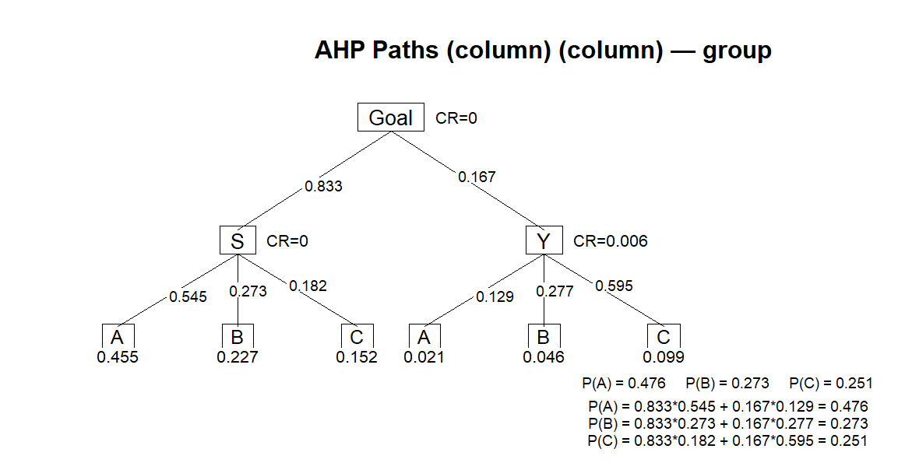
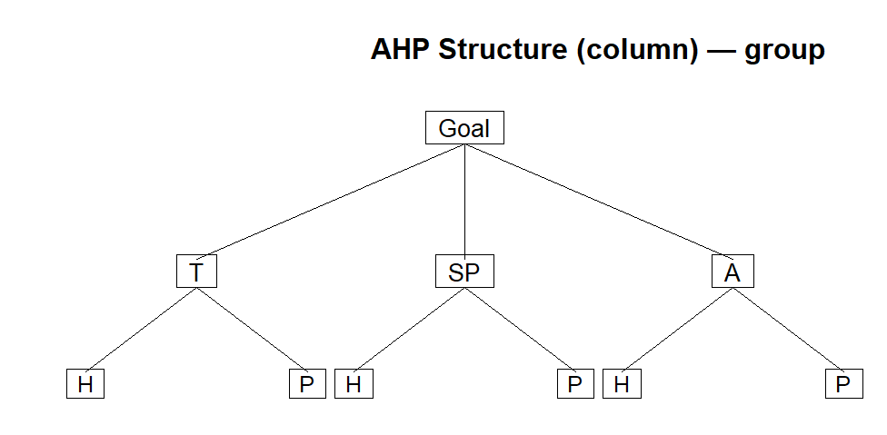
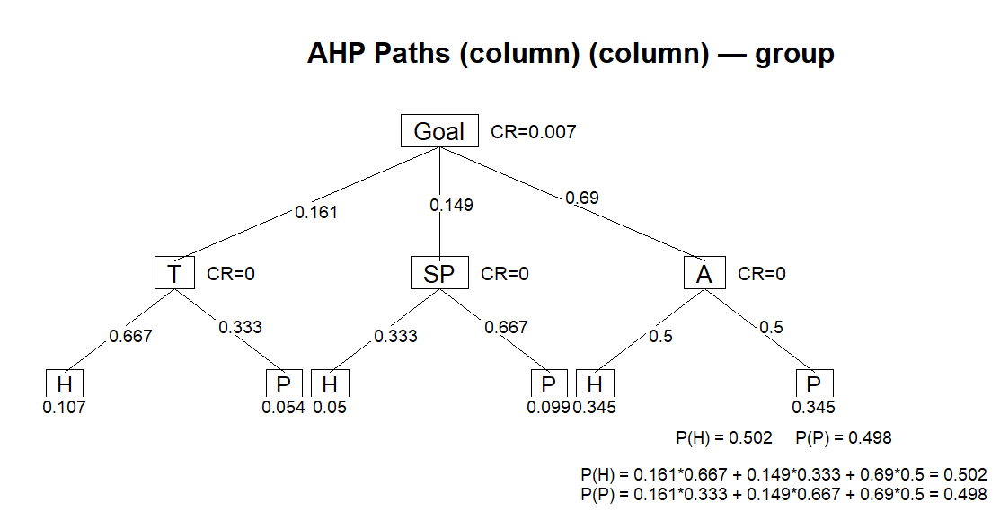
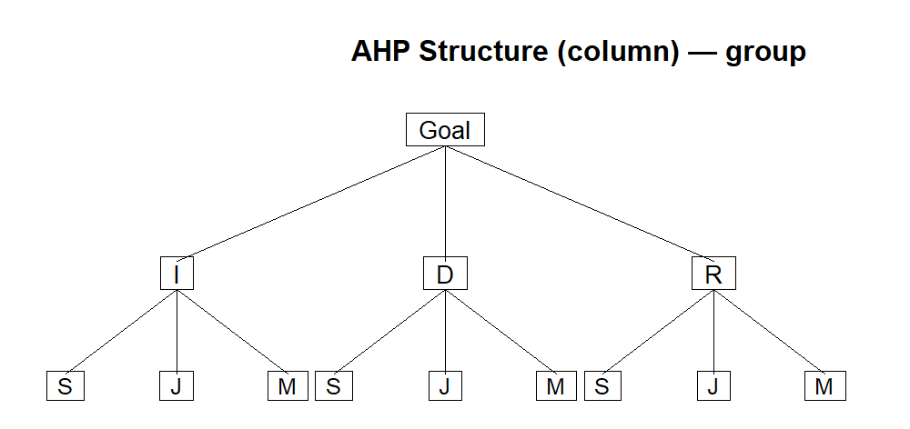
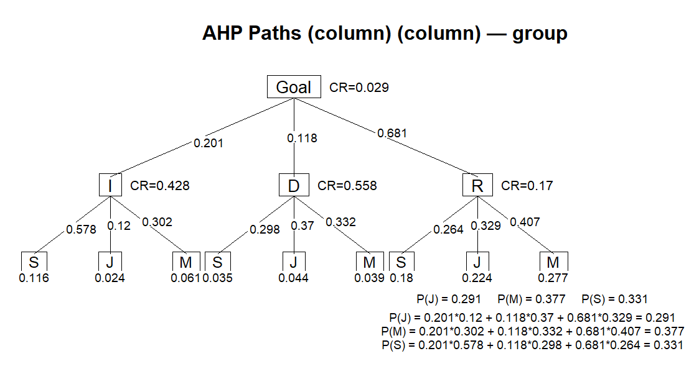
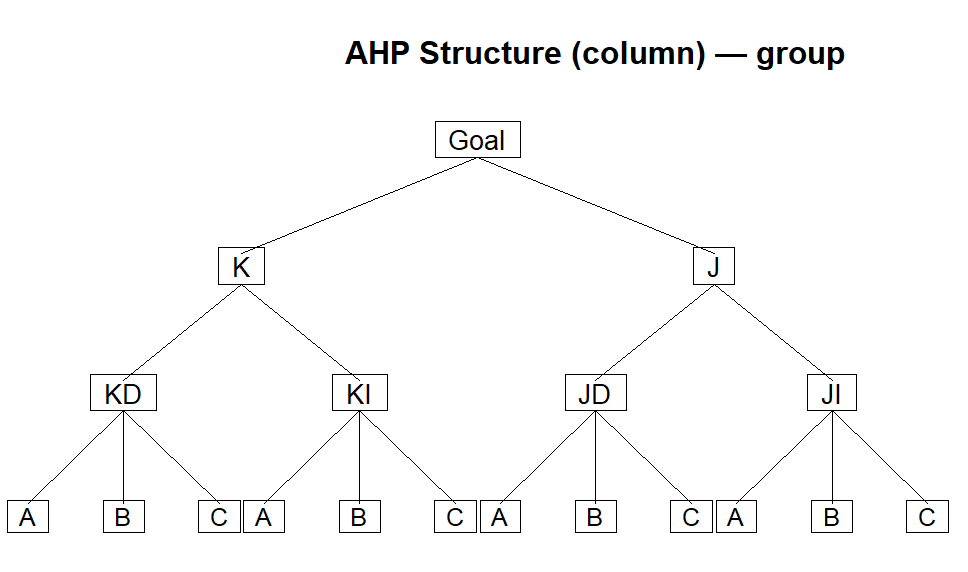
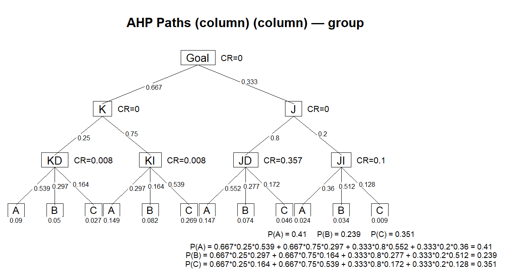

## Karar Kuramı

::: {.callout-important icon=false title="Karar Kuramı" style="font-size: 115%;"}

* [Karar kuramı]{.light-red}, karar vericiye karar alma ve karar sürecini geliştirme konularında yol gösteren bir yaklaşımdır. 
* Söz konusu yaklaşım, karar verilecek duruma ilişkin bilgi miktarına göre [üç]{.light-red} başlık altında incelenir.
  * [Belirlilik]{.light-red} durumunda karar alma
  * [Risk]{.light-red} durumunda karar alma
  * [Belirsizlik]{.light-red} durumunda karar alma
:::

## Belirlilik durumunda karar alma

::: {.callout-important icon=false title="Belirlilik durumunda karar alma" style="font-size: 100%;"}

* Belirlilik durumunda karar almada, karar vericinin aralarından seçim yapacağı karar seçeneklerine ilişkin [sonuç değerleri]{.light-red} ile olayın yapısı hakkındaki [bilgisinin]{.light-red} [eksiksiz]{.light-red} olduğu varsayılır. 
* Doğal olarak [en iyi sonucu]{.light-red} verecek olan alternatif seçilir. 
* [Doğrusal programlama]{.light-red} belirlilik durumunda karar alma probleminin bir [örneğidir]{.light-red}.
* [Örnek:]{.light-red} Bunun için beslenme gereksinmemizi [en düşük maliyetle]{.light-red} karşılayacak besin maddeleri miktarlarını belirlemek istediğimizi düşünelim. 
  * Besin maddelerinin birim maliyetleri [($C_j$)]{.light-red} [sabit sayılar]{.light-red} olsun. 
  * [$j$]{.light-red} ürünü tüketim miktarı [$x_j$]{.light-red}, değeri bilinen bir [sabit sayı]{.light-red} olarak kabul edildiğinde, [$j$]{.light-red} ürününün maliyete olan katkısı [$C_j \cdot x_j$]{.light-red} de [sabit bir sayı]{.light-red} olur.
  * Tüm [$C_j \cdot x_j$]{.light-red} kombinasyonları kıyaslanarak [en düşük olan]{.light-red} seçilir.
:::

## Risk durumunda karar alma

::: {.callout-important icon=false title="Risk durumunda karar alma" style="font-size: 90%;"}

* [Risk durumunda]{.light-red} problemin seçeneklerine ilişkin değerler ve olayın yapısı [olasılıklar]{.light-red} ile açıklanırken, [belirsizlik]{.light-red} durumunda sonuç değerleri bir ölçüde bilinse de olayın yapısına ilişkin [olasılıklar hakkında hiçbir bilgi edinilememektedir]{.light-red}. 
* Özetle, [belirlilik]{.light-red} ve [belirsizlik]{.light-red} verilerle ilgili bilgi derecesi bakımından [iki aşırı ucu]{.light-red} temsil ederken, [risk]{.light-red} bu iki uç [arasında]{.light-red} bulunur.
* [Örnek:]{.light-red} Risk ve belirsizlik durumlarını açıklamak için beslenme problemi örneğine dönelim. 
  * [Risk durumunda]{.light-red} maliyet katsayısı [$C_j$]{.light-red} sabit sayı olma özelliğini yitirir ve kesin değeri bilinmeyen ancak, istendiğinde değeri ilgili [olasılık yoğunluk fonksiyonu]{.light-red} cinsinden açıklanabilen bir [rasgele değişken]{.light-red} olur. 
  * Buna göre [$C_j$]{.light-red}, olasılık yoğunluk fonksiyonu [$f(C_j)$]{.light-red} ile gösterilen bir [rasgele değişken]{.light-red} olarak tanımlanabilir. 
  * Bu durumda, kendisine ait bir olasılık yoğunluk fonksiyonu tanımlanmaksızın, [$C_j$]{.light-red} hakkında konuşmak fazla anlamlı olmaz. 
  * Bunun sonucunda, [$x_j$]{.light-red}’nin belirli bir değeri için [$j$]{.light-red}’inci değişkenin kara olan katkısı [$C_j \cdot x_j$]{.light-red}’de kesin değeri bilinmeyen bir rasgele değişken olur.
:::

## Belirsizlik durumunda karar alma

::: {.callout-important icon=false title="Belirsizlik durumunda karar alma" style="font-size: 115%;"}

* Belirsizlik durumunda ise, [$f(C_j)$]{.light-red} olasılık yoğunluk fonksiyonu [bilinmez]{.light-red} veya [belirlenemez]{.light-red}. 
* Ancak, bu konudaki bilgi eksikliği problem hakkında [hiçbir bilgi yoktur şeklinde yorumlanmamalıdır]{.light-red}. 
* Sözgelimi, karar verici [$C_j$]{.light-red}’nin değerlerinden birine [eşit olduğunu bilebilir]{.light-red} ancak, bu bilgi duruma ilişkin [olasılıkların belirlenmesinde yetersiz kalır]{.light-red}. 
* Bu durum [belirsizlik ortamında karar alma]{.light-red} durumudur. 
* Karar probleminin nasıl formüle edileceği ve çözüleceği doğrudan doğruya karar verenin problemin bileşenleri hakkındaki [bilgi derecesine]{.light-red} bağlıdır.
:::

## Karar Alma Ölçütleri

::: {.callout-important icon=false title="Karar Alma Ölçütleri" style="font-size: 115%;"}

* [Belirlilik durumunda]{.light-red} evrensel biçimde kabul görmüş karar alma ölçütü, [kârın en büyüklenmesi]{.light-red} veya [maliyetin en küçüklenmesi]{.light-red} iken, [belirsizlik]{.light-red} ve [risk]{.light-red} durumlarında karar almada [değişik ölçütler]{.light-red} söz konusu olur. 
* Sözgelimi, [risk ortamında karar almada ortalama (beklenen) kârın en büyüklenmesi]{.light-red} karar ölçütü olarak kabul edilebilirse de bu ölçüt [bütün durumlar için uygun olmayabilir]{.light-red}.
:::

## Karar Analizinin Temel Adımları

::: {.callout-important icon=false title="Karar Analizinin Temel Adımları" style="font-size: 115%;"}

* [Sorunun tanımlanması]{.light-red}
* [Tüm olası seçeneklerin listelenmesi]{.light-red}
* Karar Verici’nin kontrolunda olmayan / doğanın sunduğu [tüm olası olayların listelenmesi]{.light-red}
* Her seçeneğin her olay için elde edeceği sonuçları gösteren [karar tablosunun oluşturulması]{.light-red}.
* Bir [karar modelinin seçilmesi]{.light-red} (doğa durumuna göre)
* Modelin uygulanması ve bir seçeneğin seçilerek [karar verilmesi]{.light-red}.
:::

## Karar Problemi

::: {.callout-important icon=false title="Karar Problemi" style="font-size: 130%;"}

* [Birden fazla olay]{.light-red} ve [birden fazla karar seçeneğinin]{.light-red} (eylem biçimi, strateji) bulunması, sistemin [davranış ölçeğinin]{.light-red} her bir stratejiye göre [farklı değer alması]{.light-red} ve bu [değerlerin bilinmemesi]{.light-red} durumundaki bir probleme [karar problemi]{.light-red} denir.
:::

## Karar Probleminin Ortak Özellikleri

::: {.callout-important icon=false title="Karar Probleminin Ortak Özellikleri" style="font-size: 95%;"}

* [Karar Verici:]{.light-red} Sisteme amacına göre [hedefler koyan]{.light-red}, bu hedeflere ulaşmak için [amaçlar]{.light-red}, [stratejiler]{.light-red} ve [taktikler]{.light-red} tanımlayan, bu tanımlar uyarınca sistemin davranışlarını [planlayan]{.light-red}, [örgütleyen]{.light-red}, [denetleyen]{.light-red}, sapmalar karşısında gerekli [düzenlemeyi]{.light-red} yapan [birey]{.light-red} ya da [topluluğa]{.light-red} [karar verici]{.light-red} denir.
* [Strateji (Eylem Biçimi):]{.light-red} Karar vericinin [amaç]{.light-red} veya [amaçlarına ulaşmasını sağlayacak değişik yollar]{.light-red} veya [hareket tarzlarının]{.light-red} her birine [strateji]{.light-red} veya [eylem biçimi]{.light-red} denir. Stratejilerin belirlenmesi ve tanımlanması [karar vericinin]{.light-red} en önemli görevlerindendir. Stratejiler karar vericinin [kontrolünde olan faktörlerdir]{.light-red}.
* [Olay (Doğal Durum):]{.light-red} Karar vericinin [davranışını etkileyen]{.light-red} ve alabileceği değerlerde [karar vericinin hiçbir etkisi olmayan]{.light-red} faktörlerdir. Olaylar, karar vericinin içinde bulunduğu karar ortamını oluştururlar. [Sayıları ne olursa olsun]{.light-red} gelecekte yalnızca [bir olayın gerçekleşeceği]{.light-red} unutulmamalıdır.
* [Sonuç:]{.light-red} Her bir [strateji]{.light-red} ve [olay bileşimi]{.light-red} sonucu ortaya çıkan [değerdir]{.light-red}. Sonuç değerlerine [ödeme]{.light-red}, [yarar]{.light-red} veya [kayıp]{.light-red} denir ve bunlar genellikle [parasal değer]{.light-red} cinsinden açıklanır

:::

## Belirlilik Altında Karar Verme - Analitik Hiyerarşi Yaklaşımı

::: {.callout-important icon=false title="Belirlilik Altında Karar Verme - Analitik Hiyerarşi Yaklaşımı" style="font-size: 95%;"}

* [Analitik Hiyerarşi Süreci (AHP)]{.light-red}, 1970’lerde [Thomas L. Saaty]{.light-red} tarafından geliştirilen ve [çok kriterli karar verme]{.light-red} problemlerinde kullanılan bir yöntemdir. 
* [AHP]{.light-red}, karmaşık kararları [hiyerarşik bir yapıya]{.light-red} dönüştürerek karar vericinin [hem nicel hem de nitel]{.light-red} yargılarını sistematik biçimde değerlendirmesini sağlar. 
* Süreç, [karar hedefinin]{.light-red} en üstte yer aldığı bir hiyerarşi oluşturulmasıyla başlar; ardından [kriterler]{.light-red}, [alt kriterler]{.light-red} ve [alternatifler]{.light-red} belirlenir. 
* Karar verici, [ikili karşılaştırmalar]{.light-red} aracılığıyla her seviyedeki öğelerin [göreli önemini]{.light-red} değerlendirir. 
* Elde edilen [karşılaştırma matrislerinden]{.light-red} özvektör yöntemiyle [ağırlıklar]{.light-red} hesaplanır ve [tutarlılık oranı (CR)]{.light-red} analiziyle [yargıların tutarlılığı]{.light-red} kontrol edilir. 
* Böylece [AHP]{.light-red}, [öznel]{.light-red} yargılara dayalı kararları [matematiksel temele]{.light-red} oturtarak en [uygun alternatifi seçmede]{.light-red} güçlü ve esnek bir yöntem sunar.

:::

## Örnek 1: Üniversite Tercihi - Basit Versiyon (1)

::: {.callout-tip icon=false title="Örnek 1: Üniversite Tercihi - Basit Versiyon (1)" style="font-size: 95%;"}

::: columns

::: {.column width="60%"}

:::{.fragment fragment-index=1}
* Başarılı bir öğrenci olan Zeki [üç]{.light-blue} üniversiteden akademik burs kazanmıştır: [A]{.light-red} üniversitesi, [B]{.light-red} üniversitesi ve [C]{.light-red} üniversitesi. 
:::

:::{.fragment fragment-index=2}
* Bir üniversiteyi seçmek için Zeki iki kriter belirler: [üniversitenin yeri]{.light-red} ve [akademik saygınlık]{.light-red}.
:::

:::{.fragment fragment-index=3}
* Mükemmel bir öğrenci olarak, akademik saygınlığa üniversitenin yerinden [5]{.light-blue} kat fazla önem verip ağırlıkları [%83]{.light-blue} [akademik saygınlık]{.light-red}, [%17]{.light-blue} [üniversitenin yeri]{.light-red} olarak belirler. 
:::

:::{.fragment fragment-index=4}
* Sonra bu üç üniversiteyi yer ve akademik saygınlık açısından derecelendirmek için [sistematik analizi]{.light-red} kullanır [(daha sonra anlatılacaktır)]{.orange}.
:::

:::

::: {.column width="1%"}
:::

::: {.column width="39%"}

:::{.fragment fragment-index=5}
Zeki yaptığı analiz sonucunda,
:::

:::{.fragment fragment-index=6}
* [Yer:]{.red} [A]{.light-red} üni. [(%12.9)]{.light-blue}, [B]{.light-red} üni. [(%27.7)]{.light-blue} ve [C]{.light-red} üni. [(%59.4)]{.light-blue}
* [Saygınlık:]{.red} [A]{.light-red} üni. [(%54.5)]{.light-blue}, [B]{.light-red} üni. [(%27.3)]{.light-blue} ve [C]{.light-red} üni. [(%18.2)]{.light-blue}

olarak belirlemiştir.
:::

:::{.fragment fragment-index=7}
Problem [iki]{.light-blue} [kriter]{.light-red} ([yer]{.light-red} ve [saygınlık]{.light-red}) ve [üç]{.light-blue} [karar]{.light-red} alternatifiyle ([A]{.light-red}, [B]{.light-red} ve [C]{.light-red} üniversiteleri) işlenen [tek]{.light-blue} [hiyerarşiyle]{.light-red} ilgilenmektedir.
:::

:::{.fragment fragment-index=8}
[Zeki bu durumda hangi üniversiteyi seçmelidir?]{.red}
:::

:::
:::

:::

## Örnek 1: Üniversite Tercihi - Basit Versiyon (2)

::: {.callout-tip icon=false title="Örnek 1: Üniversite Tercihi - Basit Versiyon (2)" style="font-size: 95%;"}

::: columns

::: {.column width="90%"}

:::{.fragment fragment-index=1}
Bu [üç]{.light-blue} üniversitenin derecelenmesi her bir üniversite için [birleşik bir ağırlığın]{.light-red} hesaplanmasına dayanır.
:::

:::{.fragment fragment-index=2}
* [A üniversitesi]{.light-red} = [$0.167 \times 0.129 + 0.833 \times 0.545 = 0.476$]{.light-blue}
:::

:::{.fragment fragment-index=3}
* [B üniversitesi]{.light-red} = [$0.167 \times 0.277 + 0.833 \times 0.273 = 0.273$]{.light-blue}
:::

:::{.fragment fragment-index=4}
* [C üniversitesi]{.light-red} = [$0.167 \times 0.595 + 0.833 \times 0.182 = 0.251$]{.light-blue}
:::

:::{.fragment fragment-index=5}
Bu hesaplara göre [A üniversitesi]{.red} [en yüksek birleşik ağırlıkla]{.light-red} ([$0.476$]{.light-blue}) Zeki için [en uygun tercih]{.red} olacaktır.
:::

:::

:::

::: {.column width="1%"}
:::

::: {.column width="9%"}

:::
:::

## Örnek 1: Üniversite Tercihi - Basit Versiyon (3)

::: {.callout-tip icon=false title="Örnek 1: Üniversite Tercihi - Basit Versiyon (2)" style="font-size: 95%;"}
{width=1000 height=500}

:::

## Analitik Hiyerarşi Yaklaşımı - Ağırlıkların Belirlenmesi (1)

::: {.callout-important icon=false title="Analitik Hiyerarşi Yaklaşımı - Ağırlıkların Belirlenmesi (1)" style="font-size: 100%;"}

* AHP'nin püf noktası, karar alternatiflerinin derecelendiği [göreceli ağırlıkların]{.light-red} belirlenmesidir. 
* Bir önceki örnekte [göreceli ağırlıklar]{.light-red}, [$0.129$]{.light-blue}, [$0.277$]{.light-blue}, [$0.595$]{.light-blue}, [$0.545$]{.light-blue}, [$0.273$]{.light-blue} ve [$0.182$]{.light-blue} idi. 
* Bu değerler aşağıda bahsedilen yaklaşımla belirlenir.
  * Verilmiş olan bir hiyerarşide [$n$]{.light-red} adet kriterle ilgilendiğimizi varsayalım. 
  * Burada ilk adım, karar vericinin farklı kriterlerin göreceli önemini yorumlamasını yansıtan ve [$\mathbf{A}$]{.light-red} ile tanımlanan [$n \times n$]{.light-red} ikili [karşılaştırma matrisini]{.light-red} oluşturmaktır.
  * [İkili karşılaştırma]{.light-red}, [$i$]{.light-red} satırındaki [$(i = 1,2, \dots,n)$]{.light-red} kriterlerin [$n$]{.light-red} sütunla temsil edilen her bir kritere bağlı olarak derecelendirilmesiyle yapılır.
  * [$a_{ij}$]{.light-red}, [$\mathbf{A}$]{.light-red}'nın [$(i,j)$]{.light-red} elemanını tanımladığında, AHP [$1$]{.light-blue} ile [$9$]{.light-blue} arasında bir [ölçek]{.light-red} önerir.

:::

## Analitik Hiyerarşi Yaklaşımı - Ağırlıkların Belirlenmesi (2)

::: {.callout-important icon=false title="Analitik Hiyerarşi Yaklaşımı - Ağırlıkların Belirlenmesi (2)" style="font-size: 100%;"}

* Önerilen bu [ölçeğe]{.light-red} göre, 
    * [$a_{ij} = 1$]{.light-blue}, [$i$]{.light-red} ve [$j$]{.light-red} nin eşit önemde olduğunu, 
    * [$a_{ij} = 5$]{.light-blue}, [$i$]{.light-red}'nin [$j$]{.light-red}'den çok önemli olduğunu
    * [$a_{ij} = 9$]{.light-blue}, [$i$]{.light-red}'nin [$j$]{.light-red}'den kesinlikle çok önemli olduğunu yansıtır.
    * [$1$]{.light-blue} ile [$9$]{.light-blue} arasındaki diğer değerler ara değerler olarak yorumlanır. 
    * Tutarlılık için [$a_{ij} = k \Rightarrow a_{ji} = \frac{1}{k}$]{.light-red} olarak ifade edilmelidir.
    * Ayrıca [$\mathbf{A}$]{.light-red}'nın tüm diyagonal [$a_{ii}$]{.light-red} elemanları, kendilerine bağlı kriteri değerlendirdiği için [$1$]{.light-blue} olmalıdır.

:::

## Örnek 1: Üniversite Tercihi - Ağırlıkların Belirlenmesi (1)

::: {.callout-tip icon=false title="Örnek 1: Üniversite Tercihi - Ağırlıkların Belirlenmesi (1)" style="font-size: 95%;"}

::: columns

::: {.column width="50%"}

:::{.fragment fragment-index=1}
Zeki'nin karar problemi için belirlenen [$\mathbf{A}$]{.light-red} karar matrisini gösterelim.
:::

:::{.fragment fragment-index=2}
Zeki bir üniversitenin [saygınlığının (S) yerine (Y)]{.light-red} göre [çok daha önemli olacağını]{.orange} belirttiği için [$\mathbf{A}$]{.light-red} karar matrisinde [saygınlığın yere]{.light-red} göre önemi [$5$]{.light-blue} olacak iken, [yerin saygınlığa]{.light-red} göre önemi ise [bu değerin tersi]{.light-red} olan [$\frac{1}{5}$]{.light-blue} olacaktır.
:::

:::{.fragment fragment-index=3}
[$$
\mathbf{A} = \left[\begin{array}{c|cc}
 & \text{S} & \text{Y} \\
\hline
\text{S} & 1 & 5 \\
\text{Y} & \frac{1}{5} & 1
\end{array}\right]$$]{.light-blue}
:::

:::

::: {.column width="1%"}
:::

::: {.column width="49%"}

:::{.fragment fragment-index=4}
[S]{.light-red} ve [Y]{.light-red}'nin göreceli ağırlıkları [her bir sütunun elemanlarını aynı sütunun elemanlarının toplamına bölerek]{.red} [$\mathbf{A}$]{.light-red}'dan bulunur.
:::

:::{.fragment fragment-index=5}
Böylece [1.]{.light-red} sütunun elemanlarını [$(1+\frac{1}{5}=1.2)$]{.light-blue}'ye, [2.]{.light-red} sütunun elemanlarını [$(5+1=6)$]{.light-blue}'ya bölerek normalleştiririz. 
:::

:::{.fragment fragment-index=6}

[$$
\mathbf{N} = \left[\begin{array}{c|cc}
 & \text{S} & \text{Y} \\
\hline
\text{S} & 0.833 & 0.833 \\
\text{Y} & 0.167 & 0.167
\end{array}\right]
$$]{.light-blue}

:::

:::{.fragment fragment-index=6}

[$n_{11} = \frac{1}{1.2}=0.833$]{.light-blue}, [$n_{21} = \frac{\frac{1}{5}}{1.2}=0.167$]{.light-blue}, [$n_{12} = \frac{5}{6}=0.833$]{.light-blue} ve [$n_{22} = \frac{1}{6}=0.167$]{.light-blue}

:::

:::
:::

:::

## Örnek 1: Üniversite Tercihi - Ağırlıkların Belirlenmesi (2)

::: {.callout-tip icon=false title="Örnek 1: Üniversite Tercihi - Ağırlıkların Belirlenmesi (2)" style="font-size: 95%;"}

::: columns

::: {.column width="50%"}

:::{.fragment fragment-index=1}

[$$
\mathbf{N} = \left[\begin{array}{c|cc}
 & \text{S} & \text{Y} \\
\hline
\text{S} & 0.833 & 0.833 \\
\text{Y} & 0.167 & 0.167
\end{array}\right]
$$]{.light-blue}

:::

:::{.fragment fragment-index=2}

[$\mathbf{N}$]{.light-red} belirlendikten sonra, istenen göreceli ağırlıklar [$w_S$]{.light-red} ve [$w_Y$]{.light-red} [normalleştirilen matrisin satır ortalaması]{.red} olarak bulunur. 
:::

:::{.fragment fragment-index=3}

[Satır ortalamaları:]{.light-red}

[$w_S = \frac{0.833+0.833}{2}= 0.833$]{.light-blue}
[$w_Y = \frac{0.167+0.167}{2}= 0.167$]{.light-blue}

olarak bulunur. 
:::

:::

::: {.column width="1%"}
:::

::: {.column width="49%"}

:::{.fragment fragment-index=4}

Satır ortalamaları bir matris şeklinde

[$$w = \begin{bmatrix}0.833 & 0.167\end{bmatrix}^T$$]{.light-blue}

şeklinde de gösterilebilir.

:::

:::{.fragment fragment-index=5}

Bu örnek için [$\mathbf{N}$]{.light-red}'nin sütunları özdeştir. Bu durum yalnıca karar vericinin, [$\mathbf{A}$]{.light-red} matrislerine girişlerde [mükemmel bir tutarlılık]{.light-red} sergilediğinde ortaya çıkar. [Bu noktaya daha sonra tekrar değinilecektir.]{.orange}

:::

:::
:::

:::

## Örnek 1: Üniversite Tercihi - Ağırlıkların Belirlenmesi (3)

::: {.callout-tip icon=false title="Örnek 1: Üniversite Tercihi - Ağırlıkların Belirlenmesi (3)" style="font-size: 80%;"}

::: columns

::: {.column width="50%"}

:::{.fragment fragment-index=1}

Ağırlıkların sadece değerlendirme kriterleri için belirlenmesi yeterli değildir. [Her bir kriter]{.light-red} için [her bir alternatifin]{.light-red} de birbiriyle karşılaştırıldığı [matrislere]{.light-red} ihtiyaç vardır.
:::

:::{.fragment fragment-index=2}

[A]{.light-red}, [B]{.light-red} ve [C]{.light-red} üniversitesi alternatiflerinin göreceli ağırlıkları aşağıdaki [karşılaştırma matrisleri]{.light-red} kullanılarak [$S$]{.light-red} ve [$Y$]{.light-red} kriterleri içerisinde belirlenir.
:::

:::{.fragment fragment-index=3}
Örneğin, Zeki her bir [üniversite seçeneği]{.light-red} için [Saygınlık (S)]{.light-red} kriteri için aşağıdaki [karşılaştıma matrisini]{.light-red} oluşturmuş olsun.
:::

:::{.fragment fragment-index=4}
[$$A_S = \left[\begin{array}{c|ccc}
 & \text{A} & \text{B} & \text{C} \\
\hline
\text{A} & 1 & 2 & 3 \\
\text{B} & 0.5 & 1 & 1.5 \\
\text{C} & 0.333 & 0.667 & 1
\end{array}\right] $$]{.light-blue}
:::

:::{.fragment fragment-index=5}
Bu matris [saygınlık]{.light-red} açısından [A]{.light-red}'nın [B]{.light-red}'den ([$2$]{.light-blue}); [A]{.light-red}'nın [C]{.light-red}'den ([$3$]{.light-blue}) ve [B]{.light-red}'nin [C]{.light-red}'den ([$1.5$]{.light-blue}) [daha önemli]{.red} olduğunu belirtmektedir.
:::

:::

::: {.column width="1%"}
:::

::: {.column width="49%"}

:::{.fragment fragment-index=6}
[Sütun toplamları =]{.light-red} [$[1.833, 3.667, 5.5]$]{.light-blue}
:::

:::{.fragment fragment-index=7}
[$$N_S = \left[\begin{array}{c|ccc}
 & \text{A} & \text{B} & \text{C} \\
\hline
\text{A} & 0.545 & 0.545 & 0.545 \\
\text{B} & 0.273 & 0.273 & 0.273 \\
\text{C} & 0.182 & 0.182 & 0.182
\end{array}\right]$$]{.light-blue}
:::

:::{.fragment fragment-index=8}
[Satır ortalamaları:]{.light-red}

[$w_{SA} = \frac{0.545+0.545+0.545}{3}= 0.545$]{.light-blue}
[$w_{SB} = \frac{0.273+0.273+0.273}{3}= 0.273$]{.light-blue}
[$w_{SC} = \frac{0.182+0.182+0.182}{3}= 0.182$]{.light-blue}

olarak hesaplanır. 
:::

:::{.fragment fragment-index=9}
Satır ortalamaları matris şeklinde [$w_S = \begin{bmatrix}0.545 & 0.273 & 0.182 \end{bmatrix}^T$]{.light-blue} gösterilir.

:::

:::{.fragment fragment-index=10}
Bu üç değer sırasıyla [A]{.light-red}, [B]{.light-red} ve [C]{.light-red} üniversitelerinin [akademik saygınlık]{.light-red} açısından [ağırlıklarını]{.light-red} verir.
:::

:::
:::

:::

## Örnek 1: Üniversite Tercihi - Ağırlıkların Belirlenmesi (4)

::: {.callout-tip icon=false title="Örnek 1: Üniversite Tercihi - Ağırlıkların Belirlenmesi (4)" style="font-size: 80%;"}

::: columns

::: {.column width="50%"}

:::{.fragment fragment-index=1}
Aynı işlem bu kez akademik saygınlık yerine, üniversitenin [yeri]{.light-red} için yapılmalıdır.
:::

:::{.fragment fragment-index=2}
Zeki bu kez her bir [üniversite seçeneği]{.light-red} için [Yer (Y)]{.light-red} kriteri için aşağıdaki [karşılaştıma matrisini]{.light-red} oluşturmuş olsun.
:::

:::{.fragment fragment-index=3}

:::

:::{.fragment fragment-index=4}
[$$A_Y = \left[\begin{array}{c|ccc}
 & \text{A} & \text{B} & \text{C} \\
\hline
\text{A} & 1 & 0.5 & 0.2 \\
\text{B} & 2 & 1 & 0.5 \\
\text{C} & 5 & 2 & 1
\end{array}\right]$$]{.light-blue}
:::

:::{.fragment fragment-index=5}
Bu matris [yer]{.light-red} açısından [A]{.light-red}'nın [B]{.light-red}'den ([$0.5$]{.light-blue}); [A]{.light-red}'nın [C]{.light-red}'den ([$0.2$]{.light-blue}) ve [B]{.light-red}'nin [C]{.light-red}'den ([$0.5$]{.light-blue}) [daha kötü konumda]{.red} olduğunu belirtmektedir.
:::

:::{.fragment fragment-index=6}
[Sütun toplamları =]{.light-red} [$[8, 3.5, 1.7]$]{.light-blue}
:::

:::

::: {.column width="1%"}
:::

::: {.column width="49%"}

:::{.fragment fragment-index=7}
[$$N_Y = \left[\begin{array}{c|ccc}
 & \text{A} & \text{B} & \text{C} \\
\hline
\text{A} & 0.125 & 0.143 & 0.118 \\
\text{B} & 0.25 & 0.286 & 0.294 \\
\text{C} & 0.625 & 0.571 & 0.588
\end{array}\right]$$]{.light-blue}
:::

:::{.fragment fragment-index=8}
[Satır ortalamaları:]{.light-red}

[$w_{YA} = \frac{0.125+0.143+0.118}{3}= 0.129$]{.light-blue}
[$w_{YB} = \frac{0.25+0.286+0.294}{3}= 0.277$]{.light-blue}
[$w_{YC} = \frac{0.625+0.571+0.588}{3}= 0.595$]{.light-blue}
:::

:::{.fragment fragment-index=9}
Satır ortalamaları matris şeklinde [$w_Y = \begin{bmatrix}0.129 & 0.277 & 0.595 \end{bmatrix}^T$]{.light-blue} gösterilir.

:::

:::{.fragment fragment-index=10}
Bu üç değer sırasıyla [A]{.light-red}, [B]{.light-red} ve [C]{.light-red} üniversitelerinin [yer]{.light-red} açısından [ağırlıklarını]{.light-red} verir.
:::

:::{.fragment fragment-index=11}
Dikkat ederseniz [$N$]{.light-red} ve [$N_S$]{.light-red} nin tüm sütunları [özdeş iken]{.red} [$N_Y$]{.light-red} nin sütunları [özdeş değildir]{.red}. [Şimdi bunun ne anlama geldiğini öğrenelim.]{.orange}
:::

:::
:::

:::

## Örnek 1: Üniversite Tercihi - Ağırlıkların Belirlenmesi (5)

::: {.callout-tip icon=false title="Örnek 1: Üniversite Tercihi - Ağırlıkların Belirlenmesi (5)" style="font-size: 95%;"}
{width=1000 height=500}

:::

## Analitik Hiyerarşi Yaklaşımı - Karşılaştırma Matrisinin Tutarlılığı (1)

::: {.callout-important icon=false title="Analitik Hiyerarşi Yaklaşımı - Karşılaştırma Matrisinin Tutarlılığı (1)" style="font-size: 95%;"}

:::{.fragment fragment-index=1}
[$N$]{.light-red} ve [$N_S$]{.light-red} nin tüm sütunları [özdeş iken]{.red} [$N_Y$]{.light-red} nin sütunlarının [özdeş olmadığından]{.red} bahsetmiştik. 
:::

:::{.fragment fragment-index=2}
[Özdeş sütunlar]{.light-red} karşılaştırmanın nasıl yapıldığına [bakılmaksızın]{.light-red} elde edilen [göreceli ağırlıkların aynı]{.light-red} olduğunu göstermektedir.
:::

:::{.fragment fragment-index=3}
Bu orijinal [$A$]{.light-red} ve [$A_S$]{.light-red} karşılaştırma matrislerinin [tutarlı]{.light-red} olduğuna işaret ederken, [$A_Y$]{.light-red} matrisi [tutarlı değildir]{.light-red}.
:::

:::{.fragment fragment-index=4}
[Tüm]{.light-red} karşılaştırma matrislerinin tutarlı olması zordur. Açıkçası, bu matrislerin temel yapısını insan yargısı oluşturur ve [bir dereceye kadar tutarsızlık beklenebilir]{.light-red}.
:::

:::{.fragment fragment-index=5}
Önemli olan bu tutarsızlığın [mantıksız]{.light-red} diye değerlendirilmeyecek şekilde [tölere edilebilmesini]{.light-red} sağlamaktır.
:::

:::{.fragment fragment-index=6}
Bir tutarsızlık söz konusu ise bunun [kabul edilebilir]{.light-red} düzeyde olup olmadığını belirlemek için [A]{.light-red} karşılaştırma matrisi için [objektif bir ölçüt]{.light-red} geliştirmek gerekir.
:::
:::

## Analitik Hiyerarşi Yaklaşımı - Karşılaştırma Matrisinin Tutarlılığı (2)

::: {.callout-important icon=false title="Analitik Hiyerarşi Yaklaşımı - Karşılaştırma Matrisinin Tutarlılığı (2)" style="font-size: 85%;"}

::: columns

::: {.column width="50%"}

:::{.fragment fragment-index=1}
[AHP tutarlılık oranı]{.red}

[$$CR = \frac{CI}{RI}$$]{.light-red}
şeklinde hesaplanır.
:::

:::{.fragment fragment-index=2}
Burada, [$CI$]{.light-red}, [$A$]{.light-red} nın [tutarlılık indeksini]{.light-red} göstermekte ve 

[$$CI = \frac{n_{maks}-n}{n-1}$$]{.light-red}

ile hesaplanmaktadır.
:::

:::{.fragment fragment-index=3}
Formülde [$n$]{.light-red}, [$A$]{.light-red} matrisinin [satır sayısı]{.light-red} iken, [$n_{maks}$]{.light-red}, [$A \overline{w}$]{.light-red} matrislerinin çarpımı sonucunda elde edilen [sütun vektörünun elemanlarının toplanmasıyla]{.light-red} bulunur. 
:::

:::

::: {.column width="1%"}
:::

::: {.column width="49%"}

:::{.fragment fragment-index=4}
[$RI$]{.light-red}, [$A$]{.light-red} nın [rastgele tutarlılık indeksi]{.light-red} olarak tanımlanır ve 

[$$RI = \frac{1.98 (n-2)}{n}$$]{.light-red}

formülüyle hesaplanır.
:::

:::{.fragment fragment-index=5}
Eğer [$CR \leq 0.1$]{.light-red} ise tutarsızlık düzeyi kabul edilebilir. Aksi taktirde [$A$]{.light-red} karşılaştırma matrisinde [tutarsızlık yüksektir]{.light-red}. Matris elemanları kontrol edilmelidir.
:::

:::
:::
:::

## Örnek 1: Üniversite Tercihi - Tutarlılığın Kontrolü

::: {.callout-tip icon=false title="Örnek 1: Üniversite Tercihi - Tutarlılığın Kontrolü" style="font-size: 90%;"}

::: columns

::: {.column width="50%"}

:::{.fragment fragment-index=1}
[$A_Y$]{.light-red} matrisi [$N_Y$]{.light-red} matrisinin [sütunları özdeş olmadığı]{.light-red} için [tutarsızdır]{.light-red}. [Tutarsızlığın kabul edilebilir ölçülerde olup olmadığını belirleyelim.]{.red}
:::

:::{.fragment fragment-index=2}

İşleme [$n_{maks}$]{.light-red} ı bularak başlayalım. 

[$$A_Y \cdot \overline{w}_Y = \left[\begin{array}{ccc}
1 & \frac{1}{2} & \frac{1}{5} \\
2 & 1 & \frac{1}{2} \\
5 & 2 & 1
\end{array}\right] \cdot \left[\begin{array}{c}
0.129\\
0.277\\
0.595\end{array}\right] = \left[\begin{array}{c}
0.386\\
0.831\\
1.791\end{array}\right]$$]{.light-blue}
:::

:::{.fragment fragment-index=3}
[$$n_{maks} = 0.386 + 0.831 + 1.791 = 3.007$$]{.light-blue}
:::

:::

::: {.column width="1%"}
:::

::: {.column width="49%"}

:::{.fragment fragment-index=4}
[$n=3$]{.light-blue} olduğundan

[$$CI = \tfrac{n_{maks}-n}{n-1} = \tfrac{3.007 - 3}{2} = 0.004$$]{.light-blue}

:::

:::{.fragment fragment-index=5}
[$$RI = \tfrac{1.98(n-2)}{n} = \tfrac{1.98(3-2)}{3} = 0.66$$]{.light-blue}

:::

:::{.fragment fragment-index=6}
[$$CR = \tfrac{CI}{RI} = 0.006$$]{.light-blue}
:::

:::{.fragment fragment-index=7}
[$CR \leq 0.1$]{.light-blue} olduğundan [$A_Y$]{.light-red} nin [tutarsızlık düzeyi kabul edilebilir]{.light-red} seviyededir.
:::

:::
:::

:::

## Örnek 2: Yazar - Yayıncı Seçimi (1)

::: {.callout-tip icon=false title="Örnek 2: Yazar - Yayıncı Seçimi (1)" style="font-size: 90%;"}

::: columns

::: {.column width="50%"}

:::{.fragment fragment-index=1}
Bir yazar yeni bir Yöneylem Araştırması kitabı için yayımcı seçmek üzere [üç]{.light-red} kriter belirler.
:::

:::{.fragment fragment-index=2}
Yazara verilen [telif hakkı yüzdesi (T)]{.light-red}, [satış ve pazarlama (SP)]{.light-red} ve [avans ödemesi (A)]{.light-red}. 
:::

:::{.fragment fragment-index=3}
Kitapla ilgilendiği bilinen [iki]{.light-blue} yayımcı şirket [H]{.light-red} ve [P]{.light-red} dir.
:::

:::{.fragment fragment-index=4}
Yazar [karşılaştırma matrislerini]{.light-red} yanda verildiği şekilde oluşturduğuna göre, [H]{.light-red} ve [P]{.light-red} yayımcısından [hangisini tercih etmesi gerektiğini]{.red} ve kararın [tutarlılığının seviyesini]{.red} belirleyin.
:::

:::

::: {.column width="1%"}
:::

::: {.column width="49%"}

:::{.fragment fragment-index=5 style="font-size: 90%;"}
[$$A = \left[\begin{array}{c|ccc}
 & \text{T} & \text{SP} & \text{A} \\
\hline
\text{T} & 1 & 1 & 0.25 \\
\text{SP} & 1 & 1 & 0.2 \\
\text{A} & 4 & 5 & 1
\end{array}\right]$$]{.light-blue}
:::

:::{.fragment fragment-index=6 style="font-size: 90%;"}
[$$A_T= \left[\begin{array}{c|cc}
 & \text{H} & \text{P} \\
\hline
\text{H} & 1 & 2 \\
\text{P} & 0.5 & 1
\end{array}\right]$$]{.light-blue}
:::

:::{.fragment fragment-index=7 style="font-size: 90%;"}
[$$A_{SP} = \left[\begin{array}{c|cc}
 & \text{H} & \text{P} \\
\hline
\text{H} & 1 & 0.5 \\
\text{P} & 2 & 1
\end{array}\right]$$]{.light-blue}
:::

:::{.fragment fragment-index=8 style="font-size: 90%;"}
[$$A_{A} = \left[\begin{array}{c|cc}
 & \text{H} & \text{P} \\
\hline
\text{H} & 1 & 1 \\
\text{P} & 1 & 1
\end{array}\right]$$]{.light-blue}
:::

:::
:::

:::

## Örnek 2: Yazar - Yayıncı Seçimi (2)

::: {.callout-tip icon=false title="Örnek 2: Yazar - Yayıncı Seçimi (2)" style="font-size: 90%;"}
Öncelikle sorunun şemasını çizerek başlayalım.

{width=900 height=450}

:::

## Örnek 2: Yazar - Yayıncı Seçimi (3)

::: {.callout-tip icon=false title="Örnek 2: Yazar - Yayıncı Seçimi (3)" style="font-size: 80%;"}

::: columns

::: {.column width="30%"}

:::{.fragment fragment-index=1 style="font-size: 90%;"}
Tüm matrislerin elemanlarını, sütun toplamlarına bölerek normalize edilmiş hale getirelim.
:::

:::{.fragment fragment-index=2 style="font-size: 90%;"}
[$$N = \left[\begin{array}{c|ccc}
 & \text{T} & \text{SP} & \text{A} \\
\hline
\text{T} & 0.167 & 0.143 & 0.172 \\
\text{SP} & 0.167 & 0.143 & 0.138 \\
\text{A} & 0.667 & 0.714 & 0.69
\end{array}\right]$$]{.light-blue}
:::

:::{.fragment fragment-index=3 style="font-size: 90%;"}
[$$N_T = \left[\begin{array}{c|cc}
 & \text{H} & \text{P} \\
\hline
\text{H} & 0.667 & 0.667 \\
\text{P} & 0.333 & 0.333
\end{array}\right]$$]{.light-blue}
:::

:::{.fragment fragment-index=4 style="font-size: 90%;"}
[$$N_{SP} = \left[\begin{array}{c|cc}
 & \text{H} & \text{P} \\
\hline
\text{H} & 0.333 & 0.333 \\
\text{P} & 0.667 & 0.667
\end{array}\right]$$]{.light-blue}
:::

:::{.fragment fragment-index=5 style="font-size: 90%;"}
[$$N_A = \left[\begin{array}{c|cc}
 & \text{H} & \text{P} \\
\hline
\text{H} & 0.5 & 0.5 \\
\text{P} & 0.5 & 0.5
\end{array}\right]$$]{.light-blue}
:::

:::

::: {.column width="3%"}
:::

::: {.column width="31%"}

:::{.fragment fragment-index=6 style="font-size: 82%;"}
Satır ortalamalarını hesaplayarak her bir matris için göreceli ağırlıkları elde edelim.
:::

:::{.fragment fragment-index=7 style="font-size: 82%;"}
[$N$ matrisi için]{.red}
[$$w_{T} = \tfrac{1}{3}(0.167 + 0.143 + 0.172) = 0.161$$]{.light-blue}
[$$w_{SP} = \tfrac{1}{3}(0.167 + 0.143 + 0.138) = 0.149$$]{.light-blue}
[$$w_{A} = \tfrac{1}{3}(0.667 + 0.714 + 0.69) = 0.69$$]{.light-blue}
[$$w = \begin{bmatrix}0.161 & 0.149 & 0.69\end{bmatrix}^T$$]{.light-blue}
:::

:::{.fragment fragment-index=8 style="font-size: 82%;"}
[$N_T$ matrisi için]{.red}
[$$w_{T,H} = \tfrac{1}{2}(0.667 + 0.667) = 0.667$$]{.light-blue}
[$$w_{T,P} = \tfrac{1}{2}(0.333 + 0.333) = 0.333$$]{.light-blue}
[$$w_T = \begin{bmatrix}0.667 & 0.333\end{bmatrix}^T$$]{.light-blue}
:::

:::{.fragment fragment-index=12 style="font-size: 82%;"}
[$N_T$]{.light-red}, [$N_{SP}$]{.light-red} ve [$N_A$]{.light-red} matrislerinin sütunları [özdeş olduğundan tutarlılardır]{.red}. 

:::

:::

::: {.column width="5%"}
:::

::: {.column width="28%"}

:::{.fragment fragment-index=9 style="font-size: 82%;"}
Satır ortalamalarını hesaplayarak her bir matris için göreceli ağırlıkları elde edelim.
:::

:::{.fragment fragment-index=10 style="font-size: 82%;"}
[$N_{SP}$ matrisi için]{.red}
[$$w_{SP,H} = \tfrac{1}{2}(0.333 + 0.333) = 0.333$$]{.light-blue}
[$$w_{SP,P} = \tfrac{1}{2}(0.667 + 0.667) = 0.667$$]{.light-blue}
[$$w_{SP} = \begin{bmatrix}0.333 & 0.667\end{bmatrix}^T$$]{.light-blue}
:::

:::{.fragment fragment-index=11 style="font-size: 82%;"}
[$N_A$ matrisi için]{.red}
[$$w_{A,H} = \tfrac{1}{2}(0.5 + 0.5) = 0.5$$]{.light-blue}
[$$w_{A,P} = \tfrac{1}{2}(0.5 + 0.5) = 0.5$$]{.light-blue}
[$$w_A = \begin{bmatrix}0.5 & 0.5\end{bmatrix}^T$$]{.light-blue}
:::

:::{.fragment fragment-index=13 style="font-size: 82%;"}
[$N$]{.light-red} matrisinin sütunları [özdeş olmadığından tutarlı değildir]{.red}. [Tutarlılık derecesi araştırılmalıdır]{.orange}.
:::

:::

:::

:::

## Örnek 2: Yazar - Yayıncı Seçimi (4)

::: {.callout-tip icon=false title="Örnek 2: Yazar - Yayıncı Seçimi (4)" style="font-size: 90%;"}

::: columns

::: {.column width="50%"}

:::{.fragment fragment-index=1}
[$N_T$]{.light-red}, [$N_{SP}$]{.light-red} ve [$N_A$]{.light-red} matrisleri tutarlı olduklarından [$CR$]{.light-red} değerleri [$0$]{.light-blue} dır.

Sadece [$N$]{.light-red} matrisinin tutarlılığına bakılmalıdır.

:::

:::{.fragment fragment-index=2}
[$$A \cdot \overline{w} = \left[\begin{array}{ccc}
1 & 1 & 0.25 \\
1 & 1 & 0.2 \\
4 & 5 & 1
\end{array}\right] \cdot \left[\begin{array}{c}
0.161 \\ 
0.149 \\ 
0.69\end{array}\right] = 
\left[\begin{array}{c}
0.482 \\ 
0.448 \\ 
2.079\end{array}\right]$$]{.light-blue}
:::

:::{.fragment fragment-index=3}
[$$n_{maks} = 0.482 + 0.448 + 2.079 = 3.009$$]{.light-blue}
:::

:::

::: {.column width="1%"}
:::

::: {.column width="49%"}

:::{.fragment fragment-index=4}
[$n=3$]{.light-blue} olduğundan

[$$CI = \tfrac{\lambda_{\max}-n}{n-1} = \tfrac{3.009 - 3}{2} = 0.004$$]{.light-blue}

:::

:::{.fragment fragment-index=5}
[$$RI = \tfrac{1.98(n-2)}{n} = \tfrac{1.98(3-2)}{3} = 0.66$$]{.light-blue}

:::

:::{.fragment fragment-index=6}
[$$CR = \tfrac{CI}{RI} = 0.007$$]{.light-blue}
:::

:::{.fragment fragment-index=7}
[$CR \leq 0.1$]{.light-blue} olduğundan [$A$]{.light-red} nin [tutarsızlık düzeyi kabul edilebilir]{.light-red} seviyededir.
:::

:::
:::

:::

## Örnek 2: Yazar - Yayıncı Seçimi (5)

::: {.callout-tip icon=false title="Örnek 2: Yazar - Yayıncı Seçimi (5)" style="font-size: 90%;"}

::: columns

::: {.column width="90%"}

:::{.fragment fragment-index=1}
Son olarak hesaplanan ağırlıklar ile yazarın tercihini belirleyelim.

:::

:::{.fragment fragment-index=2}

[$$P(H) = w_T\cdot w_{T,H} + w_{SP}\cdot w_{SP,H} + w_A\cdot w_{A,H}$$]{.light-blue}
[$$P(H) = 0.161\cdot0.667 + 0.149\cdot0.333 + 0.69\cdot0.5 = 0.502$$]{.light-blue}
:::

:::{.fragment fragment-index=3}
[$$P(P) = w_T\cdot w_{T,P} + w_{SP}\cdot w_{SP,P} + w_A\cdot w_{A,P} $$]{.light-blue}
[$$P(P) = 0.161\cdot0.333 + 0.149\cdot0.667 + 0.69\cdot0.5 = 0.498$$]{.light-blue}
:::

:::{.fragment fragment-index=4}

[Çok küçük bir farkla da olsa ($\%50.2$) yazar $H$ yayınevini seçmelidir.]{.orange}

:::

:::

::: {.column width="1%"}
:::

::: {.column width="9%"}

:::{.fragment fragment-index=4}

:::

:::
:::

:::

## Örnek 2: Yazar - Yayıncı Seçimi (6)

::: {.callout-tip icon=false title="Örnek 2: Yazar - Yayıncı Seçimi (6)" style="font-size: 90%;"}
Son durumda şema aşağıdaki hale gelir.

{width=900 height=450}

:::

## Örnek 3: İşe Alım (1)

::: {.callout-tip icon=false title="Örnek 3: İşe Alım (1)" style="font-size: 90%;"}

::: columns

::: {.column width="50%"}

:::{.fragment fragment-index=1}
[$C\&H$]{.light-red} firmasının insan kaynakları departmanı muhtemel bir çalışan arayışını [üç]{.light-blue} adaya indirmiştir. [Sinan (S)]{.light-red}, [Jale (J)]{.light-red} ve [Melis (M)]{.light-red}. 
:::

:::{.fragment fragment-index=2}
Son seçim [üç]{.light-blue} kritere dayanmaktadır: [kişisel görüşme (I)]{.light-red}, [deneyim (D)]{.light-red} ve [Referanslar (R)]{.light-red}. 
:::

:::{.fragment fragment-index=3}
Üç kriter arasında öncelikleri belirlemek için departman [$A$]{.light-red} matrisini kullanmaktadır.
:::

:::{.fragment fragment-index=4}
Adaylarla görüşülüp, deneyim ve referanslarına bakılarak veriler toplanınca [$A_I$]{.light-red}, [$A_D$]{.light-red} ve [$A_R$]{.light-red} karşılaştırma matrisleri de oluşturulmuştur.
:::

:::{.fragment fragment-index=5}
[Bu adaylardan hangisi işe alınmalıdır? Verinin tutarlılığını değerlendirin.]{.red}
:::

:::

::: {.column width="1%"}
:::

::: {.column width="49%"}

:::{.fragment fragment-index=6 style="font-size: 80%;"}
[$$A = \left[\begin{array}{c|ccc}
 & \text{I} & \text{D} & \text{R} \\
\hline
\text{I} & 1 & 2 & 0.25 \\
\text{D} & 0.5 & 1 & 0.2 \\
\text{R} & 4 & 5 & 1
\end{array}\right]$$]{.light-blue}
:::

:::{.fragment fragment-index=7 style="font-size: 80%;"}
[$$A_I = \left[\begin{array}{c|ccc}
 & \text{S} & \text{J} & \text{M} \\
\hline
\text{S} & 1 & 3 & 4 \\
\text{J} & 0.333 & 1 & 0.2 \\
\text{M} & 0.25 & 5 & 1
\end{array}\right]$$]{.light-blue}
:::

:::{.fragment fragment-index=8 style="font-size: 80%;"}
[$$A_D = \left[\begin{array}{c|ccc}
 & \text{S} & \text{J} & \text{M} \\
\hline
\text{S} & 1 & 0.333 & 2 \\
\text{J} & 3 & 1 & 0.5 \\
\text{M} & 0.5 & 2 & 1
\end{array}\right]$$]{.light-blue}
:::

:::{.fragment fragment-index=9 style="font-size: 80%;"}
[$$A_R = \left[\begin{array}{c|ccc}
 & \text{S} & \text{J} & \text{M} \\
\hline
\text{S} & 1 & 0.5 & 1 \\
\text{J} & 2 & 1 & 0.5 \\
\text{M} & 1 & 2 & 1
\end{array}\right]$$]{.light-blue}
:::

:::
:::

:::

## Örnek 3: İşe Alım (2)

::: {.callout-tip icon=false title="Örnek 3: İşe Alım (2)" style="font-size: 90%;"}
Öncelikle sorunun şemasını çizerek başlayalım.

{width=900 height=450}

:::

## Örnek 3: İşe Alım (3)

::: {.callout-tip icon=false title="Örnek 3: İşe Alım (3)" style="font-size: 80%;"}

::: columns

::: {.column width="30%"}

:::{.fragment fragment-index=1 style="font-size: 90%;"}
Tüm matrislerin elemanlarını, sütun toplamlarına bölerek normalize edilmiş hale getirelim.
:::

:::{.fragment fragment-index=2 style="font-size: 80%;"}
[$$N = \left[\begin{array}{c|ccc}
 & \text{I} & \text{D} & \text{R} \\
\hline
\text{I} & 0.182 & 0.25 & 0.172 \\
\text{D} & 0.091 & 0.125 & 0.138 \\
\text{R} & 0.727 & 0.625 & 0.69
\end{array}\right]$$]{.light-blue}
:::

:::{.fragment fragment-index=3 style="font-size: 80%;"}
[$$N_I = \left[\begin{array}{c|ccc}
 & \text{S} & \text{J} & \text{M} \\
\hline
\text{S} & 0.632 & 0.333 & 0.769 \\
\text{J} & 0.211 & 0.111 & 0.038 \\
\text{M} & 0.158 & 0.556 & 0.192
\end{array}\right]$$]{.light-blue}
:::

:::{.fragment fragment-index=4 style="font-size: 80%;"}
[$$N_{D} = \left[\begin{array}{c|ccc}
 & \text{S} & \text{J} & \text{M} \\
\hline
\text{S} & 0.222 & 0.1 & 0.571 \\
\text{J} & 0.667 & 0.3 & 0.143 \\
\text{M} & 0.111 & 0.6 & 0.286
\end{array}\right]$$]{.light-blue}
:::

:::{.fragment fragment-index=5 style="font-size: 80%;"}
[$$N_R =\left[\begin{array}{c|ccc}
 & \text{S} & \text{J} & \text{M} \\
\hline
\text{S} & 0.25 & 0.143 & 0.4 \\
\text{J} & 0.5 & 0.286 & 0.2 \\
\text{M} & 0.25 & 0.571 & 0.4
\end{array}\right]$$]{.light-blue}
:::

:::

::: {.column width="1%"}
:::

::: {.column width="33%"}

:::{.fragment fragment-index=6 style="font-size: 80%;"}
Satır ortalamalarını hesaplayarak her bir matris için göreceli ağırlıkları elde edelim.
:::

:::{.fragment fragment-index=7 style="font-size: 80%;"}
[$N$ matrisi için]{.red}
[$$w_{I} = \tfrac{1}{3}(0.182 + 0.25 + 0.172) = 0.201$$]{.light-blue}
[$$w_{D} = \tfrac{1}{3}(0.091 + 0.125 + 0.138) = 0.118$$]{.light-blue}
[$$w_{R} = \tfrac{1}{3}(0.727 + 0.625 + 0.69) = 0.681$$]{.light-blue}
[$$w = \begin{bmatrix}0.201 & 0.118 & 0.681\end{bmatrix}^T$$]{.light-blue}
:::

:::{.fragment fragment-index=8 style="font-size: 80%;"}
[$N_I$ matrisi için]{.red}
[$$w_{I,S} = \tfrac{1}{3}(0.632 + 0.333 + 0.769) = 0.578$$]{.light-blue}
[$$w_{I,J} = \tfrac{1}{3}(0.211 + 0.111 + 0.038) = 0.12$$]{.light-blue}
[$$w_{I,M} = \tfrac{1}{3}(0.158 + 0.556 + 0.192) = 0.302$$]{.light-blue}
[$$w_I = \begin{bmatrix}0.578 & 0.12 & 0.302\end{bmatrix}^T$$]{.light-blue}
:::

:::

::: {.column width="2%"}
:::

::: {.column width="31%"}

:::{.fragment fragment-index=9 style="font-size: 80%;"}
Satır ortalamalarını hesaplayarak her bir matris için göreceli ağırlıkları elde edelim.
:::

:::{.fragment fragment-index=10 style="font-size: 80%;"}
[$N_{D}$ matrisi için]{.red}
[$$w_{D,S} = \tfrac{1}{3}(0.222 + 0.1 + 0.571) = 0.298$$]{.light-blue}
[$$w_{D,J} = \tfrac{1}{3}(0.667 + 0.3 + 0.143) = 0.37$$]{.light-blue}
[$$w_{D,M} = \tfrac{1}{3}(0.111 + 0.6 + 0.286) = 0.332$$]{.light-blue}
[$$w_D = \begin{bmatrix}0.298 & 0.37 & 0.332\end{bmatrix}^T$$]{.light-blue}
:::

:::{.fragment fragment-index=11 style="font-size: 80%;"}
[$N_R$ matrisi için]{.red}
[$$w_{R,S} = \tfrac{1}{3}(0.25 + 0.143 + 0.4) = 0.264$$]{.light-blue}
[$$w_{R,J} = \tfrac{1}{3}(0.5 + 0.286 + 0.2) = 0.329$$]{.light-blue}
[$$w_{R,M} = \tfrac{1}{3}(0.25 + 0.571 + 0.4) = 0.407$$]{.light-blue}
[$$w_R = \begin{bmatrix}0.264 & 0.329 & 0.407\end{bmatrix}^T$$]{.light-blue}
:::

:::

:::

:::

## Örnek 3: İşe Alım (4)

::: {.callout-tip icon=false title="Örnek 3: İşe Alım (4)" style="font-size: 75%;"}

::: columns

::: {.column width="50%"}

:::{.fragment fragment-index=1}
Elde edilen matrislerin hiç biri tutarlı değildir. Hangi matrislerdeki tutarsızlığa katlanılabilineceğine bakalım.
:::

:::{.fragment fragment-index=1}
Öncelikle [$A$]{.light-red} matrisinin tutarlılığına bakalım.
:::

:::{.fragment fragment-index=2}
[$$A \cdot \overline{w} = \left[\begin{array}{ccc}
1 & 2 & 0.25 \\
0.5 & 1 & 0.2 \\
4 & 5 & 1
\end{array}\right] \cdot \left[\begin{array}{c}
0.201 \\ 
0.118 \\ 
0.681\end{array}\right] = 
\left[\begin{array}{c}
0.607 \\ 
0.355 \\ 
2.076\end{array}\right]$$]{.light-blue}
:::

:::{.fragment fragment-index=3}
[$$n_{maks} = 0.607 + 0.355 + 2.076 = 3.038$$]{.light-blue}
:::

:::{.fragment fragment-index=4}
[$n=3$]{.light-blue} olduğundan

[$$CI = \tfrac{\lambda_{\max}-n}{n-1} = \tfrac{3.038 - 3}{2} = 0.019$$]{.light-blue}

:::

:::{.fragment fragment-index=5}
[$$RI = \tfrac{1.98(n-2)}{n} = \tfrac{1.98(3-2)}{3} = 0.66$$]{.light-blue}

:::

:::{.fragment fragment-index=6}
[$$CR = \tfrac{CI}{RI} = 0.029$$]{.light-blue}
:::

:::{.fragment fragment-index=7}
[$CR \leq 0.1$]{.light-blue} olduğundan [$A$]{.light-red} nin [tutarsızlık düzeyi kabul edilebilir]{.light-red} seviyededir.
:::

:::

::: {.column width="1%"}
:::

::: {.column width="49%"}

:::{.fragment fragment-index=8}
Şimdi [$A_I$]{.light-red} matrisinin tutarlılığına bakalım.
:::

:::{.fragment fragment-index=9}
[$$A_I \cdot \overline{w}_I = \left[\begin{array}{ccc}
1 & 3 & 4 \\
0.333 & 1 & 0.2 \\
0.25 & 5 & 1
\end{array}\right] \cdot \left[\begin{array}{c}
0.578 \\ 
0.12 \\ 
0.302\end{array}\right] = 
\left[\begin{array}{c}
2.146 \\ 
0.373 \\ 
1.047\end{array}\right]$$]{.light-blue}
:::

:::{.fragment fragment-index=10}
[$$n_{maks} = 2.146 + 0.373 + 1.047 = 3.566$$]{.light-blue}
:::

:::{.fragment fragment-index=11}
[$n=3$]{.light-blue} olduğundan

[$$CI = \tfrac{\lambda_{\max}-n}{n-1} = \tfrac{3.566 - 3}{2} = 0.283$$]{.light-blue}

:::

:::{.fragment fragment-index=12}
[$$RI = \tfrac{1.98(n-2)}{n} = \tfrac{1.98(3-2)}{3} = 0.66$$]{.light-blue}

:::

:::{.fragment fragment-index=13}
[$$CR = \tfrac{CI}{RI} = 0.428$$]{.light-blue}
:::

:::{.fragment fragment-index=14}
[$CR \geq 0.1$]{.light-blue} olduğundan [$A_I$]{.light-red} nin [tutarsızlık düzeyi kabul edilemez]{.light-red} seviyededir.
:::

:::
:::

:::

## Örnek 3: İşe Alım (5)

::: {.callout-tip icon=false title="Örnek 3: İşe Alım (5)" style="font-size: 75%;"}

::: columns

::: {.column width="50%"}

:::{.fragment fragment-index=1}
Ardından [$A_D$]{.light-red} matrisinin tutarlılığına bakalım.
:::

:::{.fragment fragment-index=2}
[$$A_D \cdot \overline{w}_D = \left[\begin{array}{ccc}
1 & 0.333 & 2 \\
3 & 1 & 0.5 \\
0.5 & 2 & 1
\end{array}\right] \cdot \left[\begin{array}{c}
0.298 \\ 
0.37 \\ 
0.332\end{array}\right] = 
\left[\begin{array}{c}
1.086 \\ 
1.43 \\ 
1.221\end{array}\right]$$]{.light-blue}
:::

:::{.fragment fragment-index=3}
[$$n_{maks} = 1.086 + 1.43 + 1.221 = 3.736$$]{.light-blue}
:::

:::{.fragment fragment-index=4}
[$n=3$]{.light-blue} olduğundan

[$$CI = \tfrac{\lambda_{\max}-n}{n-1} = \tfrac{3.736 - 3}{2} = 0.368$$]{.light-blue}

:::

:::{.fragment fragment-index=5}
[$$RI = \tfrac{1.98(n-2)}{n} = \tfrac{1.98(3-2)}{3} = 0.66$$]{.light-blue}

:::

:::{.fragment fragment-index=6}
[$$CR = \tfrac{CI}{RI} = 0.558$$]{.light-blue}
:::

:::{.fragment fragment-index=7}
[$CR \geq 0.1$]{.light-blue} olduğundan [$A_D$]{.light-red} nin [tutarsızlık düzeyi kabul edilemez]{.light-red} seviyededir.
:::

:::

::: {.column width="1%"}
:::

::: {.column width="49%"}

:::{.fragment fragment-index=8}
Son olarak [$A_R$]{.light-red} matrisinin tutarlılığına bakalım.
:::

:::{.fragment fragment-index=9}
[$$A_R \cdot \overline{w}_R = \left[\begin{array}{ccc}
1 & 0.5 & 1 \\
2 & 1 & 0.5 \\
1 & 2 & 1
\end{array}\right] \cdot \left[\begin{array}{c}
0.264 \\ 
0.329 \\ 
0.407\end{array}\right] = 
\left[\begin{array}{c}
0.836 \\ 
1.061 \\ 
1.329\end{array}\right]$$]{.light-blue}
:::

:::{.fragment fragment-index=10}
[$$n_{maks} = 0.836 + 1.061 + 1.329 = 3.225$$]{.light-blue}
:::

:::{.fragment fragment-index=11}
[$n=3$]{.light-blue} olduğundan

[$$CI = \tfrac{\lambda_{\max}-n}{n-1} = \tfrac{3.009 - 3}{2} = 0.113$$]{.light-blue}

:::

:::{.fragment fragment-index=12}
[$$RI = \tfrac{1.98(n-2)}{n} = \tfrac{1.98(3-2)}{3} = 0.66$$]{.light-blue}

:::

:::{.fragment fragment-index=13}
[$$CR = \tfrac{CI}{RI} = 0.017$$]{.light-blue}
:::

:::{.fragment fragment-index=14}
[$CR \geq 0.1$]{.light-blue} olduğundan [$A_R$]{.light-red} nin [tutarsızlık düzeyi kabul edilemez]{.light-red} seviyededir.
:::

:::
:::

:::

## Örnek 3: İşe Alım (6)

::: {.callout-tip icon=false title="Örnek 3: İşe Alım (6)" style="font-size: 90%;"}

::: columns

::: {.column width="90%"}

:::{.fragment fragment-index=1}

Son olarak hesaplanan ağırlıklar ile işe alım tercihini belirleyelim.

:::

:::{.fragment fragment-index=2}

[$$P(S) = w_I\cdot w_{I,S} + w_{D}\cdot w_{D,S} + w_R\cdot w_{R,S}$$]{.light-blue}
[$$P(S) = 0.201 \cdot 0.578 + 0.118 \cdot 0.298 + 0.681 \cdot 0.264 = 0.331$$]{.light-blue}
:::

:::{.fragment fragment-index=3}
[$$P(J) = w_I\cdot w_{I,J} + w_{D}\cdot w_{D,J} + w_R\cdot w_{R,J} $$]{.light-blue}
[$$P(J) = 0.201 \cdot 0.12 + 0.118 \cdot 0.37 + 0.681 \cdot 0.329 = 0.291$$]{.light-blue}
:::

:::{.fragment fragment-index=4}
[$$P(M) = w_I\cdot w_{I,M} + w_{D}\cdot w_{D,M} + w_R\cdot w_{R,M} $$]{.light-blue}
[$$P(M) = 0.201 \cdot 0.302 + 0.118 \cdot 0.332 + 0.681 \cdot 0.407 = 0.377$$]{.light-blue}
:::

:::{.fragment fragment-index=5}

[İş için en iyi aday $\%37.7$ ile Melis (M) tir.]{.orange}

:::

:::

::: {.column width="1%"}
:::

::: {.column width="9%"}

:::{.fragment fragment-index=4}

:::

:::
:::

:::

## Örnek 3: İşe Alım (7)

::: {.callout-tip icon=false title="Örnek 3: İşe Alım (7)" style="font-size: 90%;"}
Son durumda şema aşağıdaki hale gelir.

{width=900 height=450}

:::

## Örnek 4: Ev Satın Alma (1)

::: {.callout-tip icon=false title="Örnek 4: Ev Satın Alma (1)" style="font-size: 90%;"}

::: columns

::: {.column width="35%"}

:::{.fragment fragment-index=1}

Kerem ve Jale Perçem ([K]{.light-red} ve [J]{.light-red}) çifti yeni bir ev alacaklardır. 
:::

:::{.fragment fragment-index=2}
[A]{.light-red}, [B]{.light-red} ve [C]{.light-red} evlerinin fiyatları bütçelerine uygundur. 
:::

:::{.fragment fragment-index=3}
Perçem ailesi evin seçimi için iki kriter belirler: [Depreme Dayanıklılık (D)]{.light-red} ve [İşe Yakınlık (İ)]{.light-red}. 
:::

:::{.fragment fragment-index=4}
Buradan yandaki karşılaştırma matrisleri elde edilmiştir.
:::

:::{.fragment fragment-index=5}
[Buna göre üç evin öncelik sırasını değerlendirin ve her bir matris için tutarlılık oranını hesaplayın.]{.red}
:::

:::

::: {.column width="1%"}
:::

::: {.column width="32%"}

:::{.fragment fragment-index=6 style="font-size: 80%;"}
[$$A = \left[\begin{array}{c|cc}
 & \text{K} & \text{J} \\
\hline
\text{K} & 1 & 2 \\
\text{J} & 0.5 & 1
\end{array}\right]$$]{.light-blue}
:::

:::{.fragment fragment-index=7 style="font-size: 80%;"}
[$$A_K = \left[\begin{array}{c|cc}
 & \text{KD} & \text{KI} \\
\hline
\text{KD} & 1 & 0.333 \\
\text{KI} & 3 & 1
\end{array}\right]$$]{.light-blue}
:::

:::{.fragment fragment-index=8 style="font-size: 80%;"}
[$$A_J = \left[\begin{array}{c|cc}
 & \text{JD} & \text{JI} \\
\hline
\text{JD} & 1 & 4 \\
\text{JI} & 0.25 & 1
\end{array}\right]$$]{.light-blue}
:::

:::{.fragment fragment-index=9 style="font-size: 80%;"}
[$$A_{KD} = \left[\begin{array}{c|ccc}
 & \text{A} & \text{B} & \text{C} \\
\hline
\text{A} & 1 & 2 & 3 \\
\text{B} & 0.5 & 1 & 2 \\
\text{C} & 0.333 & 0.5 & 1
\end{array}\right]$$]{.light-blue}
:::

:::

::: {.column width="1%"}
:::

::: {.column width="30%"}

:::{.fragment fragment-index=10 style="font-size: 80%;"}
[$$A_{KI} = \left[\begin{array}{c|ccc}
 & \text{A} & \text{B} & \text{C} \\
\hline
\text{A} & 1 & 2 & 0.5 \\
\text{B} & 0.5 & 1 & 0.333 \\
\text{C} & 2 & 3 & 1
\end{array}\right]$$]{.light-blue}
:::

:::{.fragment fragment-index=11 style="font-size: 80%;"}
[$$A_{JD} = \left[\begin{array}{c|ccc}
 & \text{A} & \text{B} & \text{C} \\
\hline
\text{A} & 1 & 4 & 2 \\
\text{B} & 0.25 & 1 & 3 \\
\text{C} & 0.5 & 0.333 & 1
\end{array}\right]$$]{.light-blue}
:::

:::{.fragment fragment-index=12 style="font-size: 80%;"}
[$$A_{JI} = \left[\begin{array}{c|ccc}
 & \text{A} & \text{B} & \text{C} \\
\hline
\text{A} & 1 & 0.5 & 4 \\
\text{B} & 2 & 1 & 3 \\
\text{C} & 0.25 & 0.333 & 1
\end{array}\right]$$]{.light-blue}
:::
:::

:::

:::

## Örnek 4: Ev Satın Alma (2)

::: {.callout-tip icon=false title="Örnek 4: Ev Satın Alma (2)" style="font-size: 90%;"}
Öncelikle sorunun şemasını çizerek başlayalım.

{width=900 height=450}
:::

## Örnek 4: Ev Satın Alma (3)

::: {.callout-tip icon=false title="Örnek 4: Ev Satın Alma (3)" style="font-size: 80%;"}

::: columns

::: {.column width="30%"}

:::{.fragment fragment-index=1 style="font-size: 90%;"}
Tüm matrislerin elemanlarını, sütun toplamlarına bölerek normalize edilmiş hale getirelim.
:::

:::{.fragment fragment-index=2 style="font-size: 80%;"}
[$$N = \left[\begin{array}{c|cc}
 & \text{K} & \text{J} \\
\hline
\text{K} & 0.667 & 0.667 \\
\text{J} & 0.333 & 0.333
\end{array}\right]$$]{.light-blue}
:::

:::{.fragment fragment-index=3 style="font-size: 80%;"}
[$$N_K = \left[\begin{array}{c|cc}
 & \text{KD} & \text{KI} \\
\hline
\text{KD} & 0.25 & 0.25 \\
\text{KI} & 0.75 & 0.75
\end{array}\right]$$]{.light-blue}
:::

:::{.fragment fragment-index=4 style="font-size: 80%;"}
[$$N_J = \left[\begin{array}{c|cc}
 & \text{JD} & \text{JI} \\
\hline
\text{JD} & 0.8 & 0.8 \\
\text{JI} & 0.2 & 0.2
\end{array}\right]$$]{.light-blue}
:::

:::{.fragment fragment-index=5 style="font-size: 80%;"}
[$$N_{KD} =  \left[\begin{array}{c|ccc}
 & \text{A} & \text{B} & \text{C} \\
\hline
\text{A} & 0.545 & 0.571 & 0.5 \\
\text{B} & 0.273 & 0.286 & 0.333 \\
\text{C} & 0.182 & 0.143 & 0.167
\end{array}\right]$$]{.light-blue}
:::

:::

::: {.column width="1%"}
:::

::: {.column width="33%"}

:::{.fragment fragment-index=6 style="font-size: 80%;"}
Satır ortalamalarını hesaplayarak her bir matris için göreceli ağırlıkları elde edelim.
:::

:::{.fragment fragment-index=7 style="font-size: 80%;"}
[$N$ matrisi için]{.red}
[$$w_{K} = \tfrac{1}{2}(0.667 + 0.667) = 0.667$$]{.light-blue}
[$$w_{J} = \tfrac{1}{2}(0.333 + 0.333) = 0.333$$]{.light-blue}
[$$w = \begin{bmatrix}0.667 & 0.333\end{bmatrix}^T$$]{.light-blue}
:::

:::{.fragment fragment-index=8 style="font-size: 80%;"}
[$N_K$ matrisi için]{.red}
[$$w_{K,D} = \tfrac{1}{2}(0.25 + 0.25) = 0.25$$]{.light-blue}
[$$w_{K,I} = \tfrac{1}{2}(0.75 + 0.75) = 0.75$$]{.light-blue}
[$$w_K = \begin{bmatrix}0.25 & 0.75\end{bmatrix}^T$$]{.light-blue}
:::

:::

::: {.column width="1%"}
:::

::: {.column width="34%"}

:::{.fragment fragment-index=9 style="font-size: 80%;"}
Satır ortalamalarını hesaplayarak her bir matris için göreceli ağırlıkları elde edelim.
:::

:::{.fragment fragment-index=10 style="font-size: 80%;"}
[$N_J$ matrisi için]{.red}
[$$w_{J,D} = \tfrac{1}{2}(0.8 + 0.8) = 0.8$$]{.light-blue}
[$$w_{J,I} = \tfrac{1}{2}(0.2 + 0.2) = 0.2$$]{.light-blue}
[$$w_J = \begin{bmatrix}0.8 & 0.2\end{bmatrix}^T$$]{.light-blue}
:::

:::{.fragment fragment-index=11 style="font-size: 80%;"}
[$N_{KD}$ matrisi için]{.red}

[$$w_{KD,A} = \tfrac{1}{3}(0.545 + 0.571 + 0.5) = 0.539$$]{.light-blue}
[$$w_{KD,B} = \tfrac{1}{3}(0.273 + 0.286 + 0.333) = 0.297$$]{.light-blue}
[$$w_{KD,C} = \tfrac{1}{3}(0.182 + 0.143 + 0.167) = 0.164$$]{.light-blue}
[$$w_{KD} = \begin{bmatrix}0.539 & 0.297 & 0.164\end{bmatrix}^T$$]{.light-blue}
:::

:::

:::

:::

## Örnek 4: Ev Satın Alma (4)

::: {.callout-tip icon=false title="Örnek 4: Ev Satın Alma (4)" style="font-size: 80%;"}

::: columns

::: {.column width="30%"}

:::{.fragment fragment-index=1 style="font-size: 90%;"}
Tüm matrislerin elemanlarını, sütun toplamlarına bölerek normalize edilmiş hale getirelim.
:::

:::{.fragment fragment-index=2 style="font-size: 80%;"}
[$$N_{KI} = \left[\begin{array}{c|ccc}
 & \text{A} & \text{B} & \text{C} \\
\hline
\text{A} & 0.286 & 0.333 & 0.273 \\
\text{B} & 0.143 & 0.167 & 0.182 \\
\text{C} & 0.571 & 0.5 & 0.545
\end{array}\right]$$]{.light-blue}
:::

:::{.fragment fragment-index=3 style="font-size: 80%;"}
[$$N_{JD} = \left[\begin{array}{c|ccc}
 & \text{A} & \text{B} & \text{C} \\
\hline
\text{A} & 0.571 & 0.75 & 0.333 \\
\text{B} & 0.143 & 0.188 & 0.5 \\
\text{C} & 0.286 & 0.062 & 0.167
\end{array}\right]$$]{.light-blue}
:::

:::{.fragment fragment-index=4 style="font-size: 80%;"}
[$$N_{JI} = \left[\begin{array}{c|ccc}
 & \text{A} & \text{B} & \text{C} \\
\hline
\text{A} & 0.308 & 0.273 & 0.5 \\
\text{B} & 0.615 & 0.545 & 0.375 \\
\text{C} & 0.077 & 0.182 & 0.125
\end{array}\right]$$]{.light-blue}
:::

:::

::: {.column width="1%"}
:::

::: {.column width="33%"}

:::{.fragment fragment-index=6 style="font-size: 75%;"}
Satır ortalamalarını hesaplayarak her bir matris için göreceli ağırlıkları elde edelim.
:::

:::{.fragment fragment-index=7 style="font-size: 75%;"}
[$N_{KI}$ matrisi için]{.red}
[$$w_{KI,A} = \tfrac{1}{3}(0.286 + 0.333 + 0.273) = 0.297$$]{.light-blue}
[$$w_{KI,B} = \tfrac{1}{3}(0.143 + 0.167 + 0.182) = 0.164$$]{.light-blue}
[$$w_{KI,C} = \tfrac{1}{3}(0.571 + 0.5 + 0.545) = 0.539$$]{.light-blue}
[$$w_{KI} = \begin{bmatrix}0.297 & 0.164 & 0.539\end{bmatrix}^T$$]{.light-blue}
:::

:::{.fragment fragment-index=8 style="font-size: 75%;"}
[$N_{JD}$ matrisi için]{.red}

[$$w_{JD,A} = \tfrac{1}{3}(0.571 + 0.75 + 0.333) = 0.552$$]{.light-blue}
[$$w_{JD,B} = \tfrac{1}{3}(0.143 + 0.188 + 0.5) = 0.277$$]{.light-blue}
[$$w_{JD,C} = \tfrac{1}{3}(0.286 + 0.062 + 0.167) = 0.172$$]{.light-blue}
[$$w_{JD} = \begin{bmatrix}0.552 & 0.277 & 0.172\end{bmatrix}^T$$]{.light-blue}
:::

:::

::: {.column width="1%"}
:::

::: {.column width="34%"}

:::{.fragment fragment-index=9 style="font-size: 75%;"}
Satır ortalamalarını hesaplayarak her bir matris için göreceli ağırlıkları elde edelim.
:::

:::{.fragment fragment-index=10 style="font-size: 75%;"}
[$N_{JI}$ matrisi için]{.red}

[$$w_{JI,A} = \tfrac{1}{3}(0.308 + 0.273 + 0.5) = 0.36$$]{.light-blue}
[$$w_{JI,B} = \tfrac{1}{3}(0.615 + 0.545 + 0.375) = 0.512$$]{.light-blue}
[$$w_{JI,C} = \tfrac{1}{3}(0.077 + 0.182 + 0.125) = 0.128$$]{.light-blue}
[$$w_{JI} = \begin{bmatrix}0.36 & 0.512 & 0.128\end{bmatrix}^T$$]{.light-blue}
:::
:::
:::
:::

## Örnek 4: Ev Satın Alma (5)

::: {.callout-tip icon=false title="Örnek 4: Ev Satın Alma (5)" style="font-size: 75%;"}

::: columns

::: {.column width="50%"}

:::{.fragment fragment-index=1}
Elde edilen matrislerden [$A$]{.light-red}, [$A_K$]{.light-red} ve [$A_J$]{.light-red} sütunları özdeş olduğundan tutarlıyken, sütunları özdeş olmayan [$A_{KD}$]{.light-red},[$A_{KI}$]{.light-red}, [$A_{JD}$]{.light-red} ve [$A_{JI}$]{.light-red} tutarlı değildir. Tutarlı olmayan bu matrislerden hangilerindeki tutarsızlığa katlanılabilineceğine bakalım.
:::

:::{.fragment fragment-index=2}
Öncelikle [$A_{KD}$]{.light-red} matrisinin tutarlılığına bakalım.
:::

:::{.fragment fragment-index=3 style="font-size: 95%;"}
[$$A_{KD} \cdot \overline{w}_{KD} = \left[\begin{array}{ccc}
1 & 2 & 3 \\
0.5 & 1 & 2 \\
0.333 & 0.5 & 1
\end{array}\right] \cdot \left[\begin{array}{c}
0.539 \\ 
0.297 \\ 
0.164\end{array}\right] = 
\left[\begin{array}{c}
1.625 \\ 
0.894 \\ 
0.492\end{array}\right]$$]{.light-blue}
:::

:::{.fragment fragment-index=4}
[$$n_{maks} = 1.625 + 0.894 + 0.492 = 3.011$$]{.light-blue}
:::

:::{.fragment fragment-index=5}
[$n=3$]{.light-blue} olduğundan

[$$CI = \tfrac{\lambda_{\max}-n}{n-1} = \tfrac{3.011 - 3}{2} = 0.006$$]{.light-blue}

:::

:::{.fragment fragment-index=6}
[$$RI = \tfrac{1.98(n-2)}{n} = \tfrac{1.98(3-2)}{3} = 0.66$$]{.light-blue}

:::

:::{.fragment fragment-index=7}
[$$CR = \tfrac{CI}{RI} = 0.008$$]{.light-blue}
:::

:::

::: {.column width="1%"}
:::

::: {.column width="49%"}

:::{.fragment fragment-index=8}
[$CR \leq 0.1$]{.light-blue} olduğundan [$A_{KD}$]{.light-red} nin [tutarsızlık düzeyi kabul edilebilir]{.light-red} seviyededir.
:::

:::{.fragment fragment-index=9}
Şimdi [$A_{KI}$]{.light-red} matrisinin tutarlılığına bakalım.
:::

:::{.fragment fragment-index=10 style="font-size: 95%;"}
[$$A_{KI} \cdot \overline{w}_{KI} = \left[\begin{array}{ccc}
1 & 2 & 0.5 \\
0.5 & 1 & 0.333 \\
2 & 3 & 1
\end{array}\right] \cdot \left[\begin{array}{c}
0.297 \\ 
0.164 \\ 
0.539\end{array}\right] = 
\left[\begin{array}{c}
0.894 \\ 
0.492 \\ 
1.625\end{array}\right]$$]{.light-blue}
:::

:::{.fragment fragment-index=11}
[$$n_{maks} = 0.894 + 0.492 + 1.625 = 3.011$$]{.light-blue}
:::

:::{.fragment fragment-index=12}
[$n=3$]{.light-blue} olduğundan

[$$CI = \tfrac{\lambda_{\max}-n}{n-1} = \tfrac{3.011 - 3}{2} = 0.006$$]{.light-blue}

:::

:::{.fragment fragment-index=13}
[$$RI = \tfrac{1.98(n-2)}{n} = \tfrac{1.98(3-2)}{3} = 0.66$$]{.light-blue}

:::

:::{.fragment fragment-index=14}
[$$CR = \tfrac{CI}{RI} = 0.008$$]{.light-blue}
:::

:::{.fragment fragment-index=15}
[$CR \leq 0.1$]{.light-blue} olduğundan [$A_{KI}$]{.light-red} nın [tutarsızlık düzeyi kabul edilebilir]{.light-red} seviyededir.
:::

:::
:::

:::

## Örnek 4: Ev Satın Alma (6)

::: {.callout-tip icon=false title="Örnek 4: Ev Satın Alma (6)" style="font-size: 75%;"}

::: columns

::: {.column width="50%"}

:::{.fragment fragment-index=1}
Öncelikle [$A_{JD}$]{.light-red} matrisinin tutarlılığına bakalım.
:::

:::{.fragment fragment-index=2 style="font-size: 95%;"}
[$$A_{JD} \cdot \overline{w}_{JD} = \left[\begin{array}{ccc}
1 & 4 & 2 \\
0.25 & 1 & 3 \\
0.5 & 0.333 & 1
\end{array}\right] \cdot \left[\begin{array}{c}
0.552 \\ 
0.277 \\ 
0.172\end{array}\right] = 
\left[\begin{array}{c}
2.002 \\ 
0.93 \\ 
0.54\end{array}\right]$$]{.light-blue}
:::

:::{.fragment fragment-index=3}
[$$n_{maks} = 2.002 + 0.93 + 0.54 = 3.471$$]{.light-blue}
:::

:::{.fragment fragment-index=4}
[$n=3$]{.light-blue} olduğundan

[$$CI = \tfrac{\lambda_{\max}-n}{n-1} = \tfrac{3.471 - 3}{2} = 0.236$$]{.light-blue}

:::

:::{.fragment fragment-index=5}
[$$RI = \tfrac{1.98(n-2)}{n} = \tfrac{1.98(3-2)}{3} = 0.66$$]{.light-blue}

:::

:::{.fragment fragment-index=6}
[$$CR = \tfrac{CI}{RI} = 0.357$$]{.light-blue}
:::

:::{.fragment fragment-index=7}
[$CR \geq 0.1$]{.light-blue} olduğundan [$A_{JD}$]{.light-red} nin [tutarsızlık düzeyi kabul edilemez]{.light-red} seviyededir.
:::

:::

::: {.column width="1%"}
:::

::: {.column width="49%"}

:::{.fragment fragment-index=8}
Şimdi [$A_{JI}$]{.light-red} matrisinin tutarlılığına bakalım.
:::

:::{.fragment fragment-index=9 style="font-size: 95%;"}
[$$A_{JI} \cdot \overline{w}_{JI} = \left[\begin{array}{ccc}
1 & 0.5 & 4 \\
2 & 1 & 3 \\
0.25 & 0.333 & 1
\end{array}\right] \cdot \left[\begin{array}{c}
0.36 \\ 
0.512 \\ 
0.128\end{array}\right] = 
\left[\begin{array}{c}
1.128 \\ 
1.616 \\ 
0.389\end{array}\right]$$]{.light-blue}
:::

:::{.fragment fragment-index=10}
[$$n_{maks} = 1.128 + 1.616 + 0.389 = 3.132$$]{.light-blue}
:::

:::{.fragment fragment-index=11}
[$n=3$]{.light-blue} olduğundan

[$$CI = \tfrac{\lambda_{\max}-n}{n-1} = \tfrac{3.132 - 3}{2} = 0.066$$]{.light-blue}

:::

:::{.fragment fragment-index=12}
[$$RI = \tfrac{1.98(n-2)}{n} = \tfrac{1.98(3-2)}{3} = 0.66$$]{.light-blue}

:::

:::{.fragment fragment-index=13}
[$$CR = \tfrac{CI}{RI} = 0.1$$]{.light-blue}
:::

:::{.fragment fragment-index=14}
[$CR \leq 0.1$]{.light-blue} olduğundan [$A_{JI}$]{.light-red} nın [tutarsızlık düzeyi kabul edilebilir]{.light-red} seviyededir.
:::

:::
:::
:::

## Örnek 4: Ev Satın Alma (7)

::: {.callout-tip icon=false title="Örnek 4: Ev Satın Alma (7)" style="font-size: 80%;"}

:::{.fragment fragment-index=1}

Son olarak hesaplanan ağırlıklar ile ev tercihini belirleyelim.

:::

:::{.fragment fragment-index=2}

[$$P(A) = w_K \cdot w_{K,D} \cdot w_{KD,A}  + w_K \cdot w_{K,I} \cdot w_{KI,A}  +  w_J \cdot w_{J,D} \cdot w_{JD,A} + w_J \cdot w_{J,I} \cdot w_{JI,A}$$]{.light-blue}

[$$P(A) = 0.667\cdot0.25\cdot0.539 + 0.667\cdot0.75\cdot0.297 + 0.333\cdot0.8\cdot0.552 + 0.333\cdot0.2\cdot0.36 = 0.41$$]{.light-blue}

:::

:::{.fragment fragment-index=3}
[$$P(B) = w_K \cdot w_{K,D} \cdot w_{KD,B}  + w_K \cdot w_{K,I} \cdot w_{KI,B}  +  w_J \cdot w_{J,D} \cdot w_{JD,B} + w_J \cdot w_{J,I} \cdot w_{JI,B}$$]{.light-blue}

[$$P(B) = 0.667\cdot0.25\cdot0.297 + 0.667\cdot0.75\cdot0.164 + 0.333\cdot0.8\cdot0.277 + 0.333\cdot0.2\cdot0.512 = 0.239$$]{.light-blue}
:::

:::{.fragment fragment-index=4}
[$$P(C) = w_K \cdot w_{K,D} \cdot w_{KD,C}  + w_K \cdot w_{K,I} \cdot w_{KI,C}  +  w_J \cdot w_{J,D} \cdot w_{JD,C} + w_J \cdot w_{J,I} \cdot w_{JI,C}$$]{.light-blue}

[$$P(C) = 0.667\cdot0.25\cdot0.164 + 0.667\cdot0.75\cdot0.539 + 0.333\cdot0.8\cdot0.172 + 0.333\cdot0.2\cdot0.128 = 0.351$$]{.light-blue}
:::

:::{.fragment fragment-index=5}

[Ev için en iyi aday $\%41$ ile A dır.]{.orange}

:::

:::

## Örnek 4: Ev Satın Alma (8)

::: {.callout-tip icon=false title="Örnek 4: Ev Satın Alma (8)" style="font-size: 90%;"}
Son durumda şema aşağıdaki hale gelir.

{width=900 height=450}

:::
