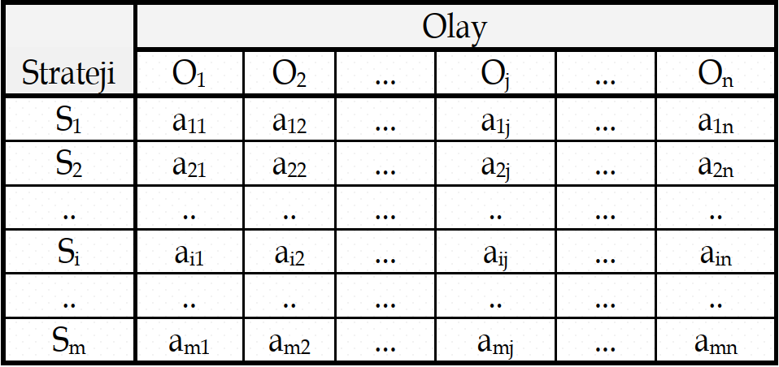

## Karar Matrisi

::: {.callout-important icon=false title="Karar Matrisi" style="font-size: 90%;"}

* [Risk]{.light-red} veya [belirsizlik]{.light-red} ortamındaki bir karar probleminin [matris]{.light-red} biçiminde gösterilmesi, [problemin değerlendirilmesi]{.light-red} ve [çözülmesinde]{.light-red} büyük [kolaylıklar]{.light-red} sağlar. 
* [Alternatif stratejiler]{.light-red}, [olası olaylar]{.light-red} ve [sonuç]{.light-red} değerlerinden oluşan matrise [karar matrisi]{.light-red} denir. 
* Karar matrisi kavramı son derece genel olup, bunun yerine [sonuç]{.light-red}, [kazanç]{.light-red}, [ödeme]{.light-red} veya [kâr-zarar]{.light-red} matrisi deyimleri de kullanılmaktadır.
* Matrisin [$a_{ij}$]{.light-blue} elemanları [$R(S_i, O_j)$]{.light-blue} sonuç değerleridir.

{width=620 height=250 fig-align="center"}

:::

## Risk durumunda karar alma

::: {.callout-important icon=false title="Risk durumunda karar alma" style="font-size: 120%;"}
* Olayların [gerçekleşme olasılıklarının bilinmesi]{.light-red} durumundaki karar problemi, [risk durumunda karar problemidir]{.light-red}. 

* Risk durumunda karar almada kullanılan [başlıca ölçütler]{.light-red} şunlardır:
  * [En yüksek olabilirlik]{.light-red}
  * [Beklenen değer]{.light-red}
  * [Beklenen fırsat kaybı]{.light-red} veya [beklenen pişmanlık]{.light-red}
  
* Risk durumunda ve ya belirsizlik durumunda karar alınırken [karar matrisinden]{.light-red} faydalanılır.

:::

## En Yüksek Olabilirlik Ölçütü

::: {.callout-important icon=false title="En Yüksek Olabilirlik Ölçütü" style="font-size: 140%;"}

* Bu ölçüte göre karar verici tüm dikkatini [olabilirliği en yüksek olan olay]{.light-red} üzerinde yoğunlaştırır.
* Gerçekleşme olasılığı en büyük olan olayın belirlenmesinden sonra bu olay için [en iyi]{.light-red} ([kar durumunda en büyük]{.light-red}, [zarar durumunda en küçük]{.light-red}) sonucu sağlayan stratejinin uygulanmasına karar verilir.

:::


## Örnek 1: En İyi Strateji - Kazanç Matrisi - En Yüksek Olabilirlik Ölçütü (1)


::: {.callout-tip icon=false title="Örnek 1: En İyi Strateji - Kazanç Matrisi - En Yüksek Olabilirlik Ölçütü (1)" style="font-size: 95%;"}

* [En yüksek olabilirlik]{.light-red} ölçütünü aşağıdaki [kazanç matrisine]{.orange} uygulayarak [en iyi stratejiyi]{.light-red} kararlaştırınız.
* [Olayların gerçekleşmesi olasılıkları]{.light-red} aynı tablonun [ilk satırında]{.light-red} verilmiştir.


:::{.tblbox .tbl-fs-xl .w-60 .scale-120  .pad-tight .text-center .scroll-x .scroll-y}
```{=html}

```
:::

:::


## Örnek 1: En İyi Strateji - Kazanç Matrisi - En Yüksek Olabilirlik Ölçütü (2)


::: {.callout-tip icon=false title="Örnek 1: En İyi Strateji - Kazanç Matrisi - En Yüksek Olabilirlik Ölçütü (2)" style="font-size: 80%;"}

:::{.fragment fragment-index=1}
* Tablonun ilk satırında görüldüğü gibi [olabilirliği en yüksek olay]{.light-red} [$O2$]{.light-blue}’dir. 
:::

:::{.fragment fragment-index=2}
* Karar verici gelecekte [$O2$]{.light-blue}’nin gerçekleşeceğini düşünerek kendisine [en yüksek kazancı]{.light-red} sağlayacak olan [$S2$]{.light-blue} stratejisini uygulayacaktır.
:::

:::{.fragment fragment-index=3}
* Bu durumda [en çok olabilirlik yönteminden beklenilen kazanç]{.light-red} [$34$]{.light-blue} tür.
:::

:::{.fragment fragment-index=4}
* Bu kural özellikle mümkün olaylardan birine ilişkin olasılık diğer olaylara ilişkin olasılıklardan [önemli derecede büyükse uygundur]{.light-red}. 
* Diğer olayları ve bunların sonuçlarını [göz ardı etmesi ölçütün zayıf tarafıdır]{.light-red}.
:::

:::{.fragment fragment-index=5}

:::{.tblbox .tbl-fs-xl .w-60 .scale-100  .pad-tight .text-center .scroll-x .scroll-y}
```{=html}

```
:::
:::
:::


## Beklenen Değer Ölçütü

::: {.callout-important icon=false title="Beklenen Değer Ölçütü" style="font-size: 140%;"}

* [Beklenen değer ölçütü]{.light-red} olayların ortaya çıkması [olasılıklarının bilinmesi durumunda]{.light-red}, her bir stratejiye ilişkin [beklenen değerin hesaplanarak]{.light-red} 
  * eğer hesaplanan değer [kazanç]{.light-red} ise bunlar arasından [en büyük olanın işaret ettiği stratejinin seçilmesi]{.light-red}, 
  * eğer hesaplanan değer [kayıp]{.light-red} ise bunlar arasından [en küçük olanın işaret ettiği stratejinin seçilmesi]{.light-red}, 
esasına dayanır.

:::

## Örnek 1: En İyi Strateji - Kazanç Matrisi - Beklenen Değer Ölçütü (1)

::: {.callout-tip icon=false title="Örnek 1: En İyi Strateji - Kazanç Matrisi - Beklenen Değer Ölçütü (1)" style="font-size: 105%;"}

* [Beklenen Değer ölçütünü]{.light-red} aşağıdaki [kazanç matrisine]{.orange} uygulayarak [en iyi stratejiyi]{.light-red} kararlaştırınız.
* [Olayların gerçekleşmesi olasılıkları]{.light-red} aynı tablonun [ilk satırında]{.light-red} verilmiştir.


:::{.tblbox .tbl-fs-xl .w-60 .scale-120  .pad-tight .text-center .scroll-x .scroll-y}
```{=html}

```
:::

:::


## Örnek 1: En İyi Strateji - Kazanç Matrisi - Beklenen Değer Ölçütü (2)

::: {.callout-tip icon=false title="Örnek 1: En İyi Strateji - Kazanç Matrisi - Beklenen Değer Ölçütü (2)" style="font-size: 80%;"}

:::{.fragment fragment-index=1}
Olayların gerçekleşmesi olasılıkları sırasıyla; [$0.2$]{.light-blue}, [$0.5$]{.light-blue}, [$0.2$]{.light-blue}, ve [$0.1$]{.light-blue} olarak verildiğinden [stratejilerin beklenen değerleri]{.light-red} aşağıdaki gibi hesaplanır.

:::

::: columns

::: {.column width="65%"}

:::{.fragment fragment-index=2}
* [S1 için]{.red} [$0.2\cdot26 + 0.5\cdot26 + 0.2\cdot18 + 0.1\cdot22 = 24.0$]{.light-blue}
* [S2 için]{.red} [$0.2\cdot22 + 0.5\cdot34 + 0.2\cdot30 + 0.1\cdot18 = 29.2$]{.light-blue}
* [S3 için]{.red} [$0.2\cdot28 + 0.5\cdot24 + 0.2\cdot34 + 0.1\cdot26 = 27.0$]{.light-blue}
* [S4 için]{.red} [$0.2\cdot22 + 0.5\cdot30 + 0.2\cdot28 + 0.1\cdot20 = 27.0$]{.light-blue}
:::
:::

::: {.column width="1%"}
:::

::: {.column width="34%"}

:::{.fragment fragment-index=4}
* [En yüksek beklenen kazancı]{.light-red} [$S2$]{.light-blue} seçeneği sağladığından [$(29.2)$]{.orange}, [karar vericinin en iyi kararı]{.light-red} [$S2$]{.light-blue}’yi seçmek olacaktır. 
:::
:::
:::

:::{.fragment fragment-index=3}
:::{.tblbox .tbl-fs-xl .w-60 .scale-100  .pad-tight .text-center .scroll-x .scroll-y}
```{=html}

```
:::
:::

:::


## Beklenen Fırsat Kaybı veya Beklenen Pişmanlık Ölçütü

::: {.callout-important icon=false title="Beklenen Fırsat Kaybı veya Beklenen Pişmanlık Ölçütü" style="font-size: 90%;"}

* Risk durumunda karar almada kullanılabilecek diğer bir ölçüt [beklenen fırsat kaybı]{.light-red} veya [beklenen pişmanlık]{.light-red} ölçütüdür. 
* Bu ölçütün beklenen değer ölçütünden [çok farklı olmadığı]{.light-red} görülebilir. 
* İki ölçüt arasındaki tek fark, [dikkate aldıkları sonuç değerleridir]{.light-red}. 
* Fırsat kaybı sonuçlarının dikkate alınması durumunda beklenen değer ölçütü [beklenen fırsat kaybı ölçütü]{.light-red} adını alır.
* [Fırsat kaybı matrisi]{.light-red} orijinal karar matrisinin 
  * [kazanç değerlerinden]{.light-red} oluşması durumunda, orijinal matrisin [sütun değerlerinin her birinin]{.light-red}, [sütun en büyük değerinden çıkartılmasıyla]{.light-red}
  * [kayıp değerlerinden]{.light-red} oluşması durumunda, orijinal matrisin [sütun değerlerinin her birinin]{.light-red}, [sütun en küçük değerinden çıkartılmasıyla]{.light-red} elde edilir.
* Fırsat kaybı matrisi kullanılarak elde edilen [beklenen değerlerden en düşüğüne ait strateji tercih edilir]{.light-red}.
:::

## Örnek 1: En İyi Strateji - Kazanç Matrisi - Beklenen Pişmanlık Ölçütü (1)

::: {.callout-tip icon=false title="Örnek 1: En İyi Strateji - Kazanç Matrisi - Beklenen Pişmanlık Ölçütü (1)" style="font-size: 95%;"}

* Aşağıdaki [kazanç matrisine]{.orange} [beklenen fırsat kaybı]{.light-red} ölçütünü uygulayarak karar vericinin [en iyi stratejisini]{.light-red} belirleyiniz.
* [Olayların gerçekleşmesi olasılıkları]{.light-red} aynı tablonun [ilk satırında]{.light-red} verilmiştir.


:::{.tblbox .tbl-fs-xl .w-60 .scale-120  .pad-tight .text-center .scroll-x .scroll-y}
```{=html}

```
:::

:::


## Örnek 1: En İyi Strateji - Kazanç Matrisi - Beklenen Pişmanlık Ölçütü (2)

::: {.callout-tip icon=false title="Örnek 1: En İyi Strateji - Kazanç Matrisi - Beklenen Pişmanlık Ölçütü (2)" style="font-size: 80%;"}

:::{.fragment fragment-index=1}
Beklenen fırsat kaybı ölçütünde fırsat kayıpları esas alındığından önce [fırsat kayıpları matrisinin]{.light-red} düzenlenmesi gerekir. 

[Kazanç matrisi]{.light-red} üzerinde çalışıldığı için [fırsat kaybı matrisi]{.light-red}, [orijinal matrisin sütun değerlerinin her birinin]{.light-red}, [sütun en büyük değerinden çıkartılmasıyla]{.light-red} elde edilir.
:::

::: columns

::: {.column width="50%"}
:::{.fragment fragment-index=2}
:::{.tblbox .tbl-fs-xl .w-100 .scale-90  .pad-tight .text-center .scroll-x .scroll-y}
```{=html}

```
:::
:::
:::

::: {.column width="1%"}
:::

::: {.column width="49%"}
:::{.fragment fragment-index=3}
Fırsat kaybı matrisinin oluşturulmasından sonra [olayların gerçekleşmesi olasılıklarından]{.light-red} yararlanarak her bir eylem için [beklenen fırsat kaybı]{.light-red} değerleri hesaplanmalıdır. Söz konusu değerler aşağıdaki gibi hesaplanacaktır.
:::

:::{.fragment fragment-index=5}
* Sonuçta, [beklenen fırsat kaybı]{.light-red} ölçütüne göre [en iyi strateji]{.light-red} [en küçük beklenen fırsat kaybı değerini]{.light-red} [$(2.8)$]{.orange} veren [$S2$]{.light-blue} olacaktır. 
:::
:::
:::


::: columns

::: {.column width="55%"}
:::{.fragment fragment-index=4 style="font-size: 90%;"}
* [S1 için]{.red} [$0.2\cdot2 + 0.5\cdot8 + 0.2\cdot16 + 0.1\cdot4 = 8.0$]{.light-blue}
* [S2 için]{.red} [$0.2\cdot6 + 0.5\cdot0 + 0.2\cdot4 + 0.1\cdot8 = 2.8$]{.light-blue}
* [S3 için]{.red} [$0.2\cdot0 + 0.5\cdot10 + 0.2\cdot0 + 0.1\cdot0 = 5.0$]{.light-blue}
* [S4 için]{.red} [$0.2\cdot6 + 0.5\cdot4 + 0.2\cdot6 + 0.1\cdot6 = 5.0$]{.light-blue}
:::
:::

::: {.column width="1%"}
:::

::: {.column width="44%"}
:::{.fragment fragment-index=6 style="font-size: 100%;"}
* Bu ölçütle en iyi olduğu kararlaştırılan [$S2$]{.light-blue}’nin daha önce [beklenen değer ölçütüyle]{.light-red} [en iyi olduğu belirlenen]{.light-red} strateji olduğuna dikkat edilmelidir.
:::
:::
:::

:::


## Örnek 1: En İyi Strateji - Kayıp Matrisi (1)


::: {.callout-tip icon=false title="Örnek 1: En İyi Strateji - Kayıp Matrisi" style="font-size: 95%;"}

* Bu kez aşağıdaki matristeki değerleri [kayıp değerleri]{.orange} olarak düşünerek soruyu,
  * [En yüksek olabilirlik]{.light-red}
  * [Beklenenen değer]{.light-red} ve 
  * [Beklenen pişmanlık]{.light-red}
yöntemleriyle çözünüz.


:::{.tblbox .tbl-fs-xl .w-60 .scale-120  .pad-tight .text-center .scroll-x .scroll-y}
```{=html}

```
:::

:::

## Örnek 1: En İyi Strateji - Kayıp Matrisi - En Yüksek Olabilirlik Ölçütü


::: {.callout-tip icon=false title="Örnek 1: En İyi Strateji - Kayıp Matrisi - En Yüksek Olabilirlik Ölçütü" style="font-size: 95%;"}

:::{.fragment fragment-index=1}
* Tablonun ilk satırında görüldüğü gibi [olabilirliği en yüksek olay]{.light-red} [$O2$]{.light-blue}’dir. 
:::

:::{.fragment fragment-index=2}
* Karar verici gelecekte [$O2$]{.light-blue}’nin gerçekleşeceğini düşünerek kendisine [en düşük kaybı]{.light-red} verecek olan [$S3$]{.light-blue} stratejisini uygulayacaktır.
:::

:::{.fragment fragment-index=3}
* Bu durumda [en çok olabilirlik yönteminden beklenilen minimum kayıp]{.light-red} [$24$]{.light-blue} tür.
:::

:::{.fragment fragment-index=4}

:::{.tblbox .tbl-fs-xl .w-60 .scale-100  .pad-tight .text-center .scroll-x .scroll-y}
```{=html}

```
:::
:::
:::

## Örnek 1: En İyi Strateji - Kayıp Matrisi - Beklenen Değer Ölçütü

::: {.callout-tip icon=false title="Örnek 1: En İyi Strateji - Kayıp Matrisi - Beklenen Değer Ölçütü" style="font-size: 80%;"}

:::{.fragment fragment-index=1}
Olayların gerçekleşmesi olasılıkları sırasıyla; [$0.2$]{.light-blue}, [$0.5$]{.light-blue}, [$0.2$]{.light-blue}, ve [$0.1$]{.light-blue} olarak verildiğinden [stratejilerin beklenen değerleri]{.light-red} aşağıdaki gibi hesaplanır.

:::

::: columns

::: {.column width="65%"}

:::{.fragment fragment-index=2}
* [S1 için]{.red} [$0.2\cdot26 + 0.5\cdot26 + 0.2\cdot18 + 0.1\cdot22 = 24.0$]{.light-blue}
* [S2 için]{.red} [$0.2\cdot22 + 0.5\cdot34 + 0.2\cdot30 + 0.1\cdot18 = 29.2$]{.light-blue}
* [S3 için]{.red} [$0.2\cdot28 + 0.5\cdot24 + 0.2\cdot34 + 0.1\cdot26 = 27.0$]{.light-blue}
* [S4 için]{.red} [$0.2\cdot22 + 0.5\cdot30 + 0.2\cdot28 + 0.1\cdot20 = 27.0$]{.light-blue}
:::
:::

::: {.column width="1%"}
:::

::: {.column width="34%"}

:::{.fragment fragment-index=4}
* [En düşük beklenen kayıp]{.light-red} [$S1$]{.light-blue} seçeneği sağladığından [$(24.0)$]{.orange}, [karar vericinin en iyi kararı]{.light-red} [$S1$]{.light-blue}’i seçmek olacaktır. 
:::
:::
:::

:::{.fragment fragment-index=3}
:::{.tblbox .tbl-fs-xl .w-60 .scale-100  .pad-tight .text-center .scroll-x .scroll-y}
```{=html}

```
:::
:::

:::

## Örnek 1: En İyi Strateji - Kayıp Matrisi - Beklenen Pişmanlık Ölçütü

::: {.callout-tip icon=false title="Örnek 1: En İyi Strateji - Kayıp Matrisi - Beklenen Pişmanlık Ölçütü (2)" style="font-size: 80%;"}

:::{.fragment fragment-index=1}
Beklenen fırsat kaybı ölçütünde fırsat kayıpları esas alındığından önce [fırsat kayıpları matrisinin]{.light-red} düzenlenmesi gerekir. 

[Kayıp matrisi]{.light-red} üzerinde çalışıldığı için [fırsat kaybı matrisi]{.light-red}, [orijinal matrisin sütun değerlerinin her birinin]{.light-red}, [sütun en küçük değerinden çıkartılmasıyla]{.light-red} elde edilir.
:::

::: columns

::: {.column width="50%"}
:::{.fragment fragment-index=2}
:::{.tblbox .tbl-fs-xl .w-100 .scale-90  .pad-tight .text-center .scroll-x .scroll-y}
```{=html}

```
:::
:::
:::

::: {.column width="1%"}
:::

::: {.column width="49%"}
:::{.fragment fragment-index=3}
Fırsat kaybı matrisinin oluşturulmasından sonra [olayların gerçekleşmesi olasılıklarından]{.light-red} yararlanarak her bir eylem için [beklenen fırsat kaybı]{.light-red} değerleri hesaplanmalıdır. Söz konusu değerler aşağıdaki gibi hesaplanacaktır.
:::

:::{.fragment fragment-index=5}
* Sonuçta, [beklenen fırsat kaybı]{.light-red} ölçütüne göre [en iyi strateji]{.light-red} [en küçük beklenen fırsat kaybı değerini]{.light-red} [$(2.2)$]{.orange} veren [$S1$]{.light-blue} olacaktır. 
:::
:::
:::


::: columns

::: {.column width="55%"}
:::{.fragment fragment-index=4 style="font-size: 92%;"}
* [S1 için]{.red} [$0.2\cdot4 + 0.5\cdot2 + 0.2\cdot0 + 0.1\cdot4 = 2.2$]{.light-blue}
* [S2 için]{.red} [$0.2\cdot0 + 0.5\cdot10 + 0.2\cdot12 + 0.1\cdot0 = 7.4$]{.light-blue}
* [S3 için]{.red} [$0.2\cdot6 + 0.5\cdot0 + 0.2\cdot16 + 0.1\cdot8 = 5.2$]{.light-blue}
* [S4 için]{.red} [$0.2\cdot0 + 0.5\cdot6 + 0.2\cdot10 + 0.1\cdot2 = 5.2$]{.light-blue}
:::
:::

::: {.column width="1%"}
:::

::: {.column width="44%"}
:::{.fragment fragment-index=6}
* Bu ölçütle en iyi olduğu kararlaştırılan [$S1$]{.light-blue}’in daha önce [beklenen değer ölçütüyle]{.light-red} [en iyi olduğu belirlenen]{.light-red} strateji olduğuna dikkat edilmelidir.
:::
:::
:::

:::


## Örnek 2: Mağaza (1)


::: {.callout-tip icon=false title="Örnek 2: Mağaza (1)" style="font-size: 90%;"}
* Bir [mağaza]{.light-red} sahibinin; [$100$]{.light-blue}, [$200$]{.light-blue} veya [$300$]{.light-blue} adet sipariş vermek gibi sırasıyla [$S1$]{.light-blue}, [$S2$]{.light-blue} ve [$S3$]{.light-blue} olarak adlandırılan [üç]{.light-blue} [stratejisi]{.light-red} vardır. 
* Mağaza sahibi [istem miktarlarının]{.light-red} ise sırasıyla [$M1$]{.light-blue}, [$M2$]{.light-blue}, [$M3$]{.light-blue} ve [$M4$]{.light-blue} olarak nitelenen  [$100$]{.light-blue}, [$150$]{.light-blue}, [$200$]{.light-blue} ve ya [$250$]{.light-blue} adetten bir tanesi olacağını bilmektedir. 
* İstem miktarının gerçekleşme olasılıkları [$M1$]{.light-blue} için [$0.2$]{.light-blue}; [$M2$]{.light-blue} için [$0.3$]{.light-blue}; [$M3$]{.light-blue} için [$0.3$]{.light-blue} ve [$M4$]{.light-blue} için [$0.2$]{.light-blue} olduğu bilinmektedir.


::: columns

::: {.column width="50%"}
:::{.tblbox .tbl-fs-xl .w-100 .scale-100  .pad-tight .text-center .scroll-x .scroll-y}
```{=html}

```
:::
:::


::: {.column width="1%"}
:::

::: {.column width="49%"}
* Karar matrisinin elemanları [farklı sipariş]{.light-red} ve [istem miktarı]{.light-red} birleşimlerinin sonucu elde edilecek 
  * [kâr]{.light-red} olarak tanımlandığı durum için
  * [maliyet]{.light-red} olarak tanımlandığı durum için ayrı ayrı olarak.

:::
:::
[Mağaza sahibinin en yüksek olabilirlik, beklenen değer ve beklenen pişmanlık kurallarına göre hangi stratejiyi seçmesi gerektiğini ve bu stratejiye ait değerleri belirleyiniz.]{.red}
:::

## Örnek 2: Mağaza - Kazanç Matrisi - En Yüksek Olabilirlik Ölçütü


::: {.callout-tip icon=false title="Örnek 2: Mağaza - Kazanç Matrisi - En Yüksek Olabilirlik Ölçütü" style="font-size: 90%;"}

:::{.fragment fragment-index=1}
* Tablonun ilk satırında görüldüğü gibi [olabilirliği en yüksek olay]{.light-red} [$M2$ - 150 İstem Miktarı]{.light-blue} ve [$M3$ - 200 İstem Miktarı]{.light-blue}’tür. 
:::

:::{.fragment fragment-index=2}
* Karar verici gelecekte [$M2$ - 150 İstem Miktarı]{.light-blue} ve ya [$M3$ - 200 İstem Miktarı]{.light-blue}'nın gerçekleşeceğini düşünerek kendisine [en yüksek kazancı]{.light-red} sağlayacak olan [S3 - $300$ sipariş]{.light-blue} stratejisini uygulayacaktır.
:::

:::{.fragment fragment-index=3}
* Bu durumda [en çok olabilirlik yönteminden beklenilen kazanç]{.light-red} [$8500$]{.light-blue} dür.
:::

:::{.fragment fragment-index=5}

:::{.tblbox .tbl-fs-xl .w-90 .scale-120  .pad-tight .text-center .scroll-x .scroll-y}
```{=html}

```
:::
:::
:::


## Örnek 2: Mağaza - Kazanç Matrisi - Beklenen Değer Ölçütü

::: {.callout-tip icon=false title="Örnek 2: Mağaza - Kazanç Matrisi - Beklenen Değer Ölçütü" style="font-size: 80%;"}

:::{.fragment fragment-index=1}
Olayların gerçekleşmesi olasılıkları sırasıyla; [$0.2$]{.light-blue}, [$0.3$]{.light-blue}, [$0.3$]{.light-blue}, ve [$0.2$]{.light-blue} olarak verildiğinden [stratejilerin beklenen değerleri]{.light-red} aşağıdaki gibi hesaplanır.

:::

::: columns

::: {.column width="65%"}

:::{.fragment fragment-index=2}
* [S1 - 100 sipariş için]{.red} [$0.2\cdot3000 + 0.3\cdot2750 + 0.3\cdot2500 + 0.2\cdot2250 = 2625$]{.light-blue}
* [S2 - 200 sipariş için]{.red} [$0.2\cdot1500 + 0.3\cdot4750 + 0.3\cdot8000 + 0.2\cdot7750 = 5675$]{.light-blue}
* [S3 - 300 sipariş için]{.red} [$0.2\cdot2000 + 0.3\cdot5250 + 0.3\cdot8500 + 0.2\cdot11750 = 6875$]{.light-blue}
:::
:::

::: {.column width="1%"}
:::

::: {.column width="34%"}

:::{.fragment fragment-index=4}
* [En yüksek beklenen kazancı]{.light-red} [S3 - $300$ sipariş]{.light-blue} seçeneği sağladığından [$(6875)$]{.orange}, [karar vericinin en iyi kararı]{.light-red} [$300$ sipariş]{.light-blue}i seçmek olacaktır. 
:::
:::
:::

:::{.fragment fragment-index=3}
:::{.tblbox .tbl-fs-xl .w-100 .scale-120  .pad-tight .text-center .scroll-x .scroll-y}
```{=html}

```
:::
:::

:::


## Örnek 2: Mağaza - Kazanç Matrisi - Beklenen Pişmanlık Ölçütü

::: {.callout-tip icon=false title="Örnek 2: Mağaza - Kazanç Matrisi - Beklenen Pişmanlık Ölçütü" style="font-size: 80%;"}

:::{.fragment fragment-index=1}
[Kazanç matrisi]{.light-red} üzerinde çalışıldığı için [fırsat kaybı matrisi]{.light-red}, [orijinal matrisin sütun değerlerinin her birinin]{.light-red}, [sütun en büyük değerinden çıkartılmasıyla]{.light-red} elde edilir.
:::

::: columns

::: {.column width="70%"}
:::{.fragment fragment-index=2}
:::{.tblbox .tbl-fs-xl .w-100 .scale-90  .pad-tight .text-center .scroll-x .scroll-y}
```{=html}

```
:::
:::
:::

::: {.column width="1%"}
:::

::: {.column width="29%"}
:::{.fragment fragment-index=3}
Fırsat kaybı matrisinin oluşturulmasından sonra [olayların gerçekleşmesi olasılıklarından]{.light-red} yararlanarak her bir eylem için [beklenen fırsat kaybı]{.light-red} değerleri hesaplanmalıdır. Söz konusu değerler aşağıdaki gibi hesaplanacaktır.
:::
:::
:::


::: columns

::: {.column width="55%"}
:::{.fragment fragment-index=4 style="font-size: 90%;"}
* [S1 - 100 sipariş için]{.red} [$0.2\cdot0 + 0.3\cdot2500 + 0.3\cdot6000 + 0.2\cdot9500 = 4450$]{.light-blue}
* [S2 - 200 sipariş için]{.red} [$0.2\cdot1500 + 0.3\cdot500 + 0.3\cdot500 + 0.2\cdot4000 = 1400$]{.light-blue}
* [S3 - 300 sipariş için]{.red} [$0.2\cdot1000 + 0.3\cdot0 + 0.3\cdot0 + 0.2\cdot0 = 200$]{.light-blue}
:::
:::

::: {.column width="1%"}
:::

::: {.column width="44%"}
:::{.fragment fragment-index=5 style="font-size: 95%;"}
* Sonuçta, [beklenen fırsat kaybı]{.light-red} ölçütüne göre [en iyi strateji]{.light-red} [en küçük beklenen fırsat kaybı değerini]{.light-red} [$(200)$]{.orange} veren [S3 - $300$ sipariş]{.light-blue} olacaktır. 
* Bu ölçütle en iyi olduğu kararlaştırılan [$300$ sipariş]{.light-blue}’in daha önce [beklenen değer ölçütüyle]{.light-red} [en iyi olduğu belirlenen]{.light-red} strateji olduğuna dikkat edilmelidir.
:::
:::
:::

:::

## Örnek 2: Mağaza - Kayıp Matrisi - En Yüksek Olabilirlik Ölçütü


::: {.callout-tip icon=false title="Örnek 2: Mağaza - Kayıp Matrisi - En Yüksek Olabilirlik Ölçütü" style="font-size: 90%;"}

:::{.fragment fragment-index=1}
* Tablonun ilk satırında görüldüğü gibi [olabilirliği en yüksek olay]{.light-red} [$M2$ - 150 İstem Miktarı]{.light-blue} ve [$M3$ - 200 İstem Miktarı]{.light-blue}’tür. 
:::

:::{.fragment fragment-index=2}
* Karar verici gelecekte [$M2$ - 150 İstem Miktarı]{.light-blue} ve ya [$M3$ - 200 İstem Miktarı]{.light-blue}'nın gerçekleşeceğini düşünerek kendisine [en düşük maliyeti]{.light-red} sağlayacak olan [S1 - $100$ sipariş]{.light-blue} stratejisini uygulayacaktır.
:::

:::{.fragment fragment-index=3}
* Bu durumda [en çok olabilirlik yönteminden beklenilen maliyet]{.light-red} [$2500$]{.light-blue} dür.
:::

:::{.fragment fragment-index=5}

:::{.tblbox .tbl-fs-xl .w-90 .scale-120  .pad-tight .text-center .scroll-x .scroll-y}
```{=html}

```
:::
:::
:::


## Örnek 2: Mağaza - Kayıp Matrisi - Beklenen Değer Ölçütü

::: {.callout-tip icon=false title="Örnek 2: Mağaza - Kayıp Matrisi - Beklenen Değer Ölçütü" style="font-size: 80%;"}

:::{.fragment fragment-index=1}
Olayların gerçekleşmesi olasılıkları sırasıyla; [$0.2$]{.light-blue}, [$0.3$]{.light-blue}, [$0.3$]{.light-blue}, ve [$0.2$]{.light-blue} olarak verildiğinden [stratejilerin beklenen değerleri]{.light-red} aşağıdaki gibi hesaplanır.

:::

::: columns

::: {.column width="65%"}

:::{.fragment fragment-index=2}
* [S1 - 100 sipariş için]{.red} [$0.2\cdot3000 + 0.3\cdot2750 + 0.3\cdot2500 + 0.2\cdot2250 = 2625$]{.light-blue}
* [S2 - 200 sipariş için]{.red} [$0.2\cdot1500 + 0.3\cdot4750 + 0.3\cdot8000 + 0.2\cdot7750 = 5675$]{.light-blue}
* [S3 - 300 sipariş için]{.red} [$0.2\cdot2000 + 0.3\cdot5250 + 0.3\cdot8500 + 0.2\cdot11750 = 6875$]{.light-blue}
:::
:::

::: {.column width="1%"}
:::

::: {.column width="34%"}

:::{.fragment fragment-index=4}
* [En düşük beklenen maliyeti]{.light-red} [S1 - $100$ sipariş]{.light-blue} seçeneği sağladığından [$(2625)$]{.orange}, [karar vericinin en iyi kararı]{.light-red} [$100$ siparişi]{.light-blue} seçmek olacaktır. 
:::
:::
:::

:::{.fragment fragment-index=3}
:::{.tblbox .tbl-fs-xl .w-100 .scale-120  .pad-tight .text-center .scroll-x .scroll-y}
```{=html}

```
:::
:::

:::


## Örnek 2: Mağaza - Kayıp Matrisi - Beklenen Pişmanlık Ölçütü

::: {.callout-tip icon=false title="Örnek 2: Mağaza - Kayıp Matrisi - Beklenen Pişmanlık Ölçütü" style="font-size: 80%;"}

:::{.fragment fragment-index=1}
[Kayıp matrisi]{.light-red} üzerinde çalışıldığı için [fırsat kaybı matrisi]{.light-red}, [orijinal matrisin sütun değerlerinin her birinden]{.light-red}, [sütun en küçük değerinin çıkartılmasıyla]{.light-red} elde edilir.
:::

::: columns

::: {.column width="70%"}
:::{.fragment fragment-index=2}
:::{.tblbox .tbl-fs-xl .w-100 .scale-90  .pad-tight .text-center .scroll-x .scroll-y}
```{=html}

```
:::
:::
:::

::: {.column width="1%"}
:::

::: {.column width="29%"}
:::{.fragment fragment-index=3}
Fırsat kaybı matrisinin oluşturulmasından sonra [olayların gerçekleşmesi olasılıklarından]{.light-red} yararlanarak her bir eylem için [beklenen fırsat kaybı]{.light-red} değerleri hesaplanmalıdır. Söz konusu değerler aşağıdaki gibi hesaplanacaktır.
:::
:::
:::


::: columns

::: {.column width="55%"}
:::{.fragment fragment-index=4 style="font-size: 90%;"}
* [S1 - 100 sipariş için]{.red} [$0.2\cdot 1500 + 0.3\cdot 0 + 0.3\cdot 0 + 0.2\cdot 0 = 300$]{.light-blue}
* [S2 - 200 sipariş için]{.red} [$0.2\cdot 0 + 0.3\cdot 2000 + 0.3\cdot 5500 + 0.2\cdot 5500 = 3350$]{.light-blue}
* [S3 - 300 sipariş için]{.red} [$0.2\cdot 500 + 0.3\cdot 2500 + 0.3\cdot 6000 + 0.2\cdot 9500 = 4550$]{.light-blue}
:::
:::

::: {.column width="1%"}
:::

::: {.column width="44%"}
:::{.fragment fragment-index=5 style="font-size: 95%;"}
* Sonuçta, [beklenen fırsat kaybı]{.light-red} ölçütüne göre [en iyi strateji]{.light-red} [en küçük beklenen fırsat kaybı değerini]{.light-red} [$(300)$]{.orange} veren [S1 - $100$ sipariş]{.light-blue} olacaktır. 
* Bu ölçütle en iyi olduğu kararlaştırılan [$100$ sipariş]{.light-blue}’in daha önce [beklenen değer ölçütüyle]{.light-red} [en iyi olduğu belirlenen]{.light-red} strateji olduğuna dikkat edilmelidir.
:::
:::
:::

:::

## Örnek 3: Hisse Senedi


::: {.callout-tip icon=false title="Örnek 3: Hisse Senedi" style="font-size: 95%;"}

* [A]{.light-red} ve [B]{.light-red} firmalarının hisse senetlerini alarak borsaya [$10000$ pb]{.light-blue} para yatırmak istediğinizi varsayalım. 
* [A]{.light-red} firmasının hisse senetleri riskli olmakla birlikte, 
  * Borsanın [iyi]{.light-red} gittiği durumda [(boğaların hakim olduğu pazarda)]{.light-red} gelecek sene için değeri [$\%50$ artacaktır]{.light-blue}. 
  * Eğer borsa [iyi gitmezse]{.light-red} [(ayıların hakim olduğu pazarda)]{.light-red} hisse senedinin değeri [$%20$ azalacaktır]{.light-blue}. 
* [B]{.light-red} hisse senedi ise güvenli bir şekilde 
  * [boğaların]{.light-red} hakim olduğu pazarda [$\%15$ getiri]{.light-blue}, 
  * [ayıların]{.light-red} hakim olduğu pazarda [$\%5$ getiri]{.light-blue} sağlayacaktır. 
* Başvurulan tüm kaynaklar [boğaların]{.light-red} hakim olduğu pazara [$\%60$]{.light-blue}, [ayıların]{.light-red} bulunduğu pazara [$\%40$]{.light-blue} şans vererek tahmin yapmaktadır.
* [Paranızı nereye yatırmanız gerektiğini ve olası kazancınızı en yüksek olabilirlik, beklenen değer ve beklenen pişmanlık kurallarına göre hesaplayınız.]{.red}

:::

## Örnek 3: Hisse Senedi - Karar Matrisinin Oluşturulması


::: {.callout-tip icon=false title="Örnek 3: Hisse Senedi - Karar Matrisinin Oluşturulması" style="font-size: 85%;"}
:::{.fragment fragment-index=1}
* Diğer sorulardan farklı olarak bu soruda [karar matrisi bize verilmemiş]{.light-red}, olası durumlara göre matrisi [bizden  hazırlamamız beklenmektedir]{.light-red}.
:::

:::{.fragment fragment-index=2}
* Olası durumlara bakılırsa,
  * [A]{.light-red} hisse senedi seçilir ve [boğa]{.light-red} yılı olursa, [$10000 \times 0.5 = 5000$ pb]{.light-blue} getiri olur.
  * [A]{.light-red} hisse senedi seçilir ve [ayı]{.light-red} yılı olursa, [$10000 \times (-0.2) = (-2000)$ pb]{.light-blue} getiri olur.
  * [B]{.light-red} hisse senedi seçilir ve [boğa]{.light-red} yılı olursa, [$10000 \times 0.15 = 1500$ pb]{.light-blue} getiri olur.
  * [A]{.light-red} hisse senedi seçilir ve [ayı]{.light-red} yılı olursa, [$10000 \times 0.05 = 500$ pb]{.light-blue} getiri olur.
:::

:::{.fragment fragment-index=3}
Bu bilgilere göre [karar matrisi]{.light-red} aşağıdaki gibi elde edilir. 
:::

:::{.fragment fragment-index=4}
:::{.tblbox .tbl-fs-xl .w-60 .scale-100  .pad-tight .text-center .scroll-x .scroll-y}
```{=html}

```
:::
:::
:::

## Örnek 3: Hisse Senedi - Kazanç Matrisi - En Yüksek Olabilirlik Ölçütü


::: {.callout-tip icon=false title="Örnek 3: Hisse Senedi - Kazanç Matrisi - En Yüksek Olabilirlik Ölçütü" style="font-size: 90%;"}

:::{.fragment fragment-index=1}
* Tablonun ilk satırında görüldüğü gibi [olabilirliği en yüksek olay]{.light-red} [Boğa]{.light-blue}'dır. 
:::

:::{.fragment fragment-index=2}
* Karar verici gelecekte [Boğa]{.light-blue}'nın gerçekleşeceğini düşünerek kendisine [en yüksek kazancı]{.light-red} sağlayacak olan [A]{.light-blue} hisse senedini alma stratejisini uygulayacaktır.
:::

:::{.fragment fragment-index=3}
* Bu durumda [en çok olabilirlik yönteminden beklenilen kazanç]{.light-red} [$5000$]{.light-blue} dir.
:::

:::{.fragment fragment-index=5}

:::{.tblbox .tbl-fs-xl .w-90 .scale-120  .pad-tight .text-center .scroll-x .scroll-y}
```{=html}

```
:::
:::
:::


## Örnek 3: Hisse Senedi - Kazanç Matrisi - Beklenen Değer Ölçütü

::: {.callout-tip icon=false title="Örnek 3: Hisse Senedi - Kazanç Matrisi - Beklenen Değer Ölçütü" style="font-size: 80%;"}

:::{.fragment fragment-index=1}
Olayların gerçekleşmesi olasılıkları sırasıyla; [$0.6$]{.light-blue} ve [$0.4$]{.light-blue} olarak verildiğinden [stratejilerin beklenen değerleri]{.light-red} aşağıdaki gibi hesaplanır.

:::

::: columns

::: {.column width="65%"}

:::{.fragment fragment-index=2}
* [A hisse senedi için]{.red} [$0.6\cdot5000 + 0.4\cdot (-2000) = 2200$]{.light-blue}
* [B hisse senedi için]{.red} [$0.6\cdot1500 + 0.4\cdot500 = 1100$]{.light-blue}
:::
:::

::: {.column width="1%"}
:::

::: {.column width="34%"}

:::{.fragment fragment-index=4}
* [En yüksek beklenen kazancı]{.light-red} [A]{.light-blue} seçeneği sağladığından [$(2200)$]{.orange}, [karar vericinin en iyi kararı]{.light-red} [A hisse senedini]{.light-blue} almak olacaktır. 
:::
:::
:::

:::{.fragment fragment-index=3}
:::{.tblbox .tbl-fs-xl .w-100 .scale-120  .pad-tight .text-center .scroll-x .scroll-y}
```{=html}

```
:::
:::

:::


## Örnek 3: Hisse Senedi - Kazanç Matrisi - Beklenen Pişmanlık Ölçütü

::: {.callout-tip icon=false title="Örnek 3: Hisse Senedi - Kazanç Matrisi - Beklenen Pişmanlık Ölçütü" style="font-size: 80%;"}

:::{.fragment fragment-index=1}
[Kazanç matrisi]{.light-red} üzerinde çalışıldığı için [fırsat kaybı matrisi]{.light-red}, [orijinal matrisin sütun değerlerinin her birinin]{.light-red}, [sütun en büyük değerinden çıkartılmasıyla]{.light-red} elde edilir.
:::

::: columns

::: {.column width="70%"}
:::{.fragment fragment-index=2}
:::{.tblbox .tbl-fs-xl .w-100 .scale-100  .pad-tight .text-center .scroll-x .scroll-y}
```{=html}

```
:::
:::
:::

::: {.column width="1%"}
:::

::: {.column width="29%"}
:::{.fragment fragment-index=3}
Fırsat kaybı matrisinin oluşturulmasından sonra [olayların gerçekleşmesi olasılıklarından]{.light-red} yararlanarak her bir eylem için [beklenen fırsat kaybı]{.light-red} değerleri hesaplanmalıdır. Söz konusu değerler aşağıdaki gibi hesaplanacaktır.
:::
:::
:::


::: columns

::: {.column width="55%"}
:::{.fragment fragment-index=4 style="font-size: 100%;"}
* [A hisse senedi için]{.red} [$0.6\cdot 0 + 0.4 \cdot 2500 = 1000$]{.light-blue}
* [B hisse senedi için]{.red} [$0.6\cdot 3500 + 0.4\cdot 0 = 2100$]{.light-blue}
:::
:::

::: {.column width="1%"}
:::

::: {.column width="44%"}
:::{.fragment fragment-index=5 style="font-size: 95%;"}
* Sonuçta, [beklenen fırsat kaybı]{.light-red} ölçütüne göre [en iyi strateji]{.light-red} [en küçük beklenen fırsat kaybı değerini]{.light-red} [$(1000)$]{.orange} veren [A hisse senedi]{.light-blue} olacaktır. 
* Bu ölçütle en iyi olduğu kararlaştırılan [A hisse senedi]{.light-blue}’nin daha önce [beklenen değer ölçütüyle]{.light-red} [en iyi olduğu belirlenen]{.light-red} strateji olduğuna dikkat edilmelidir.
:::
:::
:::

:::

## Örnek 4: Fon


::: {.callout-tip icon=false title="Örnek 4: Fon" style="font-size: 90%;"}

* Paranızı [kamu]{.light-red}, [gelişme]{.light-red} ve [global]{.light-red} gibi [üç]{.light-blue} farklı [fonda]{.light-red} değerlendirebilme şansına sahip olduğunuzu düşünelim.
* Yatırımınızın değeri [pazar koşullarına]{.light-red} bağlı olarak [değişecektir]{.light-red}.
* Pazarın kötüye gitme olasılığı [$\%10$]{.light-blue}, ne kötü ne iyi gitme olasılığı [$\%50$]{.light-blue} ve iyi gitme olasılığı ise [$\%40$]{.light-blue}'tır.
* Aşağıdaki [tabloda]{.light-red} [pazarın durumu]{.light-red} ve [paranın yatırıldığı fon]{.light-red} göz önüne alınarak hazırlanan [kazanç matrisi]{.orange} verilmiştir.


::: columns

::: {.column width="60%"}
:::{.tblbox .tbl-fs-xl .w-90 .scale-120  .pad-tight .text-center .scroll-x .scroll-y}
```{=html}

```
:::
:::


::: {.column width="1%"}
:::

::: {.column width="39%"}
[Buna göre hangi fonu seçmeniz gerektiğini ve elde edeceğiniz beklenen kazancı en yüksek olabilirlik, beklenen değer ve beklenen pişmanlık kurallarına göre hesaplayınız.]{.red}

:::
:::
:::


## Örnek 4: Fon - Kazanç Matrisi - En Yüksek Olabilirlik Ölçütü


::: {.callout-tip icon=false title="Örnek 4: Fon - Kazanç Matrisi - En Yüksek Olabilirlik Ölçütü" style="font-size: 90%;"}

:::{.fragment fragment-index=1}
* Tablonun ilk satırında görüldüğü gibi [olabilirliği en yüksek olay]{.light-red} [Nötr]{.light-blue}’dür. 
:::

:::{.fragment fragment-index=2}
* Karar verici gelecekte [Nötr]{.light-blue}'ün gerçekleşeceğini düşünerek kendisine [en yüksek kazancı]{.light-red} sağlayacak olan [Kamu]{.light-blue} ya da [Global]{.light-blue} fon stratejisini uygulayacaktır.
:::

:::{.fragment fragment-index=3}
* Bu durumda [en çok olabilirlik yönteminden beklenilen kazanç]{.light-red} [$\%7$]{.light-blue} dir.
:::

:::{.fragment fragment-index=5}

:::{.tblbox .tbl-fs-xl .w-90 .scale-120  .pad-tight .text-center .scroll-x .scroll-y}
```{=html}

```
:::
:::
:::


## Örnek 4: Fon - Kazanç Matrisi - Beklenen Değer Ölçütü

::: {.callout-tip icon=false title="Örnek 4: Fon - Kazanç Matrisi - Beklenen Değer Ölçütü" style="font-size: 80%;"}

:::{.fragment fragment-index=1}
Olayların gerçekleşmesi olasılıkları sırasıyla; [$0.1$]{.light-blue}, [$0.5$]{.light-blue} ve [$0.4$]{.light-blue} olarak verildiğinden [stratejilerin beklenen değerleri]{.light-red} aşağıdaki gibi hesaplanır.

:::

::: columns

::: {.column width="65%"}

:::{.fragment fragment-index=2}
* [Kamu için]{.red} [$0.1\cdot5 + 0.5\cdot7 + 0.4\cdot8 = 7.2$]{.light-blue}
* [Gelişme için]{.red} [$0.1\cdot(-10) + 0.5\cdot5 + 0.4\cdot30 = 13.5$]{.light-blue}
* [Global için]{.red} [$0.1\cdot2 + 0.5\cdot7 + 0.4\cdot20 = 11.7$]{.light-blue}
:::
:::

::: {.column width="1%"}
:::

::: {.column width="34%"}

:::{.fragment fragment-index=4}
* [En yüksek beklenen kazancı]{.light-red} [Gelişme fon]{.light-blue} seçeneği sağladığından [$(\%13.5)$]{.orange}, [karar vericinin en iyi kararı]{.light-red} [Gelişme fonuna]{.light-blue} yatırım yapmak olacaktır. 
:::
:::
:::

:::{.fragment fragment-index=3}
:::{.tblbox .tbl-fs-xl .w-100 .scale-120  .pad-tight .text-center .scroll-x .scroll-y}
```{=html}

```
:::
:::

:::


## Örnek 4: Fon - Kazanç Matrisi - Beklenen Pişmanlık Ölçütü

::: {.callout-tip icon=false title="Örnek 4: Fon - Kazanç Matrisi - Beklenen Pişmanlık Ölçütü" style="font-size: 80%;"}

:::{.fragment fragment-index=1}
[Kazanç matrisi]{.light-red} üzerinde çalışıldığı için [fırsat kaybı matrisi]{.light-red}, [orijinal matrisin sütun değerlerinin her birinin]{.light-red}, [sütun en büyük değerinden çıkartılmasıyla]{.light-red} elde edilir.
:::

::: columns

::: {.column width="70%"}
:::{.fragment fragment-index=2}
:::{.tblbox .tbl-fs-xl .w-100 .scale-100  .pad-tight .text-center .scroll-x .scroll-y}
```{=html}

```
:::
:::
:::

::: {.column width="1%"}
:::

::: {.column width="29%"}
:::{.fragment fragment-index=3}
Fırsat kaybı matrisinin oluşturulmasından sonra [olayların gerçekleşmesi olasılıklarından]{.light-red} yararlanarak her bir eylem için [beklenen fırsat kaybı]{.light-red} değerleri hesaplanmalıdır. Söz konusu değerler aşağıdaki gibi hesaplanacaktır.
:::
:::
:::


::: columns

::: {.column width="55%"}
:::{.fragment fragment-index=4 style="font-size: 100%;"}
* [Kamu için]{.red} [$0.1\cdot0 + 0.5\cdot0 + 0.4\cdot22 = 8.8$]{.light-blue}
* [Gelişme için]{.red} [$0.1\cdot15 + 0.5\cdot2 + 0.4\cdot0 = 2.5$]{.light-blue}
* [Global için]{.red} [$0.1\cdot3 + 0.5\cdot0 + 0.4\cdot10 = 4.3$]{.light-blue}
:::
:::

::: {.column width="1%"}
:::

::: {.column width="44%"}
:::{.fragment fragment-index=5 style="font-size: 95%;"}
* Sonuçta, [beklenen fırsat kaybı]{.light-red} ölçütüne göre [en iyi strateji]{.light-red} [en küçük beklenen fırsat kaybı değerini]{.light-red} [$(2.5)$]{.orange} veren [Gelişme fonu]{.light-blue} olacaktır. 
* Bu ölçütle en iyi olduğu kararlaştırılan [Gelişme fonu]{.light-blue}’nun daha önce [beklenen değer ölçütüyle]{.light-red} [en iyi olduğu belirlenen]{.light-red} strateji olduğuna dikkat edilmelidir.
:::
:::
:::

:::


## Örnek 5: Doğal Yaşam Okulu


::: {.callout-tip icon=false title="Örnek 5: Doğal Yaşam Okulu" style="font-size: 75%;"}

* [Doğal yaşam okulu]{.light-red} katılanları doğal koşullarda yaşama konusunda eğitmek üzere ormanda kamp yapacaktır. Okul [katılımcı sayısının]{.light-red} [200]{.light-blue}, [250]{.light-blue}, [300]{.light-blue} ve [350]{.light-blue} olmak üzere [dört]{.light-blue} kategoriden birine ait olacağı tahmin edilmektedir.
* Eğer talebi [tam olarak karşılayabilecek]{.light-red} şekilde bir kamp organizasyonu yapılabilirse [maliyet minimum]{.light-red} olacaktır. İdeal talep düzeyinin [altında]{.light-red} ya da [üstündeki]{.light-red} sapmalar [oda fazlası]{.light-red} ve ya talebin karşılanmayan kısmından kaynaklanan [gelir kaybı]{.light-red} gibi [ek maliyetlere]{.light-red} neden olacaktır.
* [A1]{.light-blue}, [A2]{.light-blue}, [A3]{.light-blue} ve [A4]{.light-blue} sırasıyla [200]{.light-blue}, [250]{.light-blue}, [300]{.light-blue} ve [350]{.light-blue} kişi olarak [kamp yerlerinin kapasitesini]{.light-red} göstermektedir.
* [S1]{.light-blue}, [S2]{.light-blue}, [S3]{.light-blue} ve [S4]{.light-blue} ise sırasıyla [200]{.light-blue}, [250]{.light-blue}, [300]{.light-blue} ve [350]{.light-blue} kişi olarak [kampa katılım düzeyini]{.light-red} belirtmekte ve gerçekleşme ihtimalleri yine sırasıyla [$0.3$]{.light-blue}, [$0.4$]{.light-blue}, [$0.2$]{.light-blue} ve [$0.1$]{.light-blue} dir.
* Aşağıdaki tablo her bir [kamp yeri]{.light-red} ve [kampa katılım düzeyi]{.light-red} çifti için [maliyet tablosunu]{.orange} vermektedir.

::: columns

::: {.column width="60%"}
:::{.tblbox .tbl-fs-xl .w-90 .scale-100  .pad-tight .text-center .scroll-x .scroll-y}
```{=html}

```
:::
:::


::: {.column width="1%"}
:::

::: {.column width="39%"}
[Buna göre kaç kişilik bir kamp yeri tutulması gerektiğini en yüksek olabilirlik, beklenen değer ve beklenen pişmanlık kurallarına göre hesaplayınız. Her strateji için beklenen maliyeti belirleyiniz.]{.red}

:::
:::
:::


## Örnek 5: Doğal Yaşam Okulu - Kayıp Matrisi - En Yüksek Olabilirlik Ölçütü


::: {.callout-tip icon=false title="Örnek 5: Doğal Yaşam Okulu - Kayıp Matrisi - En Yüksek Olabilirlik Ölçütü" style="font-size: 90%;"}

:::{.fragment fragment-index=1}
* Tablonun ilk satırında görüldüğü gibi [olabilirliği en yüksek olay]{.light-red} [$S2$ - 250 Katılımcı]{.light-blue} bulunmasıdır. 
:::

:::{.fragment fragment-index=2}
* Karar verici gelecekte [$S2$ - 250 Katılımcı]{.light-blue}'nın kampa geleceğini düşünerek kendisine [en düşük maliyeti]{.light-red} sağlayacak olan [A2 - $250$ kişilik kamp yerini]{.light-blue} tutma stratejisini uygulayacaktır.
:::

:::{.fragment fragment-index=3}
* Bu durumda [en çok olabilirlik yönteminden beklenilen maliyet]{.light-red} [$7$]{.light-blue} dir.
:::

:::{.fragment fragment-index=5}

:::{.tblbox .tbl-fs-xl .w-90 .scale-110  .pad-tight .text-center .scroll-x .scroll-y}
```{=html}

```
:::
:::
:::


## Örnek 5: Doğal Yaşam Okulu - Kayıp Matrisi - Beklenen Değer Ölçütü

::: {.callout-tip icon=false title="Örnek 5: Doğal Yaşam Okulu - Kayıp Matrisi - Beklenen Değer Ölçütü" style="font-size: 80%;"}

:::{.fragment fragment-index=1}
Olayların gerçekleşmesi olasılıkları sırasıyla; [$0.3$]{.light-blue}, [$0.4$]{.light-blue}, [$0.2$]{.light-blue}, ve [$0.1$]{.light-blue} olarak verildiğinden [stratejilerin beklenen değerleri]{.light-red} aşağıdaki gibi hesaplanır.

:::

::: columns

::: {.column width="80%"}

:::{.fragment fragment-index=2}
* [A1 - 200 kişilik kamp yeri]{.red} [$0.3\cdot5 + 0.4\cdot10 + 0.2\cdot18 + 0.1\cdot25 = 11.6$]{.light-blue}
* [A2 - 250 kişilik kamp yeri]{.red} [$0.3\cdot8 + 0.4\cdot7 + 0.2\cdot12 + 0.1\cdot23 = 9.9$]{.light-blue}
* [A3 - 300 kişilik kamp yeri]{.red} [$0.3\cdot21 + 0.4\cdot18 + 0.2\cdot12 + 0.1\cdot21 = 18.0$]{.light-blue}
* [A4 - 350 kişilik kamp yeri]{.red} [$0.3\cdot30 + 0.4\cdot22 + 0.2\cdot19 + 0.1\cdot15 = 23.1$]{.light-blue}
:::

:::{.fragment fragment-index=3}
:::{.tblbox .tbl-fs-xl .w-100 .scale-110  .pad-tight .text-center .scroll-x .scroll-y}
```{=html}

```
:::
:::
:::

::: {.column width="1%"}
:::

::: {.column width="19%"}

:::{.fragment fragment-index=4}
* [En düşük beklenen maliyeti]{.light-red} [A2 - $250$ kişilik kamp yerini]{.light-blue} tutma seçeneği sağladığından [$(9.90)$]{.orange}, [karar vericinin en iyi kararı]{.light-red} [$250$ kişilik kamp yerini]{.light-blue} tutmak olacaktır. 
:::
:::
:::


:::


## Örnek 5: Doğal Yaşam Okulu - Kayıp Matrisi - Beklenen Pişmanlık Ölçütü

::: {.callout-tip icon=false title="Örnek 5: Doğal Yaşam Okulu - Kayıp Matrisi - Beklenen Pişmanlık Ölçütü" style="font-size: 78%;"}

:::{.fragment fragment-index=1}
[Kayıp matrisi]{.light-red} üzerinde çalışıldığı için [fırsat kaybı matrisi]{.light-red}, [orijinal matrisin sütun değerlerinin her birinden]{.light-red}, [sütun en küçük değerinin çıkartılmasıyla]{.light-red} elde edilir.
:::

::: columns

::: {.column width="70%"}
:::{.fragment fragment-index=2}
:::{.tblbox .tbl-fs-xl .w-100 .scale-90  .pad-tight .text-center .scroll-x .scroll-y}
```{=html}

```
:::
:::
:::

::: {.column width="1%"}
:::

::: {.column width="29%"}
:::{.fragment fragment-index=3}
Fırsat kaybı matrisinin oluşturulmasından sonra [olayların gerçekleşmesi olasılıklarından]{.light-red} yararlanarak her bir eylem için [beklenen fırsat kaybı]{.light-red} değerleri hesaplanmalıdır. Söz konusu değerler aşağıdaki gibi hesaplanacaktır.
:::
:::
:::


::: columns

::: {.column width="62%"}
:::{.fragment fragment-index=4 style="font-size: 90%;"}
* [A1 - 200 kişilik kamp yeri]{.red} [$0.3\cdot0 + 0.4\cdot3 + 0.2\cdot6 + 0.1\cdot10 = 3.4$]{.light-blue}
* [A2 - 250 kişilik kamp yeri]{.red} [$0.3\cdot3 + 0.4\cdot0 + 0.2\cdot0 + 0.1\cdot8 = 1.7$]{.light-blue}
* [A3 - 300 kişilik kamp yeri]{.red} [$0.3\cdot16 + 0.4\cdot11 + 0.2\cdot0 + 0.1\cdot6 = 9.8$]{.light-blue}
* [A4 - 350 kişilik kamp yeri]{.red} [$0.3\cdot25 + 0.4\cdot15 + 0.2\cdot7 + 0.1\cdot0 = 14.9$]{.light-blue}
:::
:::

::: {.column width="1%"}
:::

::: {.column width="37%"}
:::{.fragment fragment-index=5 style="font-size: 95%;"}
* Sonuçta, [beklenen fırsat kaybı]{.light-red} ölçütüne göre [en iyi strateji]{.light-red} [en küçük beklenen fırsat kaybı değerini]{.light-red} [$(1.7)$]{.orange} veren [A2 - $250$ kişilik kamp yerini]{.light-blue} tutma olacaktır. 

:::
:::
:::
:::{.fragment fragment-index=6 style="font-size: 95%;"}

* Bu ölçütle en iyi olduğu kararlaştırılan [A2]{.light-blue}’nin daha önce [beklenen değer ölçütüyle]{.light-red} [en iyi olduğu belirlenen]{.light-red} strateji olduğuna dikkat edilmelidir.
:::
:::
