## Karar Ağacı (1)

::: {.callout-important icon=false title="Karar Ağacı (1)" style="font-size: 100%;"}

* Şimdiye kadar, sonuçların matris veya tablo biçiminde gösterilmesinin mümkün olduğu [bir olaylar kümesi-bir strateji seçimi]{.light-red} olarak özetlenebilecek durumların karar problemleri incelenmiştir. 
* Oysa karar verme genellikle, [birden fazla olaylar kümesinin]{.light-red} bulunduğu, her küme için bir eylem seçiminin söz konusu olduğu çok aşamalı bir süreçtir. 
* Bu tip problemlerin matris veya tablo yaklaşımıyla çözülmesi doğru değildir. Matris yerine [karar ağacı]{.light-red} oluşturulması uygun olur.
* Karar vericinin karar aldığı her bir nokta [karar noktası]{.light-red} olup karar noktaları ağaç üzerinde bir [kare]{.light-red} ile gösterilir. 
* Bu kareden çıkan dallar karar vericinin [stratejilerine karşılık gelir]{.light-red}. 
* Karar vericinin [kontrolü dışında]{.light-red} olan olaylar dallar üzerinde gösterilirler. Bu noktalara [olay düğüm noktası]{.light-red} veya [şans noktası]{.light-red} denir. 
:::


## Karar Ağacı (2)

::: {.callout-important icon=false title="Karar Ağacı (2)" style="font-size: 100%;"}
* Olayı simgeleyen sembol ve olayın ortaya çıkma olasılığı ait olduğu dal üzerinde gösterilir. 
* Şans noktasından çıkan dallar, karar vericiyi bir [başka şans noktasına]{.light-red} veya bir [karar noktasına]{.light-red} götürebilir.
* Karar probleminin karar ağacı ile çözümünde [sondan başa doğru hesaplama]{.light-red} yaklaşımı uygulanır. 
* Bunun için oluşturulan karar ağacının [en son aşamasındaki uç noktalardan]{.light-red} başlanır ve [ağaç üzerinde başa doğru]{.light-red} gidilir. 
* Bu ilerleyiş sırasında karşılaşılan karar noktalarının her birinde o düğümün [en olabilir değeri]{.light-red}, [beklenen değeri]{.light-red} ya da [beklenen pişmanlığı]{.light-red} hesaplanır. İstenilen değerlerden [en iyi olanı]{.red} o düğümün üzerine yazılır. 
* Başlangıç noktasına ulaşıldığında [çözüm işlemi tamamlanmış]{.light-red} olur.
:::


## Örnek 1: En İyi Strateji - Karar Ağacı


::: {.callout-tip icon=false title="Örnek 1: En İyi Strateji - Karar Ağacı" style="font-size: 95%;"}

* Aşağıda verilen matristeki değerleri hem [kazanç değerleri]{.orange} hem de [kayıp değerleri]{.orange} olarak düşünerek soruyu,
  * [En yüksek olabilirlik]{.light-red}
  * [Beklenenen değer]{.light-red} ve 
  * [Beklenen pişmanlık]{.light-red}
yöntemlerini kullanarak [karar ağacı]{.red} yardımıyla çözün ve her bir durum için [optimal stratejiyi]{.red} bulun.


:::{.tblbox .tbl-fs-xl .w-60 .scale-120  .pad-tight .text-center .scroll-x .scroll-y}
```{=html}

```
:::

:::

## Örnek 1: En İyi Strateji - Karar Ağacı - Kazanç - Genel Gösterim


::: {.callout-tip icon=false title="Örnek 1: En İyi Strateji - Karar Ağacı - Kazanç - Genel Gösterim" style="font-size: 95%;"}


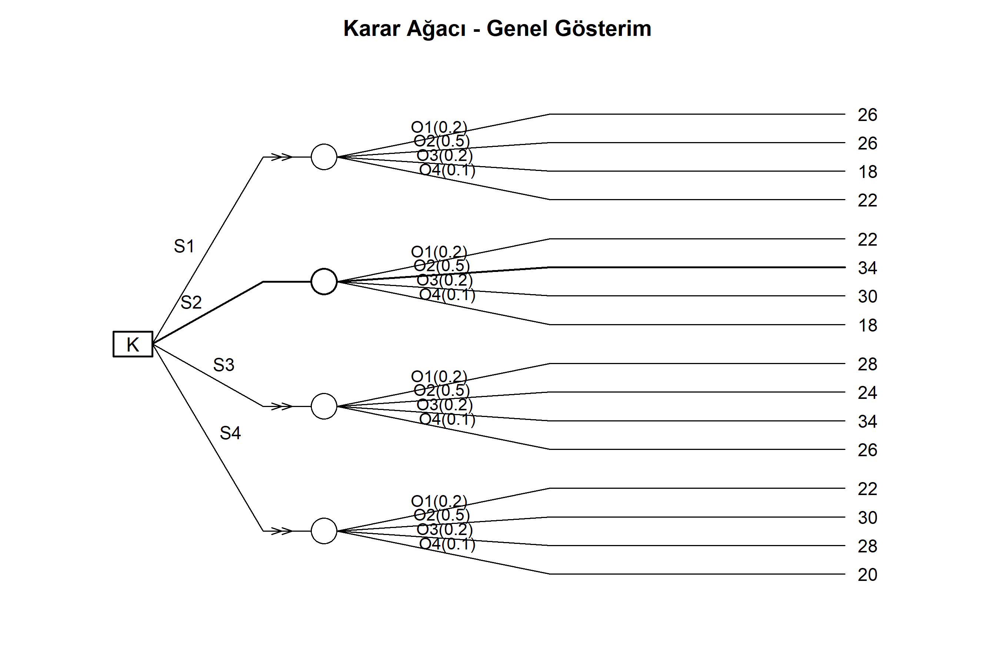{width=850 height=550 fig-align="center"}

:::


## Örnek 1: En İyi Strateji - Karar Ağacı - Kazanç - En Çok Olabilirlik


::: {.callout-tip icon=false title="Örnek 1: En İyi Strateji - Karar Ağacı - Kazanç - En Çok Olabilirlik" style="font-size: 95%;"}


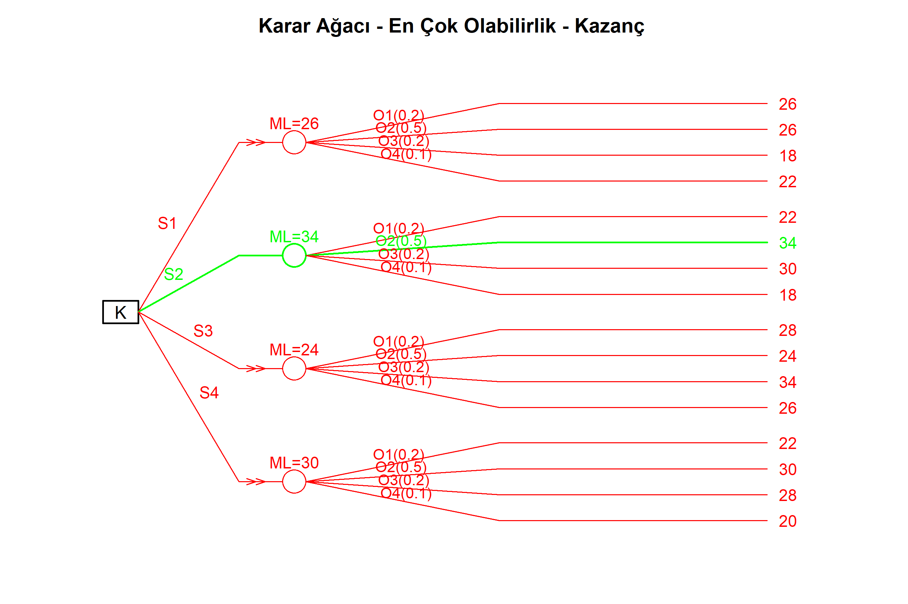{width=850 height=550 fig-align="center"}

:::

## Örnek 1: En İyi Strateji - Karar Ağacı - Kazanç - Beklenen Değer


::: {.callout-tip icon=false title="Örnek 1: En İyi Strateji - Karar Ağacı - Kazanç - Beklenen Değer" style="font-size: 95%;"}


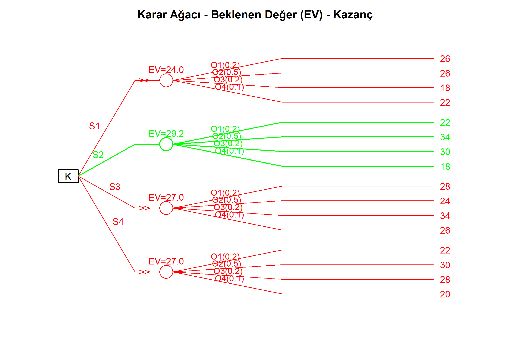{width=850 height=550 fig-align="center"}

:::

## Örnek 1: En İyi Strateji - Kazanç Matrisi - Beklenen Pişmanlık Ölçütü (2)

::: {.callout-tip icon=false title="Örnek 1: En İyi Strateji - Kazanç Matrisi - Beklenen Pişmanlık Ölçütü (2)" style="font-size: 80%;"}

:::{.fragment fragment-index=1}
Beklenen fırsat kaybı ölçütünde fırsat kayıpları esas alındığından önce [fırsat kayıpları matrisinin]{.light-red} düzenlenmesi gerekir. 

[Kazanç matrisi]{.light-red} üzerinde çalışıldığı için [fırsat kaybı matrisi]{.light-red}, [orijinal matrisin sütun değerlerinin her birinin]{.light-red}, [sütun en büyük değerinden çıkartılmasıyla]{.light-red} elde edilir.
:::

::: columns

::: {.column width="50%"}
:::{.fragment fragment-index=2}
:::{.tblbox .tbl-fs-xl .w-100 .scale-90  .pad-tight .text-center .scroll-x .scroll-y}
```{=html}

```
:::
:::
:::

::: {.column width="1%"}
:::

::: {.column width="49%"}
:::{.fragment fragment-index=3}
Fırsat kaybı matrisinin oluşturulmasından sonra [olayların gerçekleşmesi olasılıklarından]{.light-red} yararlanarak her bir eylem için [beklenen fırsat kaybı]{.light-red} değerleri hesaplanmalıdır. Söz konusu değerler aşağıdaki gibi hesaplanacaktır.
:::

:::{.fragment fragment-index=5}
* Sonuçta, [beklenen fırsat kaybı]{.light-red} ölçütüne göre [en iyi strateji]{.light-red} [en küçük beklenen fırsat kaybı değerini]{.light-red} [$(2.8)$]{.orange} veren [$S2$]{.light-blue} olacaktır. 
:::
:::
:::


::: columns

::: {.column width="55%"}
:::{.fragment fragment-index=4 style="font-size: 90%;"}
* [S1 için]{.red} [$0.2\cdot2 + 0.5\cdot8 + 0.2\cdot16 + 0.1\cdot4 = 8.0$]{.light-blue}
* [S2 için]{.red} [$0.2\cdot6 + 0.5\cdot0 + 0.2\cdot4 + 0.1\cdot8 = 2.8$]{.light-blue}
* [S3 için]{.red} [$0.2\cdot0 + 0.5\cdot10 + 0.2\cdot0 + 0.1\cdot0 = 5.0$]{.light-blue}
* [S4 için]{.red} [$0.2\cdot6 + 0.5\cdot4 + 0.2\cdot6 + 0.1\cdot6 = 5.0$]{.light-blue}
:::
:::

::: {.column width="1%"}
:::

::: {.column width="44%"}
:::{.fragment fragment-index=6 style="font-size: 100%;"}
* Bu ölçütle en iyi olduğu kararlaştırılan [$S2$]{.light-blue}’nin daha önce [beklenen değer ölçütüyle]{.light-red} [en iyi olduğu belirlenen]{.light-red} strateji olduğuna dikkat edilmelidir.
:::
:::
:::

:::


## Örnek 1: En İyi Strateji - Karar Ağacı - Kazanç - Beklenen Pişmanlık


::: {.callout-tip icon=false title="Örnek 1: En İyi Strateji - Karar Ağacı - Kazanç - Beklenen Pişmanlık" style="font-size: 95%;"}


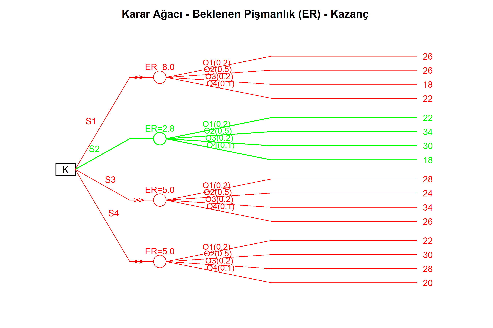{width=850 height=550 fig-align="center"}

:::

## Örnek 1: En İyi Strateji - Karar Ağacı - Kayıp - En Çok Olabilirlik


::: {.callout-tip icon=false title="Örnek 1: En İyi Strateji - Karar Ağacı - Kayıp - En Çok Olabilirlik" style="font-size: 95%;"}


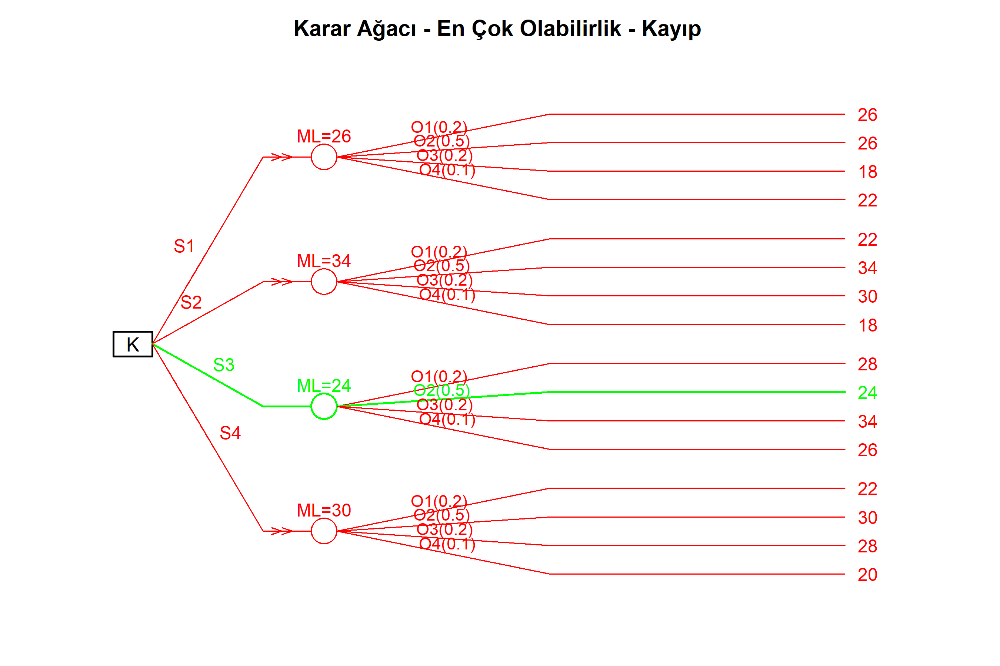{width=850 height=550 fig-align="center"}

:::

## Örnek 1: En İyi Strateji - Karar Ağacı - Kayıp - Beklenen Değer


::: {.callout-tip icon=false title="Örnek 1: En İyi Strateji - Karar Ağacı - Kayıp - Beklenen Değer" style="font-size: 95%;"}


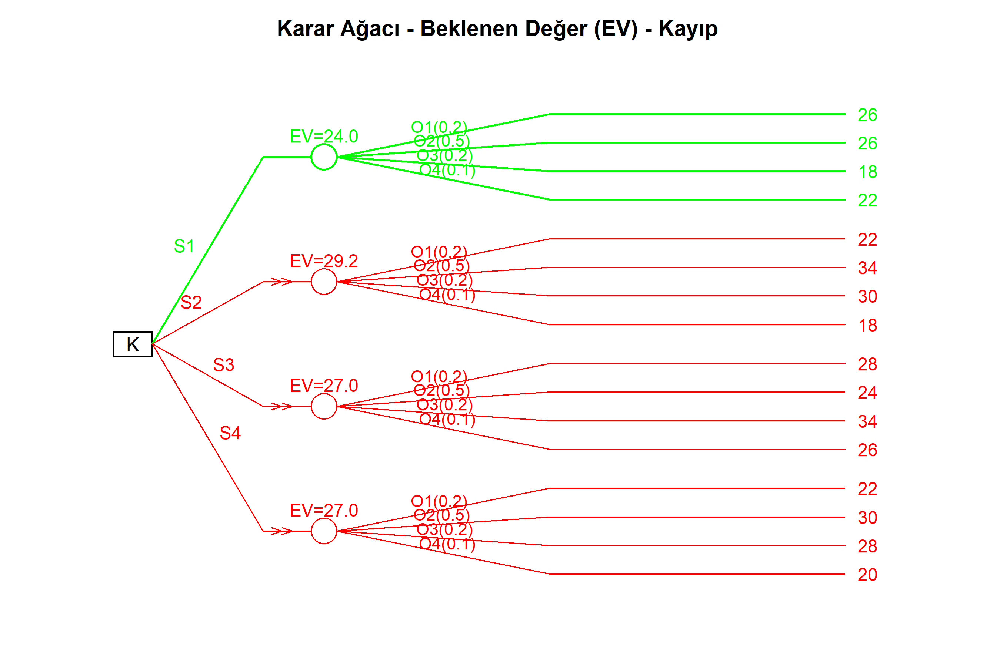{width=850 height=550 fig-align="center"}

:::

## Örnek 1: En İyi Strateji - Kayıp Matrisi - Beklenen Pişmanlık Ölçütü

::: {.callout-tip icon=false title="Örnek 1: En İyi Strateji - Kayıp Matrisi - Beklenen Pişmanlık Ölçütü (2)" style="font-size: 80%;"}

:::{.fragment fragment-index=1}
Beklenen fırsat kaybı ölçütünde fırsat kayıpları esas alındığından önce [fırsat kayıpları matrisinin]{.light-red} düzenlenmesi gerekir. 

[Kayıp matrisi]{.light-red} üzerinde çalışıldığı için [fırsat kaybı matrisi]{.light-red}, [orijinal matrisin sütun değerlerinin her birinin]{.light-red}, [sütun en küçük değerinden çıkartılmasıyla]{.light-red} elde edilir.
:::

::: columns

::: {.column width="50%"}
:::{.fragment fragment-index=2}
:::{.tblbox .tbl-fs-xl .w-100 .scale-90  .pad-tight .text-center .scroll-x .scroll-y}
```{=html}

```
:::
:::
:::

::: {.column width="1%"}
:::

::: {.column width="49%"}
:::{.fragment fragment-index=3}
Fırsat kaybı matrisinin oluşturulmasından sonra [olayların gerçekleşmesi olasılıklarından]{.light-red} yararlanarak her bir eylem için [beklenen fırsat kaybı]{.light-red} değerleri hesaplanmalıdır. Söz konusu değerler aşağıdaki gibi hesaplanacaktır.
:::

:::{.fragment fragment-index=5}
* Sonuçta, [beklenen fırsat kaybı]{.light-red} ölçütüne göre [en iyi strateji]{.light-red} [en küçük beklenen fırsat kaybı değerini]{.light-red} [$(2.2)$]{.orange} veren [$S1$]{.light-blue} olacaktır. 
:::
:::
:::


::: columns

::: {.column width="55%"}
:::{.fragment fragment-index=4 style="font-size: 92%;"}
* [S1 için]{.red} [$0.2\cdot4 + 0.5\cdot2 + 0.2\cdot0 + 0.1\cdot4 = 2.2$]{.light-blue}
* [S2 için]{.red} [$0.2\cdot0 + 0.5\cdot10 + 0.2\cdot12 + 0.1\cdot0 = 7.4$]{.light-blue}
* [S3 için]{.red} [$0.2\cdot6 + 0.5\cdot0 + 0.2\cdot16 + 0.1\cdot8 = 5.2$]{.light-blue}
* [S4 için]{.red} [$0.2\cdot0 + 0.5\cdot6 + 0.2\cdot10 + 0.1\cdot2 = 5.2$]{.light-blue}
:::
:::

::: {.column width="1%"}
:::

::: {.column width="44%"}
:::{.fragment fragment-index=6}
* Bu ölçütle en iyi olduğu kararlaştırılan [$S1$]{.light-blue}’in daha önce [beklenen değer ölçütüyle]{.light-red} [en iyi olduğu belirlenen]{.light-red} strateji olduğuna dikkat edilmelidir.
:::
:::
:::

:::


## Örnek 1: En İyi Strateji - Karar Ağacı - Kayıp - Beklenen Pişmanlık


::: {.callout-tip icon=false title="Örnek 1: En İyi Strateji - Karar Ağacı - Kayıp - Beklenen Pişmanlık" style="font-size: 95%;"}


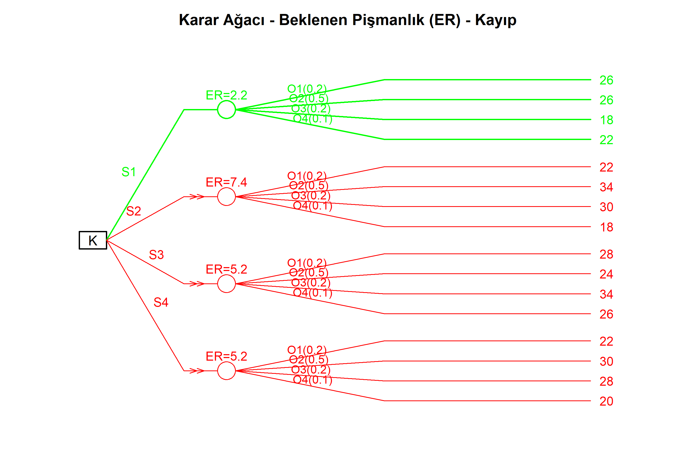{width=850 height=550 fig-align="center"}

:::


## Örnek 2: Mağaza (1)


::: {.callout-tip icon=false title="Örnek 2: Mağaza (1)" style="font-size: 90%;"}

* Bir [mağaza]{.light-red} sahibinin; [$100$]{.light-blue}, [$200$]{.light-blue} veya [$300$]{.light-blue} adet sipariş vermek gibi [üç]{.light-blue} [stratejisi]{.light-red} vardır. 
* [$O1$]{.light-blue}, [$O2$]{.light-blue}, [$O3$]{.light-blue} ve [$O4$]{.light-blue} ile simgelenen [olaylar]{.light-red} sırasıyla, [istemin]{.light-red} [$100$]{.light-blue}, [$150$]{.light-blue}, [$200$]{.light-blue} ve [$250$]{.light-blue} adet olması [durumlarını]{.light-red} belirtmektedir. 
* İstemin [$100$]{.light-blue} olma olasılığının [$0.2$]{.light-blue}; [$150$]{.light-blue} olma olasılığının [$0.3$]{.light-blue}; [$200$]{.light-blue} olma olasılığının [$0.3$]{.light-blue} ve [$250$]{.light-blue} olma olasılığının [$0.2$]{.light-blue} olduğu bilinmektedir.
* Karar matrisinin elemanları [farklı sipariş]{.light-red} ve [istem miktarı]{.light-red} birleşimlerinin sonucu elde edilecek 
  [a) kâr]{.light-red} olarak tanımlandığı, <br>
  [b) maliyet]{.light-red} olarak tanımlandığı durumu göstersin.


::: columns

::: {.column width="60%"}
:::{.tblbox .tbl-fs-xl .w-60 .scale-90  .pad-tight .text-center .scroll-x .scroll-y}
```{=html}

```
:::
:::


::: {.column width="1%"}
:::

::: {.column width="39%"}
[Her iki durum için de mağaza sahibinin en yüksek olabilirlik, beklenen değer ve beklenen pişmanlık kurallarına göre hangi stratejiyi seçmesi gerektiğini ve bu stratejiye ait değerleri karar ağacı yardımıyla elde ediniz.]{.red}
:::
:::
:::


## Örnek 2: Mağaza - Karar Ağacı - Kazanç - Genel Gösterim


::: {.callout-tip icon=false title="Örnek 2: Mağaza - Karar Ağacı - Kazanç - Genel Gösterim" style="font-size: 95%;"}


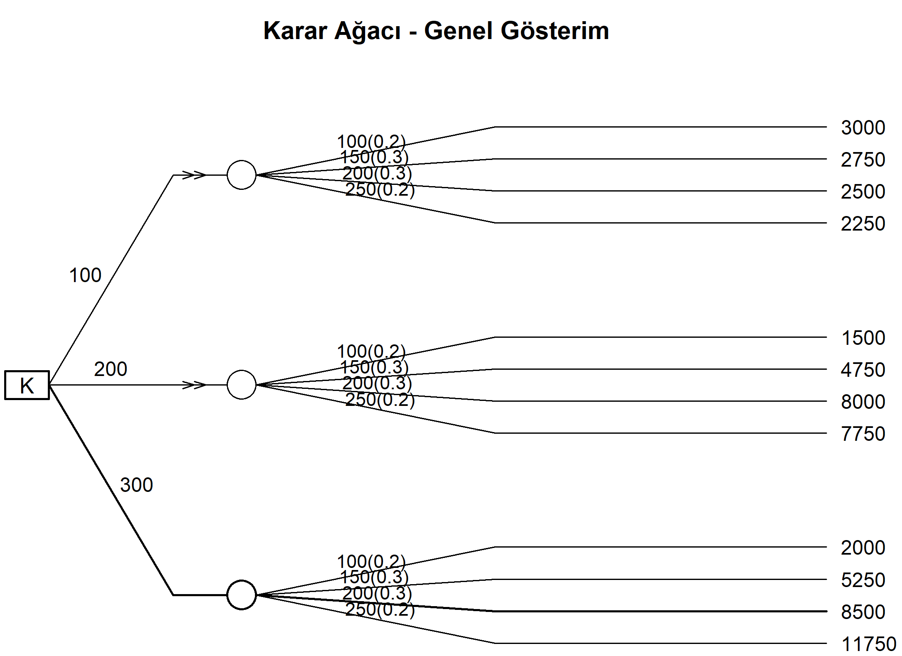{width=850 height=550 fig-align="center"}

:::

## Örnek 2: Mağaza - Karar Ağacı - Kazanç - En Yüksek Olabilirlik


::: {.callout-tip icon=false title="Örnek 1: En İyi Strateji - Karar Ağacı - Kazanç - En Yüksek Olabilirlik" style="font-size: 95%;"}


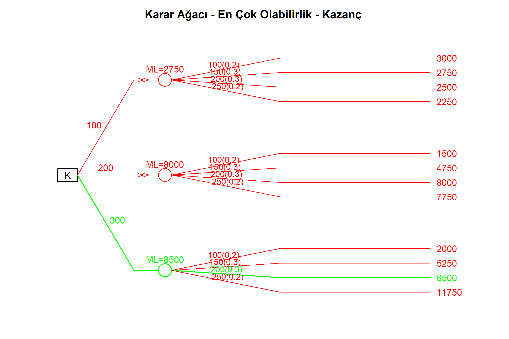{width=850 height=550 fig-align="center"}

:::


## Örnek 2: Mağaza - Karar Ağacı - Kazanç - Beklenen Değer


::: {.callout-tip icon=false title="Örnek 2: Mağaza - Karar Ağacı - Kazanç - Beklenen Değer" style="font-size: 95%;"}


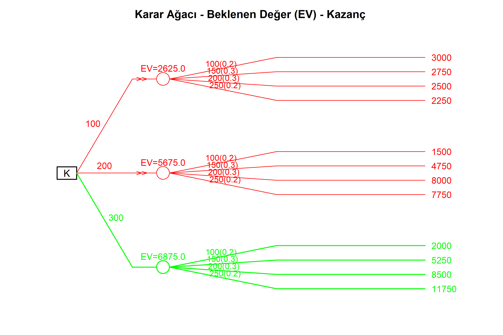{width=850 height=550 fig-align="center"}

:::

## Örnek 2: Mağaza - Kazanç Matrisi - Beklenen Pişmanlık Ölçütü

::: {.callout-tip icon=false title="Örnek 2: Mağaza - Kazanç Matrisi - Beklenen Pişmanlık Ölçütü" style="font-size: 80%;"}

:::{.fragment fragment-index=1}
[Kazanç matrisi]{.light-red} üzerinde çalışıldığı için [fırsat kaybı matrisi]{.light-red}, [orijinal matrisin sütun değerlerinin her birinin]{.light-red}, [sütun en büyük değerinden çıkartılmasıyla]{.light-red} elde edilir.
:::

::: columns

::: {.column width="70%"}
:::{.fragment fragment-index=2}
:::{.tblbox .tbl-fs-xl .w-100 .scale-90  .pad-tight .text-center .scroll-x .scroll-y}
```{=html}

```
:::
:::
:::

::: {.column width="1%"}
:::

::: {.column width="29%"}
:::{.fragment fragment-index=3}
Fırsat kaybı matrisinin oluşturulmasından sonra [olayların gerçekleşmesi olasılıklarından]{.light-red} yararlanarak her bir eylem için [beklenen fırsat kaybı]{.light-red} değerleri hesaplanmalıdır. Söz konusu değerler aşağıdaki gibi hesaplanacaktır.
:::
:::
:::


::: columns

::: {.column width="55%"}
:::{.fragment fragment-index=4 style="font-size: 90%;"}
* [S1 - 100 sipariş için]{.red} [$0.2\cdot0 + 0.3\cdot2500 + 0.3\cdot6000 + 0.2\cdot9500 = 4450$]{.light-blue}
* [S2 - 200 sipariş için]{.red} [$0.2\cdot1500 + 0.3\cdot500 + 0.3\cdot500 + 0.2\cdot4000 = 1400$]{.light-blue}
* [S3 - 300 sipariş için]{.red} [$0.2\cdot1000 + 0.3\cdot0 + 0.3\cdot0 + 0.2\cdot0 = 200$]{.light-blue}
:::
:::

::: {.column width="1%"}
:::

::: {.column width="44%"}
:::{.fragment fragment-index=5 style="font-size: 95%;"}
* Sonuçta, [beklenen fırsat kaybı]{.light-red} ölçütüne göre [en iyi strateji]{.light-red} [en küçük beklenen fırsat kaybı değerini]{.light-red} [$(200)$]{.orange} veren [S3 - $300$ sipariş]{.light-blue} olacaktır. 
* Bu ölçütle en iyi olduğu kararlaştırılan [$300$ sipariş]{.light-blue}’in daha önce [beklenen değer ölçütüyle]{.light-red} [en iyi olduğu belirlenen]{.light-red} strateji olduğuna dikkat edilmelidir.
:::
:::
:::

:::


## Örnek 2: Mağaza - Karar Ağacı - Kazanç - Beklenen Pişmanlık


::: {.callout-tip icon=false title="Örnek 2: Mağaza - Karar Ağacı - Kazanç - Beklenen Pişmanlık" style="font-size: 95%;"}


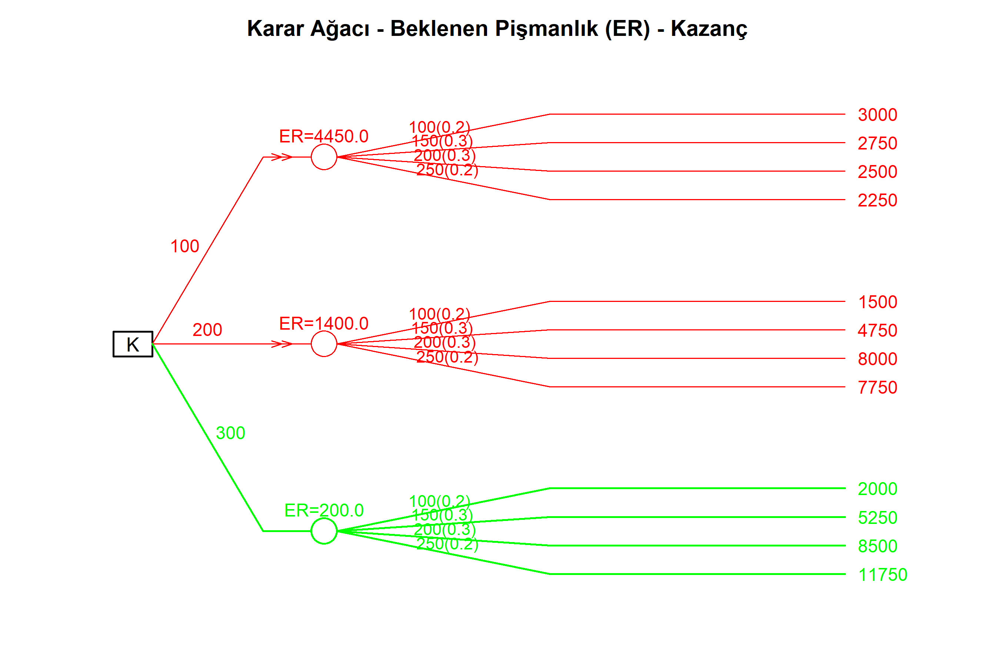{width=850 height=550 fig-align="center"}

:::

## Örnek 2: Mağaza - Karar Ağacı - Maliyet - En Yüksek Olabilirlik


::: {.callout-tip icon=false title="Örnek 1: En İyi Strateji - Karar Ağacı - Maliyet - En Yüksek Olabilirlik" style="font-size: 95%;"}


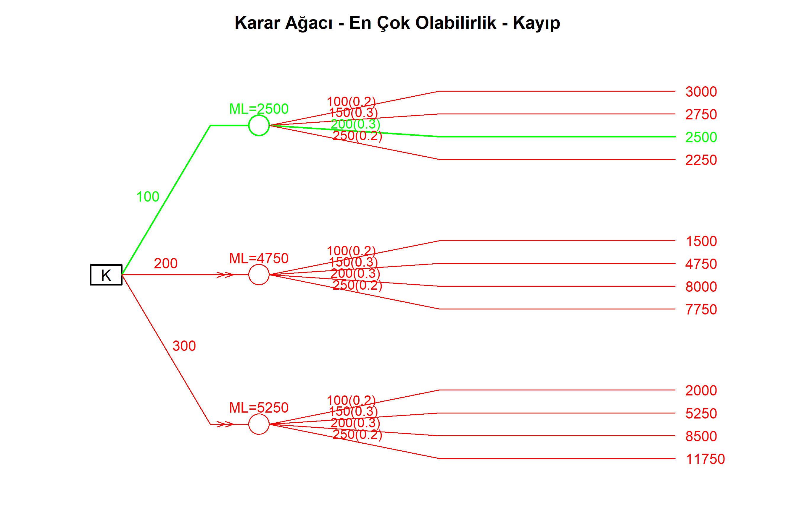{width=850 height=550 fig-align="center"}

:::


## Örnek 2: Mağaza - Karar Ağacı - Maliyet - Beklenen Değer


::: {.callout-tip icon=false title="Örnek 2: Mağaza - Karar Ağacı - Maliyet - Beklenen Değer" style="font-size: 95%;"}


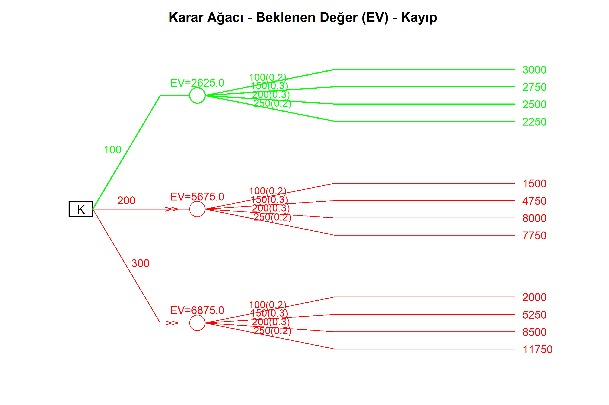{width=850 height=550 fig-align="center"}

:::

## Örnek 2: Mağaza - Kayıp Matrisi - Beklenen Pişmanlık Ölçütü

::: {.callout-tip icon=false title="Örnek 2: Mağaza - Kayıp Matrisi - Beklenen Pişmanlık Ölçütü" style="font-size: 80%;"}

:::{.fragment fragment-index=1}
[Kayıp matrisi]{.light-red} üzerinde çalışıldığı için [fırsat kaybı matrisi]{.light-red}, [orijinal matrisin sütun değerlerinin her birinden]{.light-red}, [sütun en küçük değerinin çıkartılmasıyla]{.light-red} elde edilir.
:::

::: columns

::: {.column width="70%"}
:::{.fragment fragment-index=2}
:::{.tblbox .tbl-fs-xl .w-100 .scale-90 .pad-tight .text-center .scroll-x .scroll-y}
```{=html}

```
:::
:::
:::

::: {.column width="1%"}
:::

::: {.column width="29%"}
:::{.fragment fragment-index=3}
Fırsat kaybı matrisinin oluşturulmasından sonra [olayların gerçekleşmesi olasılıklarından]{.light-red} yararlanarak her bir eylem için [beklenen fırsat kaybı]{.light-red} değerleri hesaplanmalıdır. Söz konusu değerler aşağıdaki gibi hesaplanacaktır.
:::
:::
:::


::: columns

::: {.column width="55%"}
:::{.fragment fragment-index=4 style="font-size: 90%;"}
* [S1 - 100 sipariş için]{.red} [$0.2\cdot 1500 + 0.3\cdot 0 + 0.3\cdot 0 + 0.2\cdot 0 = 300$]{.light-blue}
* [S2 - 200 sipariş için]{.red} [$0.2\cdot 0 + 0.3\cdot 2000 + 0.3\cdot 5500 + 0.2\cdot 5500 = 3350$]{.light-blue}
* [S3 - 300 sipariş için]{.red} [$0.2\cdot 500 + 0.3\cdot 2500 + 0.3\cdot 6000 + 0.2\cdot 9500 = 4550$]{.light-blue}
:::
:::

::: {.column width="1%"}
:::

::: {.column width="44%"}
:::{.fragment fragment-index=5 style="font-size: 95%;"}
* Sonuçta, [beklenen fırsat kaybı]{.light-red} ölçütüne göre [en iyi strateji]{.light-red} [en küçük beklenen fırsat kaybı değerini]{.light-red} [$(300)$]{.orange} veren [S1 - $100$ sipariş]{.light-blue} olacaktır. 
* Bu ölçütle en iyi olduğu kararlaştırılan [$100$ sipariş]{.light-blue}’in daha önce [beklenen değer ölçütüyle]{.light-red} [en iyi olduğu belirlenen]{.light-red} strateji olduğuna dikkat edilmelidir.
:::
:::
:::

:::

## Örnek 2: Mağaza - Karar Ağacı - Maliyet - Beklenen Pişmanlık


::: {.callout-tip icon=false title="Örnek 2: Mağaza - Karar Ağacı - Maliyet - Beklenen Pişmanlık" style="font-size: 95%;"}


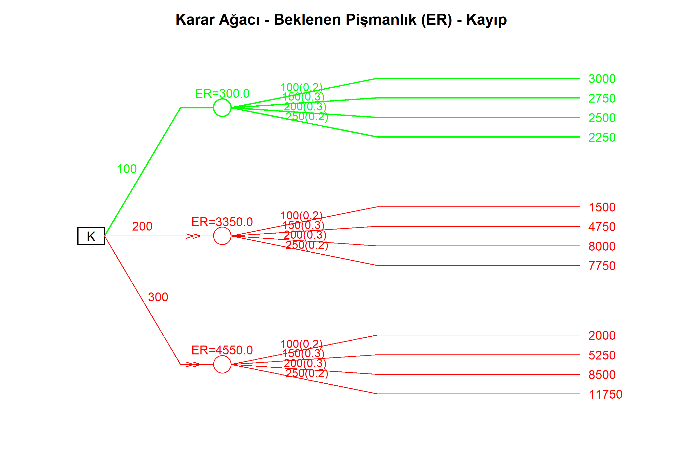{width=850 height=550 fig-align="center"}

:::

## Örnek 3: Hisse Senedi


::: {.callout-tip icon=false title="Örnek 3: Hisse Senedi" style="font-size: 95%;"}

* [A]{.light-red} ve [B]{.light-red} firmalarının hisse senetlerini alarak borsaya [$10000$ pb]{.light-blue} para yatırmak istediğinizi varsayalım. 
* [A]{.light-red} firmasının hisse senetleri riskli olmakla birlikte, 
  * Borsanın [iyi]{.light-red} gittiği durumda [(boğaların hakim olduğu pazarda)]{.light-red} gelecek sene için değeri [$\%50$ artacaktır]{.light-blue}. 
  * Eğer borsa [iyi gitmezse]{.light-red} [(ayıların hakim olduğu pazarda)]{.light-red} hisse senedinin değeri [$%20$ azalacaktır]{.light-blue}. 
* [B]{.light-red} hisse senedi ise güvenli bir şekilde 
  * [boğaların]{.light-red} hakim olduğu pazarda [$\%15$ getiri]{.light-blue}, 
  * [ayıların]{.light-red} hakim olduğu pazarda [$\%5$ getiri]{.light-blue} sağlayacaktır. 
* Başvurulan tüm kaynaklar [boğaların]{.light-red} hakim olduğu pazara [$\%60$]{.light-blue}, [ayıların]{.light-red} bulunduğu pazara [$\%40$]{.light-blue} şans vererek tahmin yapmaktadır.
* [Paranızı nereye yatırmanız gerektiğini ve olası kazancınızı en yüksek olabilirlik, beklenen değer ve beklenen pişmanlık kurallarına göre karar ağacı kullanarak hesaplayınız.]{.red}

:::

## Örnek 3: Hisse Senedi - Karar Matrisinin Oluşturulması


::: {.callout-tip icon=false title="Örnek 3: Hisse Senedi - Karar Matrisinin Oluşturulması" style="font-size: 85%;"}
:::{.fragment fragment-index=1}
* Diğer sorulardan farklı olarak bu soruda [karar matrisi bize verilmemiş]{.light-red}, olası durumlara göre matrisi [bizden  hazırlamamız beklenmektedir]{.light-red}.
:::

:::{.fragment fragment-index=2}
* Olası durumlara bakılırsa,
  * [A]{.light-red} hisse senedi seçilir ve [boğa]{.light-red} yılı olursa, [$10000 \times 0.5 = 5000$ pb]{.light-blue} getiri olur.
  * [A]{.light-red} hisse senedi seçilir ve [ayı]{.light-red} yılı olursa, [$10000 \times (-0.2) = (-2000)$ pb]{.light-blue} getiri olur.
  * [B]{.light-red} hisse senedi seçilir ve [boğa]{.light-red} yılı olursa, [$10000 \times 0.15 = 1500$ pb]{.light-blue} getiri olur.
  * [A]{.light-red} hisse senedi seçilir ve [ayı]{.light-red} yılı olursa, [$10000 \times 0.05 = 500$ pb]{.light-blue} getiri olur.
:::

:::{.fragment fragment-index=3}
Bu bilgilere göre [karar matrisi]{.light-red} aşağıdaki gibi elde edilir. 
:::

:::{.fragment fragment-index=4}
:::{.tblbox .tbl-fs-xl .w-60 .scale-100  .pad-tight .text-center .scroll-x .scroll-y}
```{=html}

```
:::
:::
:::


## Örnek 3: Hisse Senedi - Karar Ağacı - Kazanç - Genel Gösterim


::: {.callout-tip icon=false title="Örnek 3: Hisse Senedi - Karar Ağacı - Kazanç - Genel Gösterim" style="font-size: 95%;"}


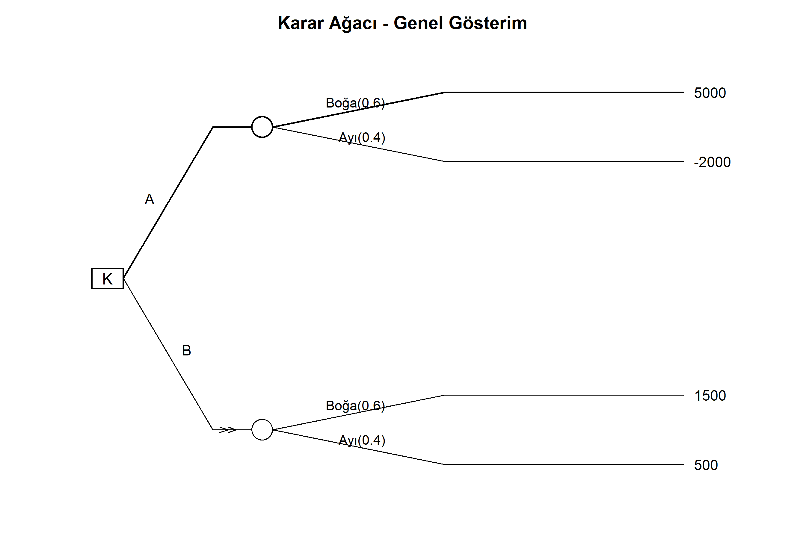{width=850 height=550 fig-align="center"}

:::

## Örnek 3: Hisse Senedi - Karar Ağacı - Kazanç - En Yüksek Olabilirlik


::: {.callout-tip icon=false title="Örnek 3: Hisse Senedi - Karar Ağacı - Kazanç - En Yüksek Olabilirlik" style="font-size: 95%;"}


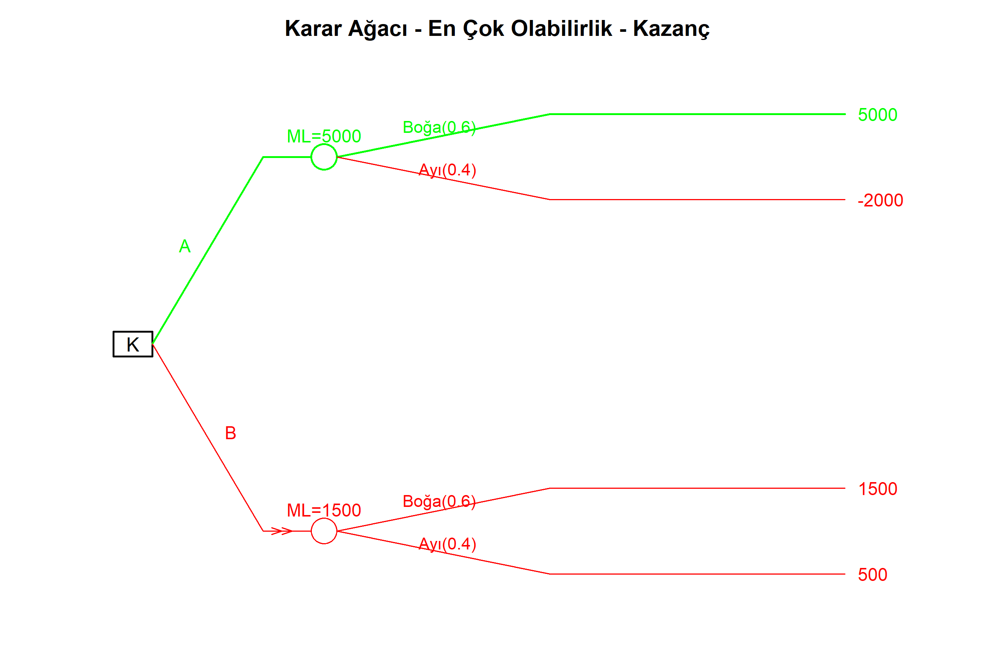{width=850 height=550 fig-align="center"}

:::


## Örnek 3: Hisse Senedi - Karar Ağacı - Kazanç - Beklenen Değer


::: {.callout-tip icon=false title="Örnek 3: Hisse Senedi - Karar Ağacı - Kazanç - Beklenen Değer" style="font-size: 95%;"}


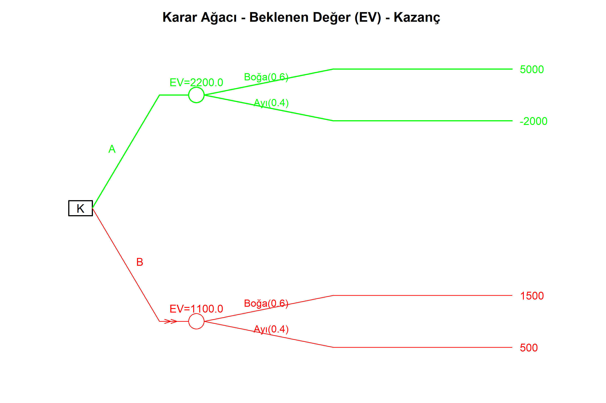{width=850 height=550 fig-align="center"}

:::

## Örnek 3: Hisse Senedi - Kazanç Matrisi - Beklenen Pişmanlık Ölçütü

::: {.callout-tip icon=false title="Örnek 3: Hisse Senedi - Kazanç Matrisi - Beklenen Pişmanlık Ölçütü" style="font-size: 80%;"}

:::{.fragment fragment-index=1}
[Kazanç matrisi]{.light-red} üzerinde çalışıldığı için [fırsat kaybı matrisi]{.light-red}, [orijinal matrisin sütun değerlerinin her birinin]{.light-red}, [sütun en büyük değerinden çıkartılmasıyla]{.light-red} elde edilir.
:::

::: columns

::: {.column width="70%"}
:::{.fragment fragment-index=2}
:::{.tblbox .tbl-fs-xl .w-100 .scale-100  .pad-tight .text-center .scroll-x .scroll-y}
```{=html}

```
:::
:::
:::

::: {.column width="1%"}
:::

::: {.column width="29%"}
:::{.fragment fragment-index=3}
Fırsat kaybı matrisinin oluşturulmasından sonra [olayların gerçekleşmesi olasılıklarından]{.light-red} yararlanarak her bir eylem için [beklenen fırsat kaybı]{.light-red} değerleri hesaplanmalıdır. Söz konusu değerler aşağıdaki gibi hesaplanacaktır.
:::
:::
:::


::: columns

::: {.column width="55%"}
:::{.fragment fragment-index=4 style="font-size: 100%;"}
* [A hisse senedi için]{.red} [$0.6\cdot 0 + 0.4 \cdot 2500 = 1000$]{.light-blue}
* [B hisse senedi için]{.red} [$0.6\cdot 3500 + 0.4\cdot 0 = 2100$]{.light-blue}
:::
:::

::: {.column width="1%"}
:::

::: {.column width="44%"}
:::{.fragment fragment-index=5 style="font-size: 95%;"}
* Sonuçta, [beklenen fırsat kaybı]{.light-red} ölçütüne göre [en iyi strateji]{.light-red} [en küçük beklenen fırsat kaybı değerini]{.light-red} [$(1000)$]{.orange} veren [A hisse senedi]{.light-blue} olacaktır. 
* Bu ölçütle en iyi olduğu kararlaştırılan [A hisse senedi]{.light-blue}’nin daha önce [beklenen değer ölçütüyle]{.light-red} [en iyi olduğu belirlenen]{.light-red} strateji olduğuna dikkat edilmelidir.
:::
:::
:::

:::

## Örnek 3: Hisse Senedi - Karar Ağacı - Kazanç - Beklenen Pişmanlık


::: {.callout-tip icon=false title="Örnek 3: Hisse Senedi - Karar Ağacı - Kazanç - Beklenen Pişmanlık" style="font-size: 95%;"}


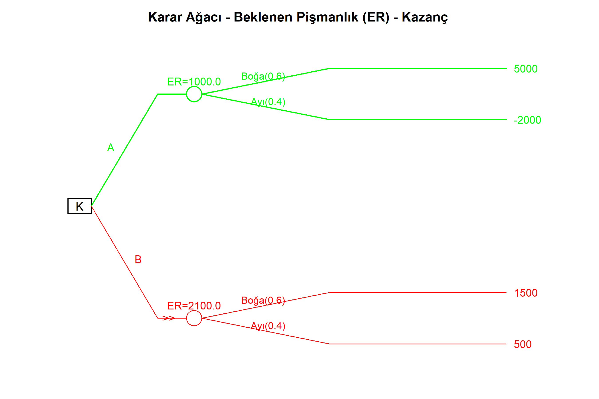{width=850 height=550 fig-align="center"}

:::


## Örnek 4: Fon


::: {.callout-tip icon=false title="Örnek 4: Fon" style="font-size: 90%;"}

* Paranızı [kamu]{.light-red}, [gelişme]{.light-red} ve [global]{.light-red} gibi [üç]{.light-blue} farklı [fonda]{.light-red} değerlendirebilme şansına sahip olduğunuzu düşünelim.
* Yatırımınızın değeri [pazar koşullarına]{.light-red} bağlı olarak [değişecektir]{.light-red}.
* Pazarın kötüye gitme olasılığı [$\%10$]{.light-blue}, ne kötü ne iyi gitme olasılığı [$\%50$]{.light-blue} ve iyi gitme olasılığı ise [$\%40$]{.light-blue}'tır.
* Aşağıdaki [tabloda]{.light-red} [pazarın durumu]{.light-red} ve [paranın yatırıldığı fon]{.light-red} göz önüne alınarak hazırlanan [kazanç matrisi]{.orange} verilmiştir.


::: columns

::: {.column width="60%"}
:::{.tblbox .tbl-fs-xl .w-90 .scale-120  .pad-tight .text-center .scroll-x .scroll-y}
```{=html}

```
:::
:::


::: {.column width="1%"}
:::

::: {.column width="39%"}
[Buna göre hangi fonu seçmeniz gerektiğini ve elde edeceğiniz beklenen kazancı en yüksek olabilirlik, beklenen değer ve beklenen pişmanlık kurallarına göre karar ağacı kullanarak hesaplayınız.]{.red}

:::
:::
:::


## Örnek 4: Fon - Karar Ağacı - Kazanç - Genel Gösterim


::: {.callout-tip icon=false title="Örnek 4: Fon - Karar Ağacı - Kazanç - Genel Gösterim" style="font-size: 95%;"}


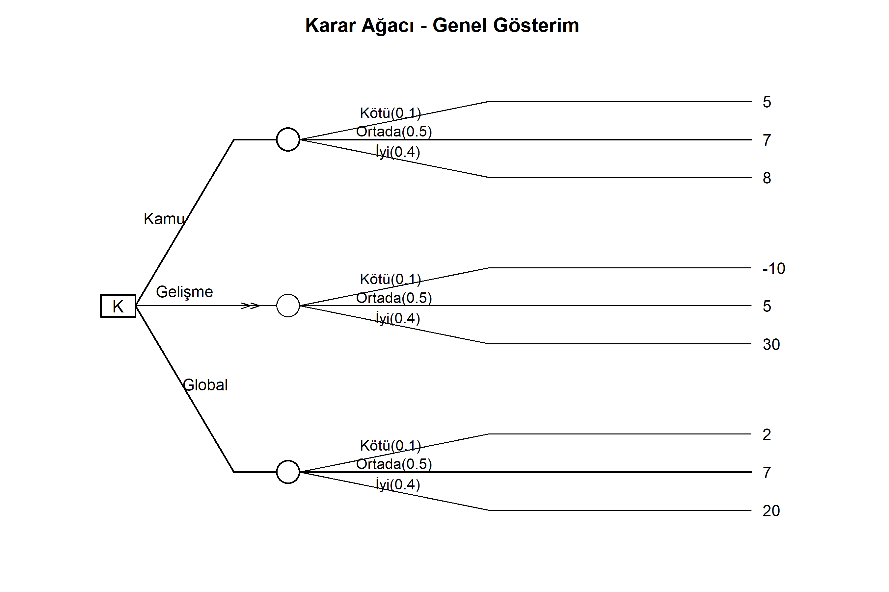{width=850 height=550 fig-align="center"}

:::

## Örnek 4: Fon - Karar Ağacı - Kazanç - En Yüksek Olabilirlik


::: {.callout-tip icon=false title="Örnek 4: Fon - Karar Ağacı - Kazanç - En Yüksek Olabilirlik" style="font-size: 95%;"}


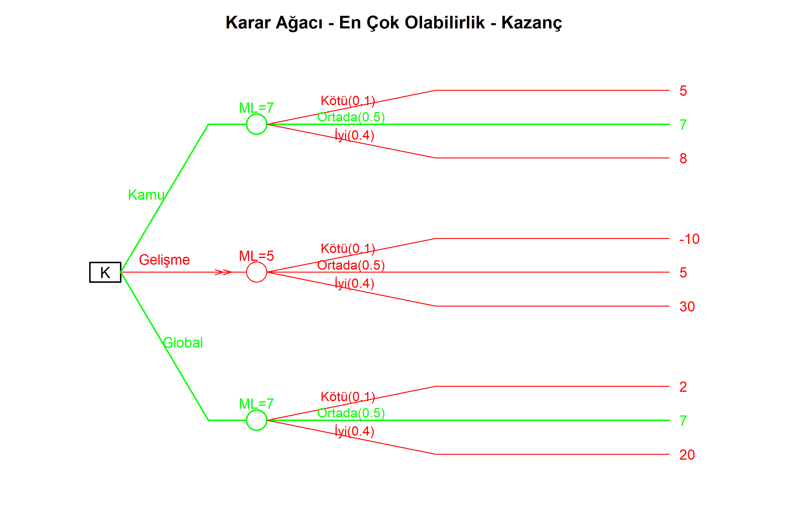{width=850 height=550 fig-align="center"}

:::


## Örnek 4: Fon - Karar Ağacı - Kazanç - Beklenen Değer


::: {.callout-tip icon=false title="Örnek 4: Fon - Karar Ağacı - Kazanç - Beklenen Değer" style="font-size: 95%;"}


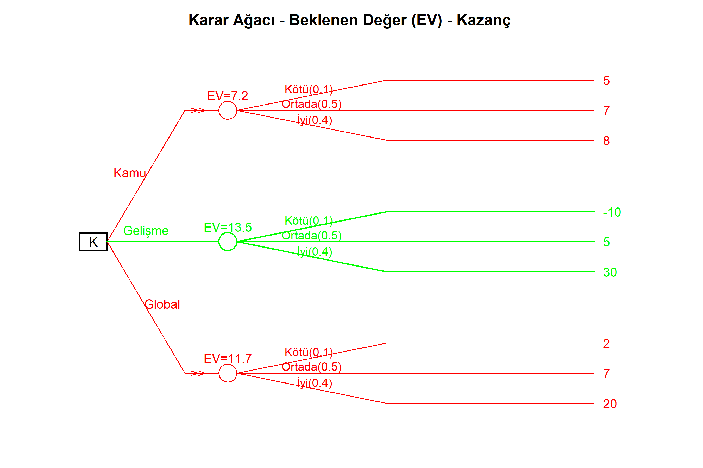{width=850 height=550 fig-align="center"}

:::

## Örnek 4: Fon - Kazanç Matrisi - Beklenen Pişmanlık Ölçütü

::: {.callout-tip icon=false title="Örnek 4: Fon - Kazanç Matrisi - Beklenen Pişmanlık Ölçütü" style="font-size: 80%;"}

:::{.fragment fragment-index=1}
[Kazanç matrisi]{.light-red} üzerinde çalışıldığı için [fırsat kaybı matrisi]{.light-red}, [orijinal matrisin sütun değerlerinin her birinin]{.light-red}, [sütun en büyük değerinden çıkartılmasıyla]{.light-red} elde edilir.
:::

::: columns

::: {.column width="70%"}
:::{.fragment fragment-index=2}
:::{.tblbox .tbl-fs-xl .w-100 .scale-100  .pad-tight .text-center .scroll-x .scroll-y}
```{=html}

```
:::
:::
:::

::: {.column width="1%"}
:::

::: {.column width="29%"}
:::{.fragment fragment-index=3}
Fırsat kaybı matrisinin oluşturulmasından sonra [olayların gerçekleşmesi olasılıklarından]{.light-red} yararlanarak her bir eylem için [beklenen fırsat kaybı]{.light-red} değerleri hesaplanmalıdır. Söz konusu değerler aşağıdaki gibi hesaplanacaktır.
:::
:::
:::


::: columns

::: {.column width="55%"}
:::{.fragment fragment-index=4 style="font-size: 100%;"}
* [Kamu için]{.red} [$0.1\cdot0 + 0.5\cdot0 + 0.4\cdot22 = 8.8$]{.light-blue}
* [Gelişme için]{.red} [$0.1\cdot15 + 0.5\cdot2 + 0.4\cdot0 = 2.5$]{.light-blue}
* [Global için]{.red} [$0.1\cdot3 + 0.5\cdot0 + 0.4\cdot10 = 4.3$]{.light-blue}
:::
:::

::: {.column width="1%"}
:::

::: {.column width="44%"}
:::{.fragment fragment-index=5 style="font-size: 95%;"}
* Sonuçta, [beklenen fırsat kaybı]{.light-red} ölçütüne göre [en iyi strateji]{.light-red} [en küçük beklenen fırsat kaybı değerini]{.light-red} [$(2.5)$]{.orange} veren [Gelişme fonu]{.light-blue} olacaktır. 
* Bu ölçütle en iyi olduğu kararlaştırılan [Gelişme fonu]{.light-blue}’nun daha önce [beklenen değer ölçütüyle]{.light-red} [en iyi olduğu belirlenen]{.light-red} strateji olduğuna dikkat edilmelidir.
:::
:::
:::

:::

## Örnek 4: Fon - Karar Ağacı - Kazanç - Beklenen Pişmanlık


::: {.callout-tip icon=false title="Örnek 4: Fon - Karar Ağacı - Kazanç - Beklenen Pişmanlık" style="font-size: 95%;"}


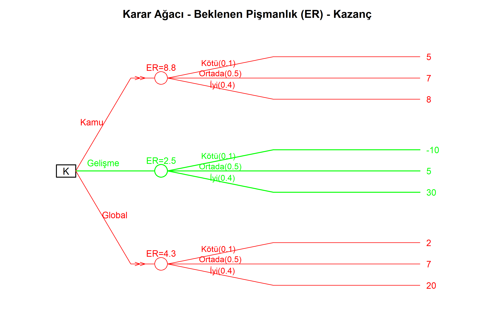{width=850 height=550 fig-align="center"}

:::


## Örnek 5: Doğal Yaşam Okulu


::: {.callout-tip icon=false title="Örnek 5: Doğal Yaşam Okulu" style="font-size: 75%;"}

* [Doğal yaşam okulu]{.light-red} katılanları doğal koşullarda yaşama konusunda eğitmek üzere ormanda kamp yapacaktır. Okul [katılımcı sayısının]{.light-red} [200]{.light-blue}, [250]{.light-blue}, [300]{.light-blue} ve [350]{.light-blue} olmak üzere [dört]{.light-blue} kategoriden birine ait olacağı tahmin edilmektedir.
* Eğer talebi [tam olarak karşılayabilecek]{.light-red} şekilde bir kamp organizasyonu yapılabilirse [maliyet minimum]{.light-red} olacaktır. İdeal talep düzeyinin [altında]{.light-red} ya da [üstündeki]{.light-red} sapmalar [oda fazlası]{.light-red} ve ya talebin karşılanmayan kısmından kaynaklanan [gelir kaybı]{.light-red} gibi [ek maliyetlere]{.light-red} neden olacaktır.
* [A1]{.light-blue}, [A2]{.light-blue}, [A3]{.light-blue} ve [A4]{.light-blue} sırasıyla [200]{.light-blue}, [250]{.light-blue}, [300]{.light-blue} ve [350]{.light-blue} kişi olarak [kamp yerlerinin kapasitesini]{.light-red} göstermektedir.
* [S1]{.light-blue}, [S2]{.light-blue}, [S3]{.light-blue} ve [S4]{.light-blue} ise sırasıyla [200]{.light-blue}, [250]{.light-blue}, [300]{.light-blue} ve [350]{.light-blue} kişi olarak [kampa katılım düzeyini]{.light-red} belirtmekte ve gerçekleşme ihtimalleri yine sırasıyla [$0.3$]{.light-blue}, [$0.4$]{.light-blue}, [$0.2$]{.light-blue} ve [$0.1$]{.light-blue} dir.
* Aşağıdaki tablo her bir [kamp yeri]{.light-red} ve [kampa katılım düzeyi]{.light-red} çifti için [maliyet tablosunu]{.orange} vermektedir.

::: columns

::: {.column width="60%"}
:::{.tblbox .tbl-fs-xl .w-90 .scale-100  .pad-tight .text-center .scroll-x .scroll-y}
```{=html}

```
:::
:::


::: {.column width="1%"}
:::

::: {.column width="39%"}
[Buna göre kaç kişilik bir kamp yeri tutulması gerektiğini en yüksek olabilirlik, beklenen değer ve beklenen pişmanlık kurallarına göre karar ağacı ile hesaplayınız. Her strateji için beklenen maliyeti belirleyiniz.]{.red}

:::
:::
:::

## Örnek 5: Doğal Yaşam Okulu - Karar Ağacı - Kazanç - Genel Gösterim


::: {.callout-tip icon=false title="Örnek 5: Doğal Yaşam Okulu - Karar Ağacı - Kazanç - Genel Gösterim" style="font-size: 95%;"}


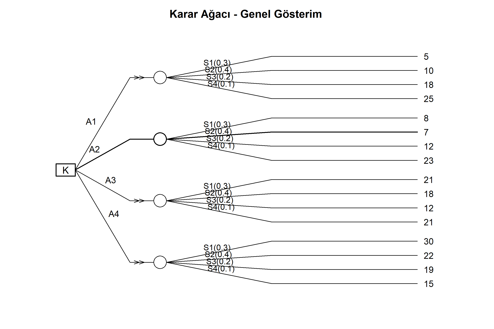{width=850 height=550 fig-align="center"}

:::

## Örnek 5: Doğal Yaşam Okulu - Karar Ağacı - Maliyet - En Yüksek Olabilirlik


::: {.callout-tip icon=false title="Örnek 5: Doğal Yaşam Okulu - Karar Ağacı - Maliyet - En Yüksek Olabilirlik" style="font-size: 95%;"}


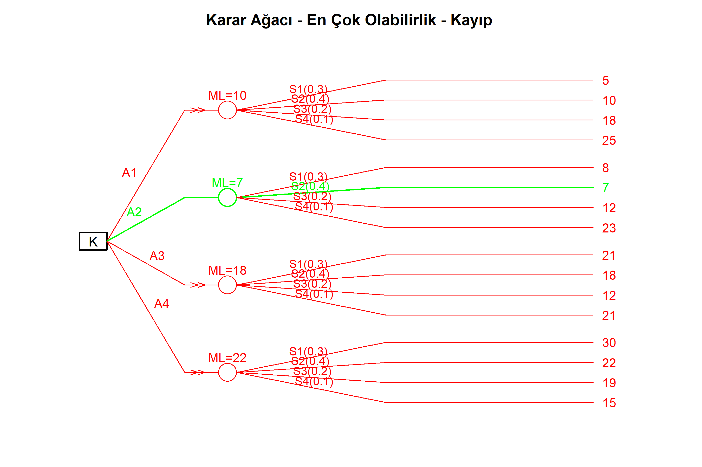{width=850 height=550 fig-align="center"}

:::


## Örnek 5: Doğal Yaşam Okulu - Karar Ağacı - Maliyet - Beklenen Değer


::: {.callout-tip icon=false title="Örnek 5: Doğal Yaşam Okulu - Karar Ağacı - Maliyet - Beklenen Değer" style="font-size: 95%;"}


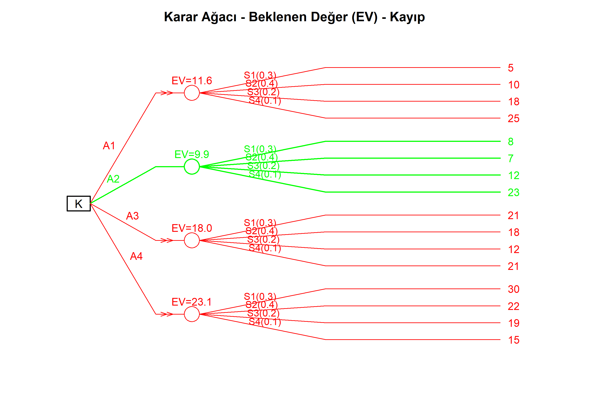{width=850 height=550 fig-align="center"}

:::

## Örnek 5: Doğal Yaşam Okulu - Kayıp Matrisi - Beklenen Pişmanlık Ölçütü

::: {.callout-tip icon=false title="Örnek 5: Doğal Yaşam Okulu - Kayıp Matrisi - Beklenen Pişmanlık Ölçütü" style="font-size: 78%;"}

:::{.fragment fragment-index=1}
[Kayıp matrisi]{.light-red} üzerinde çalışıldığı için [fırsat kaybı matrisi]{.light-red}, [orijinal matrisin sütun değerlerinin her birinden]{.light-red}, [sütun en küçük değerinin çıkartılmasıyla]{.light-red} elde edilir.
:::

::: columns

::: {.column width="70%"}
:::{.fragment fragment-index=2}
:::{.tblbox .tbl-fs-xl .w-100 .scale-90  .pad-tight .text-center .scroll-x .scroll-y}
```{=html}

```
:::
:::
:::

::: {.column width="1%"}
:::

::: {.column width="29%"}
:::{.fragment fragment-index=3}
Fırsat kaybı matrisinin oluşturulmasından sonra [olayların gerçekleşmesi olasılıklarından]{.light-red} yararlanarak her bir eylem için [beklenen fırsat kaybı]{.light-red} değerleri hesaplanmalıdır. Söz konusu değerler aşağıdaki gibi hesaplanacaktır.
:::
:::
:::


::: columns

::: {.column width="62%"}
:::{.fragment fragment-index=4 style="font-size: 90%;"}
* [A1 - 200 kişilik kamp yeri]{.red} [$0.3\cdot0 + 0.4\cdot3 + 0.2\cdot6 + 0.1\cdot10 = 3.4$]{.light-blue}
* [A2 - 250 kişilik kamp yeri]{.red} [$0.3\cdot3 + 0.4\cdot0 + 0.2\cdot0 + 0.1\cdot8 = 1.7$]{.light-blue}
* [A3 - 300 kişilik kamp yeri]{.red} [$0.3\cdot16 + 0.4\cdot11 + 0.2\cdot0 + 0.1\cdot6 = 9.8$]{.light-blue}
* [A4 - 350 kişilik kamp yeri]{.red} [$0.3\cdot25 + 0.4\cdot15 + 0.2\cdot7 + 0.1\cdot0 = 14.9$]{.light-blue}
:::
:::

::: {.column width="1%"}
:::

::: {.column width="37%"}
:::{.fragment fragment-index=5 style="font-size: 95%;"}
* Sonuçta, [beklenen fırsat kaybı]{.light-red} ölçütüne göre [en iyi strateji]{.light-red} [en küçük beklenen fırsat kaybı değerini]{.light-red} [$(1.7)$]{.orange} veren [A2 - $250$ kişilik kamp yerini]{.light-blue} tutma olacaktır. 

:::
:::
:::
:::{.fragment fragment-index=6 style="font-size: 95%;"}

* Bu ölçütle en iyi olduğu kararlaştırılan [A2]{.light-blue}’nin daha önce [beklenen değer ölçütüyle]{.light-red} [en iyi olduğu belirlenen]{.light-red} strateji olduğuna dikkat edilmelidir.
:::
:::


## Örnek 5: Doğal Yaşam Okulu - Karar Ağacı - Maliyet - Beklenen Pişmanlık


::: {.callout-tip icon=false title="Örnek 5: Doğal Yaşam Okulu - Karar Ağacı - Maliyet - Beklenen Pişmanlık" style="font-size: 95%;"}


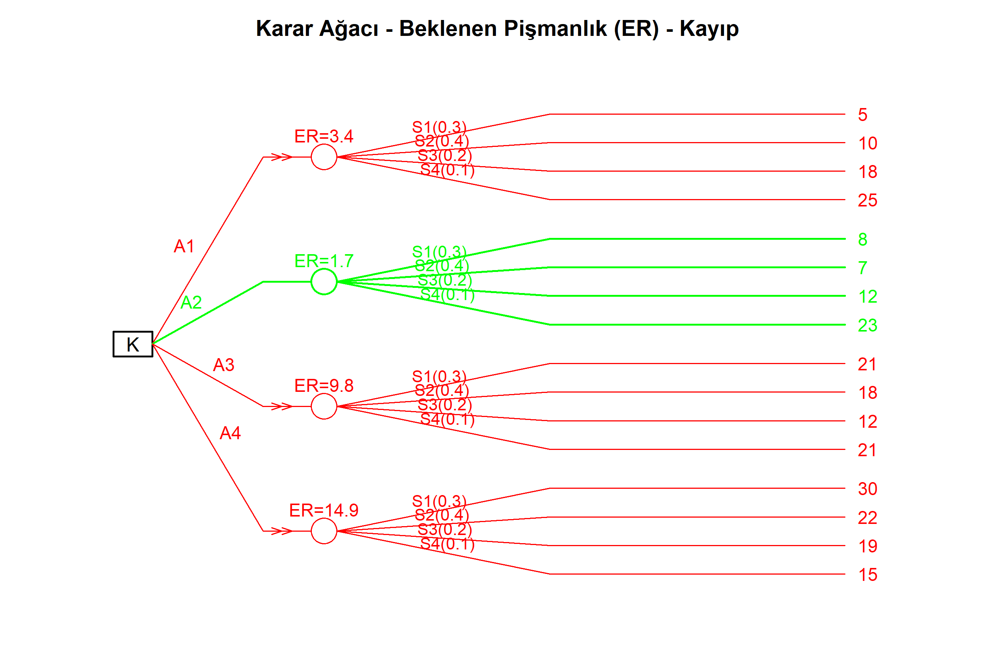{width=850 height=550 fig-align="center"}

:::


## Örnek 6: Wings 'N Things

::: {.callout-tip icon=false title="Örnek 6: Wings 'N Things" style="font-size: 100%;"}

[AFC]{.light-red}, yeni [Wings ’N Things]{.light-red} fast-food ürününü ulusal çapta piyasaya sürmek üzeredir. [Araştırma departmanı]{.light-red}, [Wings ’N Things]{.light-red}’in büyük bir [başarı yakalayacağından emindir]{.light-red} ve ürünün [hiçbir reklam yapılmadan]{.light-red}, tüm AFC şubelerinde hemen piyasaya sunulmasını istemektedir.

[Pazarlama departmanı]{.light-red} ise durumu farklı görmekte ve [yoğun bir reklam kampanyası]{.light-red} başlatmak istemektedir. Reklam kampanyasının [maliyeti]{.light-red} [$100 000$ \$]{.light-blue} olacak ve [başarılı]{.light-red} olması durumunda [$950 000$ \$]{.light-blue} [gelir]{.light-red} getirecektir. Kampanya [başarısız]{.light-red} olursa ([başarısız olma olasılığı]{.light-red} [$\%30$]{.light-blue}), [gelirin]{.light-red} [$200 000$ \$]{.light-blue} olacağı tahmin edilmektedir.

Eğer [reklam yapılmazsa]{.light-red}, müşterilerin ürüne [bağlanmma olasılığı]{.light-red} [$0.8$]{.light-blue} ve bu durumda [gelir]{.light-red} [$400.000$ \$]{.light-blue}; [bağlanmama olasılığı]{.light-red} [$0.2$]{.light-blue}, ve bu durumda [gelir]{.light-red} [$200 000$ \$]{.light-blue} olarak tahmin edilmektedir.

[(a)]{.light-red} [Karar ağacını çiziniz.]{.red} <br>
[(b)]{.light-red} [AFC bu yeni ürünü piyasaya sürerken hangi stratejiyi izlemelidir?]{.red}

:::


## Örnek 6: Wings 'N Things - Karar Ağacı - Genel Gösterim

::: {.callout-tip icon=false title="Örnek 6: Wings 'N Things - Karar Ağacı - Genel Gösterim" style="font-size: 100%;"}

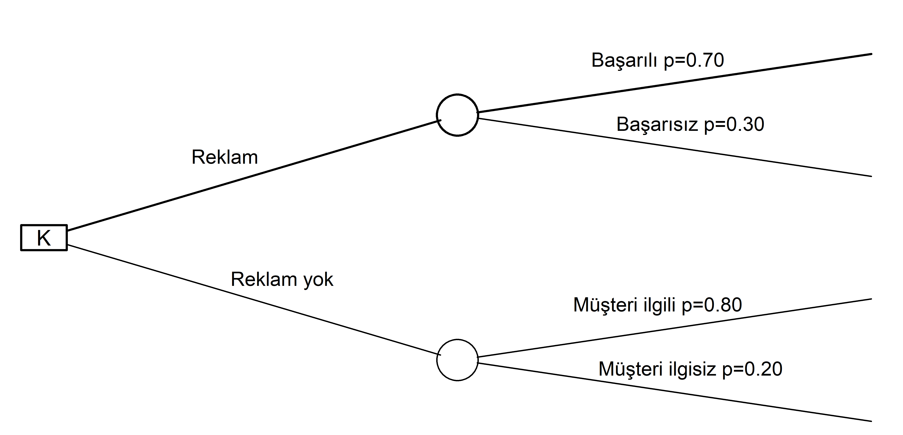{width=1200 height=550 fig-align="center"}


:::


## Örnek 6: Wings 'N Things - Karar Ağacı - Getiri Değerleri

::: {.callout-tip icon=false title="Örnek 6: Wings 'N Things - Karar Ağacı - Getiri Değerleri" style="font-size: 85%;"}

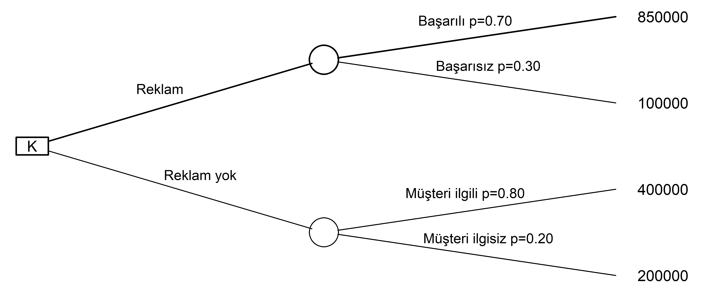{width=1200 height=500 fig-align="center"}
* Reklam kampanyası olması durumunda [$100000$ \$]{.light-blue} [maliyetin olası getirilerden düşüldüğüne]{.light-red} dikkat ediniz. 
:::


## Örnek 6: Wings 'N Things - Karar Ağacı - Beklenen Değer

::: {.callout-tip icon=false title="Örnek 6: Wings 'N Things - Karar Ağacı - Beklenen Değer" style="font-size: 100%;"}

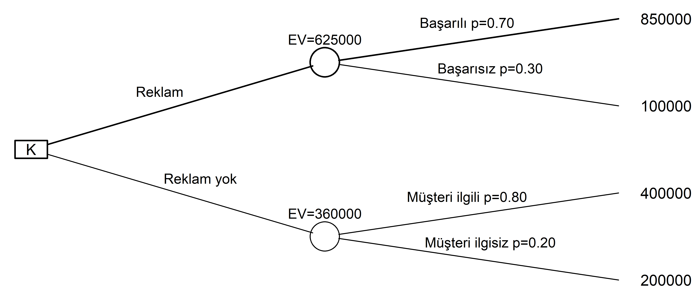{width=1200 height=550 fig-align="center"}


:::

## Örnek 6: Wings 'N Things - Karar Ağacı - Beklenen Değer Hesaplanması

::: {.callout-tip icon=false title="Örnek 6: Wings 'N Things - Karar Ağacı - Beklenen Değer Hesaplanması" style="font-size: 100%;"}

[$$EV(Reklam) = 0.7 \times  850000 + 0.3 \times  100000 =  625000$$]{.light-blue}
[$$EV(Reklamsız) = 0.8 \times  400000 + 0.2 \times  200000 =  360000$$]{.light-blue}
[$$EV(K) = max( 625000,  360000) =  625000$$]{.light-blue}
:::


## Örnek 6: Wings 'N Things - Karar Ağacı - Optimal Strateji

::: {.callout-tip icon=false title="Örnek 6: Wings 'N Things - Karar Ağacı - Optimal Strateji" style="font-size: 80%;"}

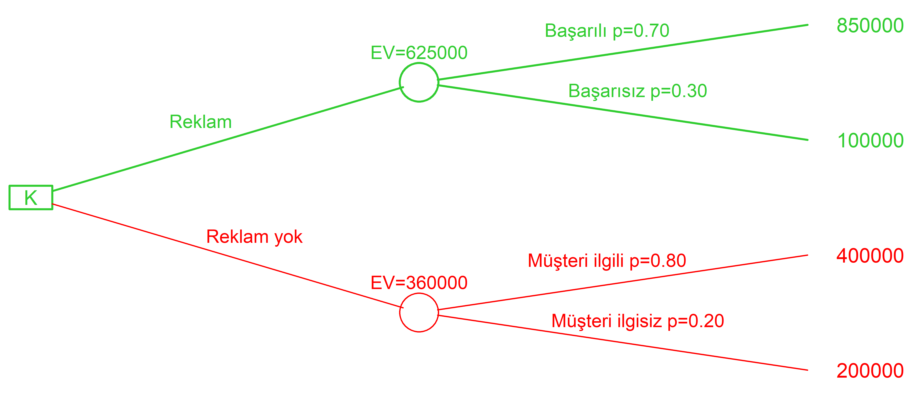{width=1200 height=500 fig-align="center"}
* Beklenen değeri daha yüksek olduğundan [($625000$ \$)]{.orange} AFC [reklam kampanyası yürütmek]{.light-red} stratejisini izlemelidir.
:::

## Örnek 7: 3 Atışlı Yazı-Tura Oyunu

::: {.callout-tip icon=false title="Örnek 7: 3 Atışlı Yazı-Tura Oyunu" style="font-size: 110%;"}

Olası sonuçları [yazı]{.light-red} [(H)]{.light-blue} ya da [Tura]{.light-red} [(T)]{.light-blue} olan [adil bir madeni para]{.light-red} art arda [üç]{.light-blue} kez atılıyor.

Gelen her bir [yazı]{.light-red} [(H)]{.light-blue} için [$1.00$ \$]{.light-blue} kazanıyor ve görünen her [iki ardışık yazı]{.light-red} [(HH)]{.light-blue} için [ayrıca]{.light-red} [$0.25$ \$]{.light-blue} daha alıyorsun (örneğin [HHH]{.light-blue} dizisi [iki]{.light-blue} tane [HH]{.light-blue} içerir: [ilk iki atış]{.light-red} ve [son iki atış]{.light-red}).

Buna karşılık, gelen her bir [tura]{.light-red} [(T)]{.light-blue} için [$1.10$ \$]{.light-blue} geri veriyorsun.
Oyunu [oynamak]{.light-red} veya [oynamamak]{.light-red} gibi [iki]{.light-blue} seçeneğinin olduğu durumda

[(a)]{.light-red} [Bu oyun için karar ağacını çiziniz.]{.red} <br>
[(b)]{.light-red} [Bu oyunu oynamayı tercih eder miydiniz?]{.red}

:::


## Örnek 7: 3 Atışlı Yazı-Tura Oyunu - Karar Ağacı - Genel Gösterim

::: {.callout-tip icon=false title="Örnek 7: 3 Atışlı Yazı-Tura Oyunu - Karar Ağacı - Genel Gösterim" style="font-size: 100%;"}

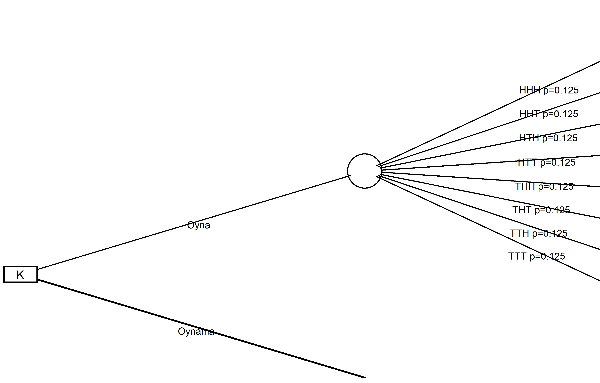{width=1200 height=500 fig-align="center"}


:::


## Örnek 7: 3 Atışlı Yazı-Tura Oyunu - Karar Ağacı - Getiri Değerleri

::: {.callout-tip icon=false title="Örnek 7: 3 Atışlı Yazı-Tura Oyunu - Karar Ağacı - Getiri Değerleri" style="font-size: 85%;"}

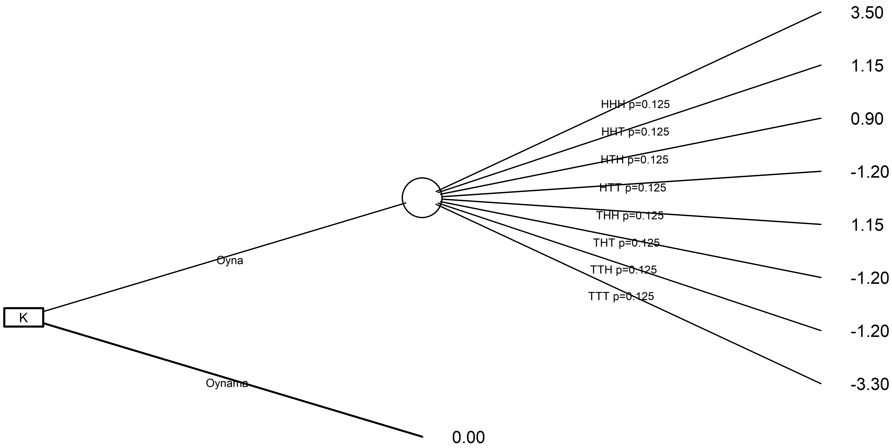{width=1000 height=500 fig-align="center"}
:::


## Örnek 7: 3 Atışlı Yazı-Tura Oyunu - Karar Ağacı - Getiri Değerlerinin Hesaplanması

::: {.callout-tip icon=false title="Örnek 7: 3 Atışlı Yazı-Tura Oyunu - Karar Ağacı - Getiri Değerlerinin Hesaplanması" style="font-size: 100%;"}


[Getiri HHH:]{.red} [$1 + 1 + 1 + 0.25 + 0.25 = 3.50$]{.light-blue} <br>

[Getiri HHT:]{.red} [$1 + 1 - 1.1 + 0.25 = 1.15$]{.light-blue} <br>

[Getiri HTH:]{.red} [$1 - 1.1 + 1 = 0.90$]{.light-blue} <br>

[Getiri HTT:]{.red} [$1 - 1.1 -1.1 = -1.2$]{.light-blue}<br>

[Getiri THH:]{.red} [$-1.1 + 1 + 1 + 0.25  = 1.15$]{.light-blue} <br>

[Getiri THT:]{.red} [$-1.1 + 1 - 1.1  = -1.2$]{.light-blue} <br>

[Getiri TTH:]{.red} [$-1.1-1.1+1  = -1.2$]{.light-blue} <br>

[Getiri TTT:]{.red} [$-1.1-1.1-1.1  = -3.3$]{.light-blue} <br>

[Getiri Oyun oynanmazsa:]{.red} [$0$]{.light-blue}
:::


## Örnek 7: 3 Atışlı Yazı-Tura Oyunu - Karar Ağacı - Beklenen Değer

::: {.callout-tip icon=false title="Örnek 7: 3 Atışlı Yazı-Tura Oyunu - Karar Ağacı - Beklenen Değer" style="font-size: 100%;"}

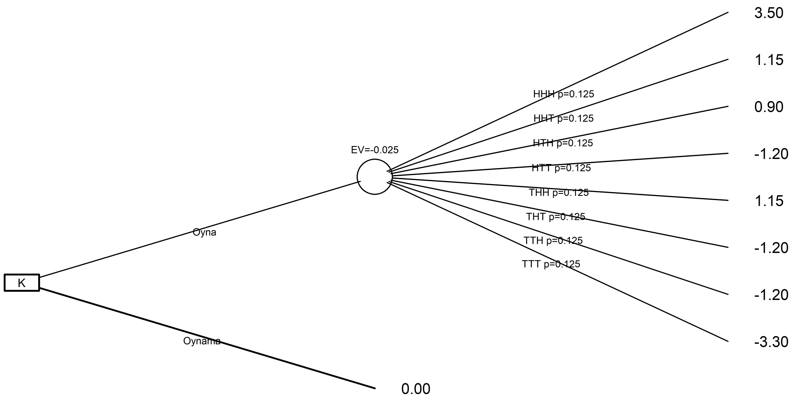{width=1200 height=550 fig-align="center"}


:::

## Örnek 7: 3 Atışlı Yazı-Tura Oyunu - Karar Ağacı - Beklenen Değer Hesaplanması

::: {.callout-tip icon=false title="Örnek 7: 3 Atışlı Yazı-Tura Oyunu - Karar Ağacı - Beklenen Değer Hesaplanması" style="font-size: 100%;"}


[$$\begin{aligned}
EV(Yazı/Tura) &= 0.125 \times     3.5 + 0.125 \times    1.15 + 0.125 \times     0.9 \\ 
&+ 0.125  \times    -1.2 + 0.125 \times    1.15 + 0.125 \times    -1.2 \\ 
&+ 0.125 \times    -1.2 + 0.125 \times    -3.3 =  -0.025\end{aligned}$$]{.light-blue}


[$$EV(K) = max( -0.025,       0) =       0$$]{.light-blue}
:::


## Örnek 7: 3 Atışlı Yazı-Tura Oyunu - Karar Ağacı - Optimal Strateji

::: {.callout-tip icon=false title="Örnek 7: 3 Atışlı Yazı-Tura Oyunu - Karar Ağacı - Optimal Strateji" style="font-size: 80%;"}

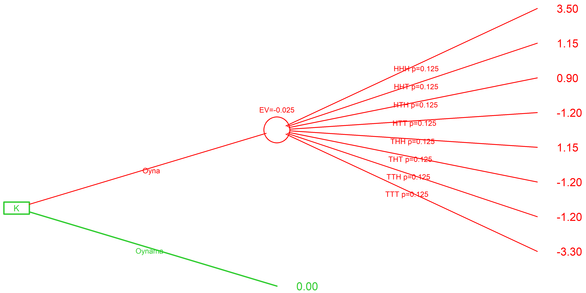{width=1200 height=500 fig-align="center"}
* Beklenen değeri daha yüksek olduğundan [$(0)$]{.orange} karar [oyunu oynamamak]{.light-red} olmalıdır.
:::

## Örnek 8: Casino Oyunu

::: {.callout-tip icon=false title="Örnek 8: Casino Oyunu" style="font-size: 87%;"}

Bir [kumarhanede]{.light-red} aşağıdaki oyunu oynama şansınız var. [Dürüst (adil)]{.light-red} bir zar [iki]{.light-blue} kez atılıyor ve şu [dört]{.light-blue} tür sonuca göre ödeme yapılıyor:

[(1)]{.red} [Her iki atış]{.light-red} da [çift ve aynı sayı]{.light-red} ([2–2]{.light-blue}, [4–4]{.light-blue}, [6–6]{.light-blue}). <br>
[(2)]{.red} [Her iki atış]{.light-red} da [tek ve aynı sayı]{.light-red} ([1–1]{.light-blue}, [3–3]{.light-blue}, [5–5]{.light-blue}). <br>
[(3)]{.red} [Atışların biri çift, diğeri tek]{.light-red} ([sırası önemli değil]{.light-red}; [çift-tek]{.light-blue} veya [tek-çift]{.light-blue}). <br>
[(4)]{.red} [Diğer tüm sonuçlar]{.light-red} ([çift-çift ama farklı sayılar]{.light-blue} veya [tek-tek ama farklı sayılar]{.light-blue}).

Paranızla [tam olarak]{.light-red} [iki]{.light-blue} [sonuç]{.light-red} üzerine, [eşit miktarlarda]{.light-blue} bahis oynayabilirsiniz. Örneğin, [hem 1. sonuca]{.light-red} ([çift eşleşme]{.light-blue}) [hem de 2. sonuca]{.light-red} ([tek eşleşme]{.light-blue}) [eşit miktarda]{.light-blue} para yatırabilirsiniz.

Her [$1$\$]{.light-blue} bahis için ödemeler şöyledir:

– [1. sonuç]{.light-red} gerçekleşirse [$2.00$\$]{.light-blue}<br>
– [2. ve 3. sonuçlar]{.light-red} gerçekleşirse [$1.95$\$]{.light-blue}<br>
– [4. sonuç]{.light-red} gerçekleşirse [$1.50$\$]{.light-blue}

[(a)]{.light-red} [Bu oyun için karar ağacını çiziniz.]{.red} <br>
[(b)]{.light-red} [Hangi iki sonucu seçerdiniz?]{.red} <br>
[(c)]{.light-red} [Bu oyunda kâra geçme şansınız var mı?]{.red}

:::


## Örnek 8: Casino Oyunu - Durum Olasılıklarının Hesaplanması

::: {.callout-tip icon=false title="Örnek 8: Casino Oyunu - Durum Olasılıklarının Hesaplanması" style="font-size: 87%;"}


[Olay 1 Örnek Uzay]{.red} [$\quad{}2–2,\quad{} 4–4,\quad{} 6–6$]{.light-blue}

[Olay 2 Örnek Uzay]{.red} [$\quad{}1–1,\quad{} 3–3,\quad{} 5–5$]{.light-blue}

[Olay 3 Örnek Uzay]{.red} 

[$$\begin{aligned}
1-2, \quad{} 2-1,\quad{} 1-4,\quad{} 4-1,\quad{} 1-6,\quad{} 6-1 \\
2-3,\quad{} 3-2,\quad{} 2-5,\quad{} 5-2,\quad{} 3-4,\quad{} 4-3 \\
3-6,\quad{} 6-3,\quad{} 4-5,\quad{} 5-4,\quad{} 5-6,\quad{} 6-5   
\end{aligned}$$]{.light-blue}

[Olay 4 Örnek Uzay]{.red}
[$$\begin{aligned}
1-3, \quad{} 3-1,\quad{} 1-5,\quad{} 5-1,\quad{} 2-4,\quad{} 4-2 \\
2-6,\quad{} 6-2,\quad{} 3-5,\quad{} 5-3,\quad{} 4-6,\quad{} 6-4
\end{aligned}$$]{.light-blue}

[Olasılıklar]{.red}

[$$P(O_1) = \frac{3}{36} = \frac{1}{12}, \quad{} P(O_2) = \frac{3}{36}= \frac{1}{12}, \quad{} P(O_3) = \frac{18}{36}= \frac{1}{2}, \quad{} P(O_4) = \frac{12}{36}= \frac{1}{3}$$]{.light-blue}

:::

## Örnek 8: Casino Oyunu - Karar Ağacı - Genel Gösterim

::: {.callout-tip icon=false title="Örnek 8: Casino Oyunu - Karar Ağacı - Genel Gösterim" style="font-size: 100%;"}

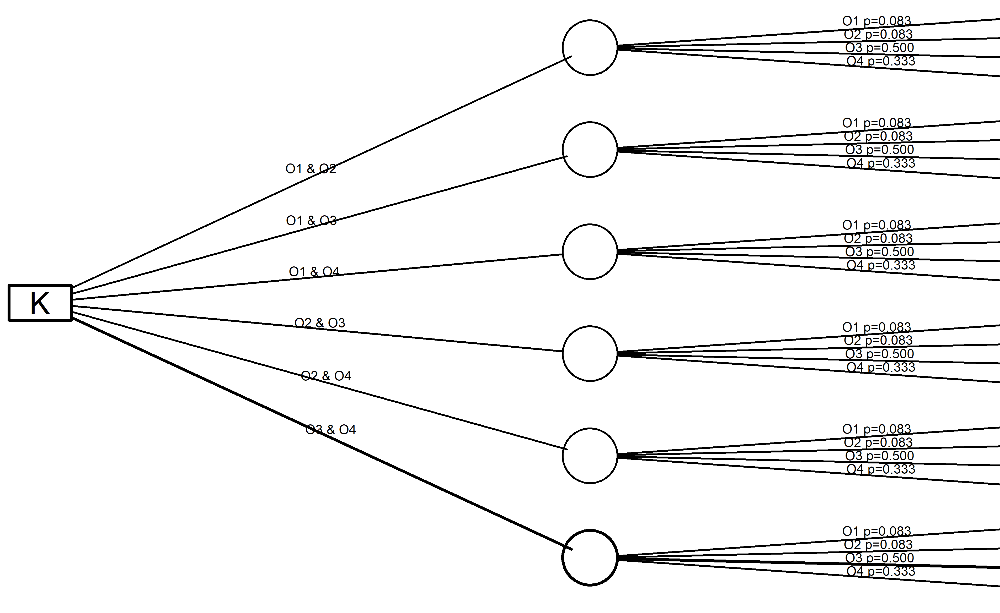{width=1000 height=500 fig-align="center"}


:::


## Örnek 8: Casino Oyunu - Karar Ağacı - Getiri Değerleri

::: {.callout-tip icon=false title="Örnek 8: Casino Oyunu - Karar Ağacı - Getiri Değerleri" style="font-size: 85%;"}

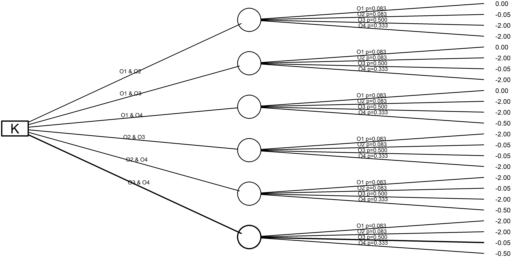{width=1000 height=500 fig-align="center"}
:::


## Örnek 8: Casino Oyunu - Karar Ağacı - Getiri Değerlerinin Hesaplanması

::: {.callout-tip icon=false title="Örnek 8: Casino Oyunu - Karar Ağacı - Getiri Değerlerinin Hesaplanması" style="font-size: 80%;"}

Oynanan senaryolarin her birine [$1\$$]{.light-blue} koyulduysa getiriler.


::: columns

::: {.column width="50%"}
[Getiri $O_1 \& O_2$ | $O_1$ gelirse:]{.red} [$2 + 0 - 2 = 0$]{.light-blue} <br> 
[Getiri $O_1 \& O_2$ | $O_2$ gelirse:]{.red} [$0 + 1.95 - 2 = -0.05$]{.light-blue} <br> 
[Getiri $O_1 \& O_2$ | $O_3$ gelirse:]{.red} [$0 + 0 - 2 = -2$]{.light-blue} <br> 
[Getiri $O_1 \& O_2$ | $O_4$ gelirse:]{.red} [$0 + 0 - 2 = -2$]{.light-blue} 


[Getiri $O_1 \& O_3$ | $O_1$ gelirse:]{.red} [$2 + 0 - 2 = 0$]{.light-blue} <br> 
[Getiri $O_1 \& O_3$ | $O_2$ gelirse:]{.red} [$0 + 0 - 2 = -2$]{.light-blue} <br> 
[Getiri $O_1 \& O_3$ | $O_3$ gelirse:]{.red} [$0 + 1.95 - 2 = -0.05$]{.light-blue} <br> 
[Getiri $O_1 \& O_3$ | $O_4$ gelirse:]{.red} [$0 + 0 - 2 = -2$]{.light-blue} 

[Getiri $O_1 \& O_4$ | $O_1$ gelirse:]{.red} [$2 + 0 - 2 = 0$]{.light-blue} <br> 
[Getiri $O_1 \& O_4$ | $O_2$ gelirse:]{.red} [$0 + 0 - 2 = -2$]{.light-blue} <br> 
[Getiri $O_1 \& O_4$ | $O_3$ gelirse:]{.red} [$0 + 0 - 2 = -2$]{.light-blue} <br> 
[Getiri $O_1 \& O_4$ | $O_4$ gelirse:]{.red} [$0 + 1.5 - 2 = -0.5$]{.light-blue} 
:::

::: {.column width="1%"}
:::

::: {.column width="49%"}
[Getiri $O_2 \& O_3$ | $O_1$ gelirse:]{.red} [$0 + 0 - 2 = -2$]{.light-blue} <br> 
[Getiri $O_2 \& O_3$ | $O_2$ gelirse:]{.red} [$1.95 + 0 - 2 = -0.05$]{.light-blue} <br> 
[Getiri $O_2 \& O_3$ | $O_3$ gelirse:]{.red} [$0 + 1.95 - 2 = -0.05$]{.light-blue} <br> 
[Getiri $O_2 \& O_3$ | $O_4$ gelirse:]{.red} [$0 + 0 - 2 = -2$]{.light-blue} 

[Getiri $O_2 \& O_4$ | $O_1$ gelirse:]{.red} [$0 + 0 - 2 = -2$]{.light-blue} <br> 
[Getiri $O_2 \& O_4$ | $O_2$ gelirse:]{.red} [$1.95 + 0 - 2 = -0.05$]{.light-blue} <br> 
[Getiri $O_2 \& O_4$ | $O_3$ gelirse:]{.red} [$0 + 0 - 2 = -2$]{.light-blue} <br> 
[Getiri $O_2 \& O_4$ | $O_4$ gelirse:]{.red} [$0 + 1.5 - 2 = -0.5$]{.light-blue} 

[Getiri $O_3 \& O_4$ | $O_1$ gelirse:]{.red} [$0 + 0 - 2 = -2$]{.light-blue} <br> 
[Getiri $O_3 \& O_4$ | $O_2$ gelirse:]{.red} [$0 + 0 - 2 = -2$]{.light-blue} <br> 
[Getiri $O_3 \& O_4$ | $O_3$ gelirse:]{.red} [$1.95 + 0 - 2 = -0.05$]{.light-blue} <br> 
[Getiri $O_3 \& O_4$ | $O_4$ gelirse:]{.red} [$0 + 1.5 - 2 = -0.5$]{.light-blue} 
:::
:::

:::


## Örnek 8: Casino Oyunu - Karar Ağacı - Beklenen Değer

::: {.callout-tip icon=false title="Örnek 8: Casino Oyunu - Karar Ağacı - Beklenen Değer" style="font-size: 100%;"}

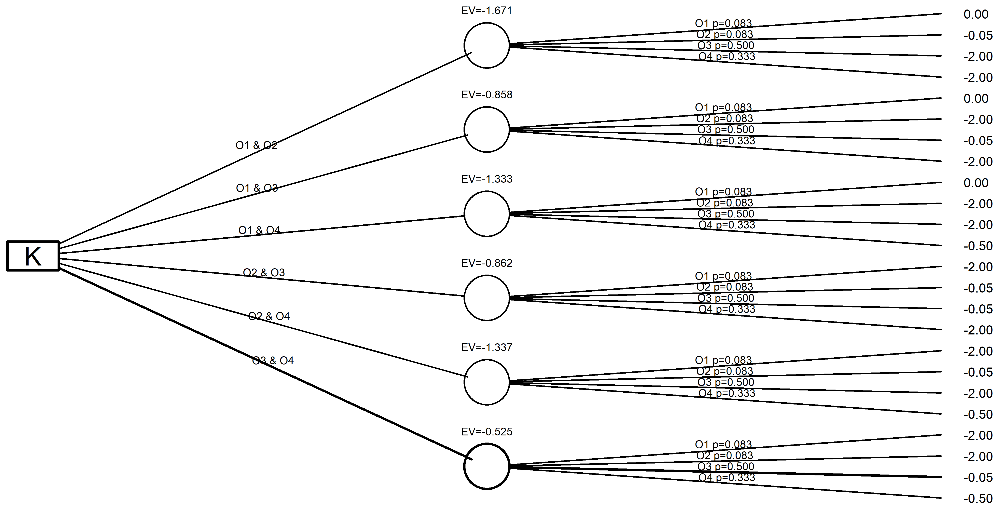{width=1200 height=550 fig-align="center"}


:::

## Örnek 8: Casino Oyunu - Karar Ağacı - Beklenen Değer Hesaplanması

::: {.callout-tip icon=false title="Örnek 8: Casino Oyunu - Karar Ağacı - Beklenen Değer Hesaplanması" style="font-size: 88%;"}
[$$EV(O_1 \& O_2) = 0.08333 \times       0 + 0.08333 \times   -0.05 + 0.5 \times      -2 + 0.3333 \times      -2 = -1.671 $$]{.light-blue}
[$$EV(O_1 \& O_3) = 0.08333 \times       0 + 0.08333 \times      -2 + 0.5 \times   -0.05 + 0.3333 \times      -2 = -0.858$$]{.light-blue}
[$$EV(O_1 \& O_4) = 0.08333 \times       0 + 0.08333 \times      -2 + 0.5 \times      -2 + 0.3333 \times    -0.5 = -1.333$$]{.light-blue}
[$$EV(O_2 \& O_3) = 0.08333 \times      -2 + 0.08333 \times   -0.05 + 0.5 \times   -0.05 + 0.3333 \times      -2 = -0.862$$]{.light-blue}
[$$EV(O_2 \& O_4) = 0.08333 \times      -2 + 0.08333 \times   -0.05 + 0.5 \times      -2 + 0.3333 \times    -0.5 = -1.337$$]{.light-blue}
[$$EV(O_3 \& O_4) = 0.08333 \times      -2 + 0.08333 \times      -2 + 0.5 \times   -0.05 + 0.3333 \times    -0.5 =  -0.525$$]{.light-blue}
[$$EV(K) = max(-1.67083, -0.858333, -1.33333, -0.8625, -1.3375,  -0.525) =  -0.525$$]{.light-blue}

:::


## Örnek 8: Casino Oyunu - Karar Ağacı - Optimal Strateji

::: {.callout-tip icon=false title="Örnek 8: Casino Oyunu - Karar Ağacı - Optimal Strateji" style="font-size: 80%;"}

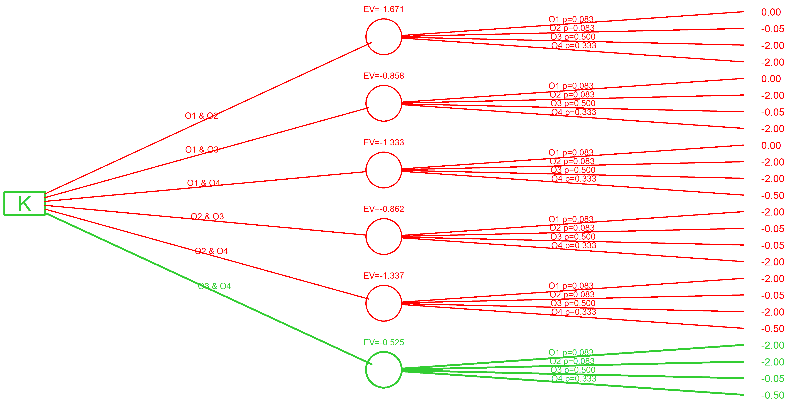{width=1100 height=450 fig-align="center"}
* Tüm çiftler için beklenen değer [negatif olduğundan oyun oynanmamalıdır]{.light-red}. Ancak illa bir çift seçilmesi isteniyorsa, en az zarar edilecek olan [$(-0.525)$]{.orange} [$O_3 \& O_4$]{.light-blue} çiftine para yatırılmalıdır.
:::


## Örnek 9: Reklam Kampanyası

::: {.callout-tip icon=false title="Örnek 9: Reklam Kampanyası" style="font-size: 90%;"}

Piyasaya sürülecek yeni bir [ürünün]{.light-red} tanıtımı için bir [reklam]{.light-red} kampanyası düzenlenecektir. Reklam için ya [TV]{.light-red} ya da [gazete]{.light-red} seçilecektir. 

[TV ile kampanyanın]{.light-red} [başarılı]{.light-red} olma olasılığı [0.6]{.light-blue} ve bu durumda [beklenen kar]{.light-red} [90TL]{.light-blue} dir. Kampanya [başarısız]{.light-red} olduğunda firmanın, [ürünün üretim haklarını]{.light-red} [10TL]{.light-blue} ye [devretmek]{.light-red} ve ya [ürünü yeniden tasarlayarak]{.light-red} yeni bir kampanya başlatmak gibi [iki]{.light-blue} stratejisi vardır.

Yeni tasarımlı ürünün [başarılı]{.light-red} olma şansı [0.7]{.light-blue} olup bu durumda [beklenen kar]{.light-red} [70TL]{.light-blue} iken [başarısız]{.light-red} olma durumunda [beklenen zarar]{.light-red} [20TL]{.light-blue} dir.

Kampanya [gazete]{.light-red} ile yapıldığında [başarılı]{.light-red} olma olasılığı [0.8]{.light-blue} ve bu durumda [beklenen kar]{.light-red} [60TL]{.light-blue} dir. [Başarısız]{.light-red} olunması durumunda [üretim haklarının devredilmesi]{.light-red} ve ya [reklam ajansının değiştirilmesi]{.light-red} mümkündür.

[Üretim haklarının  devredilmesi]{.light-red} durumunda [net kar]{.light-red} [25TL]{.light-blue} dir. [Ajansın değiştirilmesi]{.light-red} kararlaştırıldığında yeni kampanyanın [başarılı olma olasılığı]{.light-red} [0.7]{.light-blue} ve bu durumda [başarının getirisi]{.light-red} [40TL]{.light-blue}, [başarısızlığın götürüsü]{.light-red} [15TL]{.light-blue} dir. 

[Firma için en iyi stratejiyi karar ağacı kullanarak belirleyiniz.]{.red}
:::


## Örnek 9: Reklam Kampanyası - Karar Ağacı - Genel Gösterim

::: {.callout-tip icon=false title="Örnek 9: Reklam Kampanyası - Karar Ağacı - Genel Gösterim" style="font-size: 100%;"}

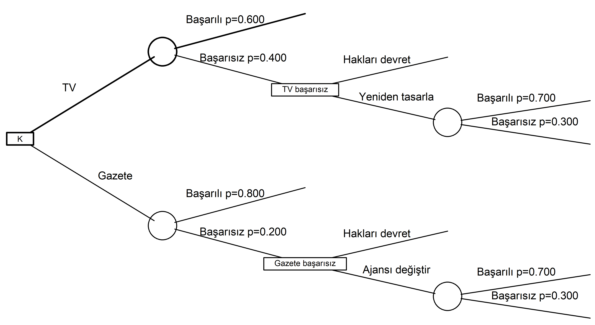{width=1000 height=500 fig-align="center"}


:::


## Örnek 9: Reklam Kampanyası - Karar Ağacı - Getiri Değerleri

::: {.callout-tip icon=false title="Örnek 9: Reklam Kampanyası - Karar Ağacı - Getiri Değerleri" style="font-size: 85%;"}

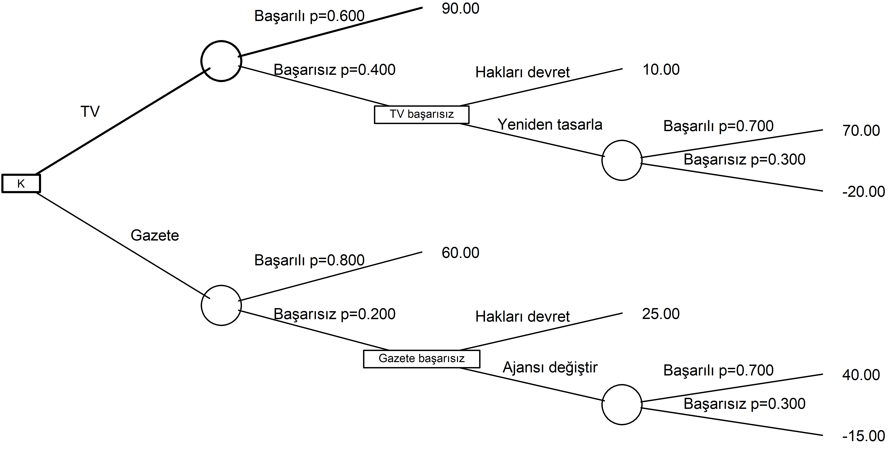{width=1000 height=500 fig-align="center"}
:::


## Örnek 9: Reklam Kampanyası - Karar Ağacı - Beklenen Değer

::: {.callout-tip icon=false title="Örnek 9: Reklam Kampanyası - Karar Ağacı - Beklenen Değer" style="font-size: 100%;"}

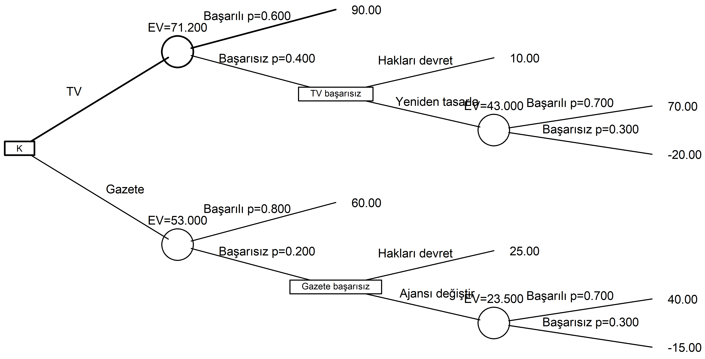{width=1000 height=550 fig-align="center"}


:::

## Örnek 9: Reklam Kampanyası - Karar Ağacı - Beklenen Değer Hesaplanması

::: {.callout-tip icon=false title="Örnek 9: Reklam Kampanyası - Karar Ağacı - Beklenen Değer Hesaplanması" style="font-size: 100%;"}

[$$EV(Yeni tasarım kamp.) = 0.7 \times      70 + 0.3 \times     -20 =      43$$]{.light-blue}

[$$EV(TV başarısız) = max(     10,      43) =      43$$]{.light-blue}

[$$EV(TV kampanya) = 0.6 \times      90 + 0.4 \times      43 =    71.2$$]{.light-blue}

[$$EV(Yeni ajans kamp.) = 0.7 \times      40 + 0.3 \times     -15 =    23.5$$]{.light-blue}

[$$EV(Gazete başarısız) = max(     25,    23.5) =      25$$]{.light-blue}

[$$EV(Gazete kampanya) = 0.8 \times      60 + 0.2 \times      25 =      53$$]{.light-blue}

[$$EV(K) = max(   71.2,      53) =    71.2$$]{.light-blue}

:::

## Örnek 9: Reklam Kampanyası - Karar Ağacı - Optimal Strateji

::: {.callout-tip icon=false title="Örnek 9: Reklam Kampanyası - Karar Ağacı - Optimal Strateji" style="font-size: 80%;"}

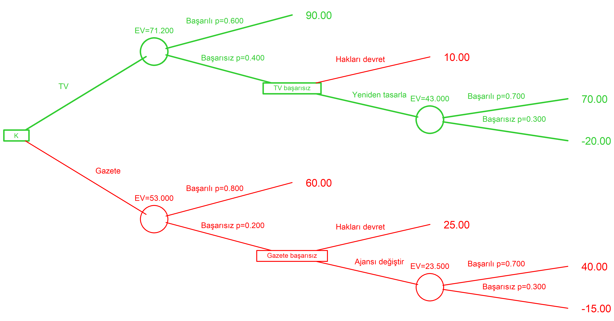{width=1000 height=400 fig-align="center"}
* Öncelikle [gazete]{.light-red} [$(53)$]{.orange} kampanyası yerine [daha yüksek getiriye]{.light-red} sahip [TV]{.light-red} [$(71.2)$]{.orange} kampanyası tercih edilmelidir. Eğer TV kampanyası [başarısız]{.light-red} olursa, o durumda da [daha düşük getiriye]{.light-red} sahip olan [hakları devretmek]{.light-red} [$(10)$]{.orange} stratejisi yerine, [daha yüksek beklenenen getiriye]{.light-red} sahip [yeniden tasarlama]{.light-red} [$(43)$]{.orange} stratejisi denenmelidir. 
:::


## Örnek 10: A ve B Yatırım

::: {.callout-tip icon=false title="Örnek 10: A ve B Yatırım" style="font-size: 95%;"}
Bir [yatırımcı]{.light-red} [A]{.light-blue} ve [B]{.light-blue} seçeneklerinden hangisine [yatırım yapmasının]{.light-red} uygun olacağını araştırmaktadır. 

* Yatırımcının [alternatif stratejileri]{.light-red} şöyledir: 
  * [Yatırım yapmamak]{.light-red}
  * [A]{.light-blue}’nın seçilmesi ve [başarılı]{.light-red} olunması durumunda yatırımcı ya [hiçbir şey yapmadan beklemekte]{.light-red} ya da elde ettiği [kazançla B’ye yatırım]{.light-red} yapmaktadır. 
  * Bunun [tam tersi]{.light-red} de bir [başka alternatiftir]{.light-red}. 
* [A]{.light-blue}’da [başarılı]{.light-red} olma olasılığı [0.70]{.light-blue}, [B]{.light-blue}’de [başarılı]{.light-red} olma olasılığı [0.40]{.light-blue}’dır. 
* Her iki yatırım seçeneğinin [gerektirdiği yatırım miktarı]{.light-red} da [2000 TL]{.light-blue} olup, [başarısız]{.light-red} olunması durumunda [kazanç]{.light-red} [–2000 TL]{.light-blue} olmaktadır. 
* [A]{.light-blue}’nın [başarılı]{.light-red} olması durumunda [3000 TL]{.light-blue} [(yatırım miktarı dahil)]{.light-red}, [B]{.light-blue}’nin [başarılı]{.light-red} olması durumunda [5000 TL]{.light-blue} [(yatırım miktarı dahil)]{.light-red} elde edilmektedir.<br>
[Firma için en iyi stratejiyi karar ağacı kullanarak belirleyiniz.]{.red}
:::

## Örnek 10: A ve B Yatırım - Karar Ağacı - Genel Gösterim

::: {.callout-tip icon=false title="Örnek 10: A ve B Yatırım - Karar Ağacı - Genel Gösterim" style="font-size: 100%;"}

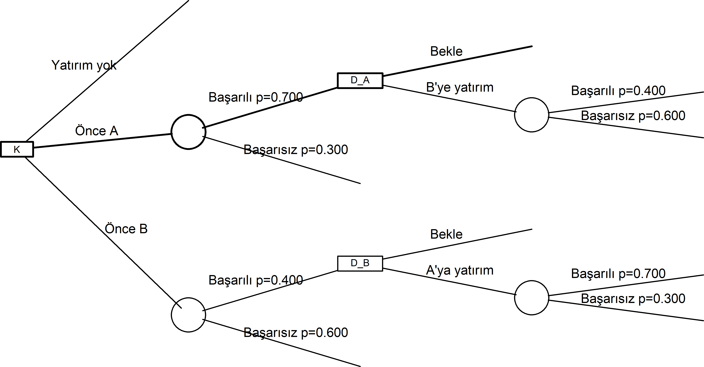{width=1000 height=500 fig-align="center"}


:::


## Örnek 10: A ve B Yatırım - Karar Ağacı - Getiri Değerleri

::: {.callout-tip icon=false title="Örnek 10: A ve B Yatırım - Karar Ağacı - Getiri Değerleri" style="font-size: 85%;"}

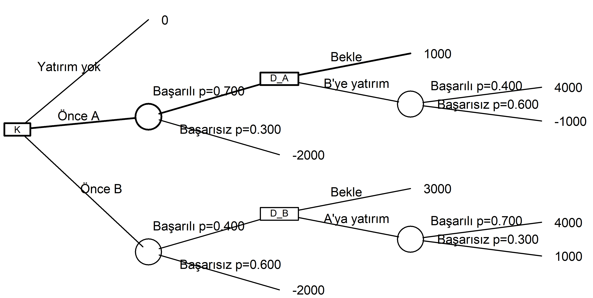{width=1000 height=500 fig-align="center"}
:::


## Örnek 10: A ve B Yatırım - Karar Ağacı - Beklenen Değer

::: {.callout-tip icon=false title="Örnek 10: A ve B Yatırım - Karar Ağacı - Beklenen Değer" style="font-size: 100%;"}

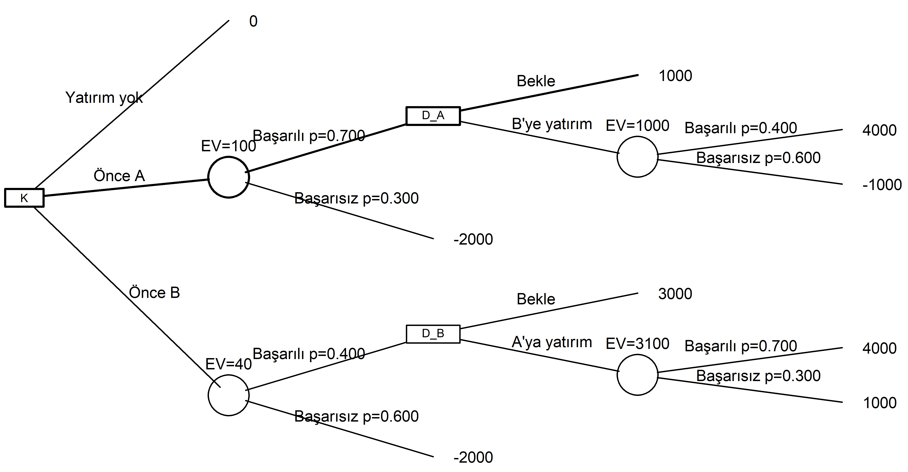{width=1000 height=550 fig-align="center"}


:::

## Örnek 10: A ve B Yatırım - Karar Ağacı - Beklenen Değer Hesaplanması

::: {.callout-tip icon=false title="Örnek 10: A ve B Yatırım - Karar Ağacı - Beklenen Değer Hesaplanması" style="font-size: 100%;"}

[$$EV(B) = 0.4 \times    4000 + 0.6 \times   -1000 =    1000$$]{.light-blue}

[$$EV(D\_A) = max(   1000,    1000) =    1000$$]{.light-blue}

[$$EV(A) = 0.7 \times    1000 + 0.3 \times   -2000 =     100$$]{.light-blue}

[$$EV(A) = 0.7 \times    4000 + 0.3 \times    1000 =    3100$$]{.light-blue}

[$$EV(D\_B) = max(   3000,    3100) =    3100$$]{.light-blue}

[$$EV(B) = 0.4 \times    3100 + 0.6 \times   -2000 =      40$$]{.light-blue}

[$$EV(K) = max(      0,     100,      40) =     100$$]{.light-blue}
:::

## Örnek 10: A ve B Yatırım - Karar Ağacı - Optimal Strateji

::: {.callout-tip icon=false title="Örnek 10: A ve B Yatırım - Karar Ağacı - Optimal Strateji" style="font-size: 80%;"}

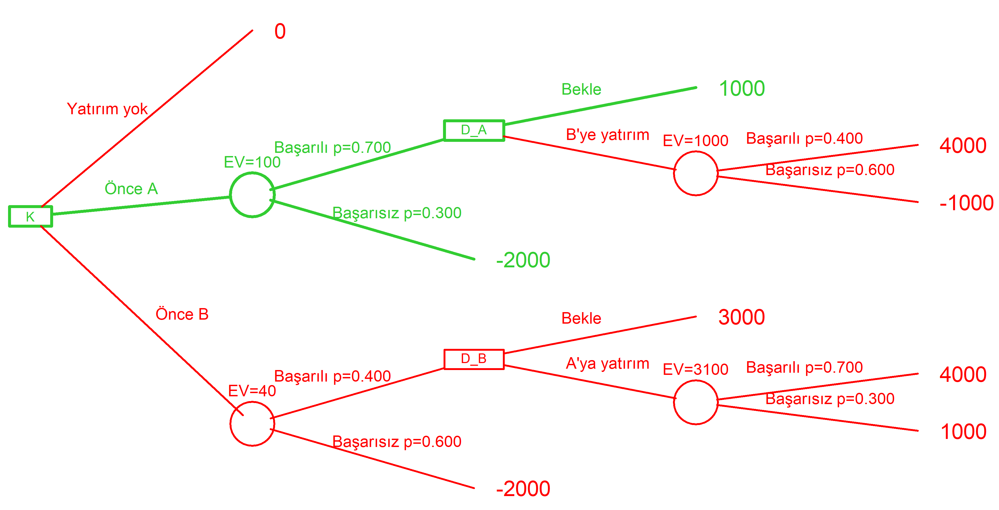{width=1100 height=450 fig-align="center"}
* Yatırımcı öncelikle [A]{.light-blue} yatırımını yapacaktır. [Başarısız]{.light-red} olursa [2000TL]{.light-blue} kaybedecektir. [Başarılı]{.light-red} olursa kazandığı [1000 TL]{.light-blue} yi alarak [bekleyecektir]{.light-red}. [B]{.light-blue} ye yatırım yapmak [daha iyi bir beklenen sonuç vermemektedir]{.light-red}.

:::

